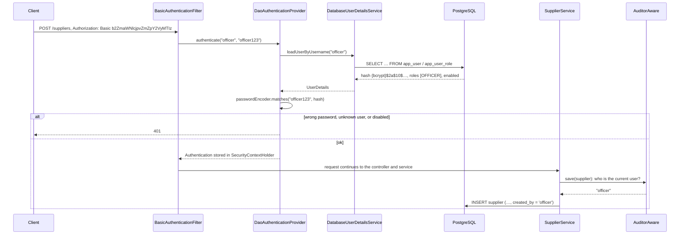

# Lesson 2 — Users in the Database, and Who Did What

> **Lesson 1 locked the door. Lesson 2 hands out the keys, and writes down who used them.**
> We move the PIS users out of Java code into PostgreSQL, let an admin manage
> accounts through the API, and record the logged-in user on every record they
> create or change.

```
supplier.created_by = 'officer'      ← filled in by Spring, not by the client
```

| Duration | Builds on | You should know |
| --- | --- | --- |
| About 2½ hours | [Lesson 1 — HTTP Basic](01-basic-auth.md) | Flyway migrations, JPA entities, `@Transactional` |

**Contents:** [Goals](#goals) · [Concepts](#concepts) · [Request flow](#request-flow) ·
[Upgrade checklist](#upgrade-checklist) · [Build it](#build-it) · [Try it](#try-it) ·
[Test it](#test-it) · [Common mistakes](#common-mistakes) · [Exercises](#exercises) ·
[Quiz](#quiz) · [Next lesson](#next-lesson)

---

## Goals

By the end of this lesson you can:

- Explain what a `UserDetailsService` does and write one backed by a JPA repository.
- Design `app_user` and `app_user_role` tables with a Flyway migration.
- Hash a password when an account is created, and never return it.
- Solve the *first admin* problem without putting a password in git.
- Disable an account instead of deleting it, and explain why.
- Fill `created_by` / `updated_by` automatically with `AuditorAware` and the `SecurityContext`.

### Lesson plan

| Time (min) | Activity |
| --- | --- |
| 0–15 | Why in-memory users are not enough; the `UserDetailsService` contract |
| 15–25 | Request flow: from the Basic header to a row in `app_user` |
| 25–70 | Build it, part A: tables, entity, `DatabaseUserDetailsService`, first admin |
| 70–95 | Build it, part B: the users API |
| 95–110 | Build it, part C: who did it (`AuditorAware`) |
| 110–125 | Try it live with curl and psql |
| 125–150 | Tests, exercises, quiz |

---

## Concepts

### Why move users out of the code?

In Lesson 1 the users were written into `SecurityConfig`:

| In memory (Lesson 1) | In the database (Lesson 2) |
| --- | --- |
| Adding a user means editing Java and redeploying | An admin calls `POST /api/v1/users` |
| Every restart re-creates the same three users | Accounts survive restarts |
| Can't disable one person without a release | `PATCH /users/{id}/enabled` takes effect on their next request |
| Three shared logins: nobody knows *which* officer did something | One account per person, so `created_by` means something |

The last row is the real reason. **An audit trail is only as good as the
accounts behind it.** If five officers share one login, `created_by = 'officer'`
tells you nothing.

### The `UserDetailsService` contract

Spring Security doesn't know about your tables. It asks one question, through
one interface:

```java
public interface UserDetailsService {
    UserDetails loadUserByUsername(String username) throws UsernameNotFoundException;
}
```

You answer with a `UserDetails`: the username, the **stored hash**, the roles,
and whether the account is enabled. Spring then compares the password from the
Basic header against that hash itself. **Your code never compares passwords.**

Lesson 1's `InMemoryUserDetailsManager` was just one implementation of this
interface. Swap in a database-backed one and `SecurityConfig`'s rules don't
change at all.

### Two tables, not one

A user can hold several roles (the admin holds all three), so roles go in their
own table, one row per role:

```
app_user                                   app_user_role
┌──────────┬───────────────┬─────────┐     ┌──────────┬──────────┐
│ username │ password_hash │ enabled │     │ user_id  │ role     │
├──────────┼───────────────┼─────────┤     ├──────────┼──────────┤
│ admin    │ {bcrypt}$2a$… │ true    │◄────┤ admin-id │ ADMIN    │
│ officer  │ {bcrypt}$2a$… │ true    │     │ admin-id │ APPROVER │
└──────────┴───────────────┴─────────┘     │ admin-id │ OFFICER  │
                                           │ off-id   │ OFFICER  │
                                           └──────────┴──────────┘
```

> **Why `app_user` and not `user`?** `USER` is a reserved word in PostgreSQL.
> `SELECT * FROM user` returns the *current database user*, not your table.

### The first-admin problem

Only an admin can create accounts. So who creates the first admin?

| Option | Problem |
| --- | --- |
| Insert the admin in a Flyway migration | The password hash is in git forever, identical on every install |
| Let anyone call `POST /users` when the table is empty | A race: whoever gets there first owns the system |
| **On startup, if `app_user` is empty, create `admin` from `ADMIN_PASSWORD`** | ✅ The secret stays in `.env`; runs once, then never again |

### Disable, don't delete

Deleting a user who created 300 purchase orders would leave 300 records
pointing at nobody. Procurement records are evidence. So we **disable**
accounts: `enabled = false` makes Spring reject the login with 401, and the
name stays on everything that person did.

### Who did it: `AuditorAware`

`Auditable` already fills in `created_at` and `updated_at`. Spring Data can also
fill in `created_by` and `updated_by`, if we tell it who the current user is:

```java
@Bean
public AuditorAware<String> currentUser() {
    return () -> Optional.ofNullable(SecurityContextHolder.getContext().getAuthentication())
            ...
            .map(Authentication::getName);
}
```

`SecurityContextHolder` holds the user that `BasicAuthenticationFilter`
authenticated **for this request, on this thread**. By the time a service calls
`save()`, it already knows who is logged in. The client never sends
`createdBy`, so the client can't lie about it.

---

## Request flow

What happens between the Basic header arriving and a supplier row being saved:



> **`DaoAuthenticationProvider`** is created by Spring Boot automatically when
> it finds exactly one `UserDetailsService` bean and one `PasswordEncoder` bean.
> We never wire it ourselves.

---

## Upgrade checklist

Starting from the end of Lesson 1. Tick these off as you go.

| | File | Change |
| --- | --- | --- |
| ➕ | `db/migration/V4__create_app_user.sql` | New: `app_user`, `app_user_role` |
| ➕ | `db/migration/V5__add_audit_user_columns.sql` | New: `created_by`, `updated_by` on four tables |
| ➕ | `model/Role.java`, `model/AppUser.java` | New entity and enum |
| ➕ | `repository/AppUserRepository.java` | New |
| ➕ | `service/DatabaseUserDetailsService.java` | New: replaces the in-memory users |
| ➕ | `service/UserService.java`, `controller/UserController.java` | New users API |
| ➕ | `dto/UserRequest.java`, `UserResponse.java`, `UserEnabledRequest.java` | New |
| ➕ | `config/AdminAccountInitializer.java` | New: creates the first admin |
| ✏️ | `config/SecurityConfig.java` | **Delete** the `userDetailsService` bean; add two rules |
| ✏️ | `config/JpaConfig.java` | Add the `AuditorAware` bean |
| ✏️ | `model/Auditable.java` | Add `createdBy`, `updatedBy` |
| ✏️ | `dto/SupplierResponse.java` | Return `createdBy`, `updatedBy` |
| ✏️ | `application.yml`, `application-test.yml`, `.env`, `.env.example` | Only `ADMIN_PASSWORD` remains |
| ✏️ | `SecurityTest.java` | Insert officer and approver in `@BeforeEach` |
| ➕ | `UserApiTest.java` | New |

---

## Build it

### Part A: users in the database

#### 1 · The migration

```sql
-- src/main/resources/db/migration/V4__create_app_user.sql
-- The table is app_user, not user: USER is a reserved word in PostgreSQL.
-- password_hash holds a BCrypt hash with its {bcrypt} prefix, never a password.

CREATE TABLE app_user (
    id            UUID          PRIMARY KEY,
    username      VARCHAR(50)   NOT NULL,
    password_hash VARCHAR(100)  NOT NULL,
    full_name     VARCHAR(150)  NOT NULL,
    enabled       BOOLEAN       NOT NULL DEFAULT TRUE,
    created_at    TIMESTAMPTZ   NOT NULL,
    updated_at    TIMESTAMPTZ,
    created_by    VARCHAR(50),
    updated_by    VARCHAR(50),
    CONSTRAINT uk_app_user_username UNIQUE (username)
);

-- One row per role. A composite key stops the same role being granted twice.
CREATE TABLE app_user_role (
    user_id UUID        NOT NULL REFERENCES app_user (id) ON DELETE CASCADE,
    role    VARCHAR(20) NOT NULL,
    PRIMARY KEY (user_id, role)
);
```

`password_hash` is `VARCHAR(100)`: a BCrypt hash is 60 characters, plus the
8-character `{bcrypt}` prefix, with room to switch algorithms later.

#### 2 · The entity

```java
// model/Role.java
public enum Role {
    OFFICER,
    APPROVER,
    ADMIN
}
```

```java
// model/AppUser.java
@Entity
@Table(name = "app_user", uniqueConstraints =
        @UniqueConstraint(name = "uk_app_user_username", columnNames = "username"))
@Data
@EqualsAndHashCode(callSuper = true)
@NoArgsConstructor(access = AccessLevel.PROTECTED)
@ToString(of = { "id", "username" }) // never the password hash, not even in a log line
public class AppUser extends Auditable {

    @Id
    @GeneratedValue(strategy = GenerationType.UUID)
    private UUID id;

    /** Always stored in lower case, so "Officer" and "officer" are the same account. */
    @Column(nullable = false, length = 50)
    private String username;

    @Column(name = "password_hash", nullable = false, length = 100)
    private String passwordHash;

    @Column(name = "full_name", nullable = false, length = 150)
    private String fullName;

    @Column(nullable = false)
    private boolean enabled = true;

    @ElementCollection
    @CollectionTable(name = "app_user_role", joinColumns = @JoinColumn(name = "user_id"))
    @Enumerated(EnumType.STRING)
    @Column(name = "role", nullable = false, length = 20)
    private Set<Role> roles = new HashSet<>();

    public AppUser(String username, String passwordHash, String fullName, Set<Role> roles) {
        this.username = username.toLowerCase();
        this.passwordHash = passwordHash;
        this.fullName = fullName;
        this.roles = new HashSet<>(roles);
    }
}
```

Points to discuss:

- **`@ElementCollection`**: roles are plain values, not entities with their own
  id. JPA manages the `app_user_role` rows for us.
- **`@ToString(of = …)`**: with `@Data`, a plain `toString()` would print the
  password hash every time someone logs the user.
- The field is called **`passwordHash`**, not `password`. The name reminds every
  reader what may be stored there.

```java
// repository/AppUserRepository.java
public interface AppUserRepository extends JpaRepository<AppUser, UUID> {

    Optional<AppUser> findByUsername(String username);

    boolean existsByUsername(String username);
}
```

#### 3 · `DatabaseUserDetailsService`

The heart of Part A: the bridge between our table and Spring Security.

```java
// service/DatabaseUserDetailsService.java
@RequiredArgsConstructor
@Service
public class DatabaseUserDetailsService implements UserDetailsService {

    private final AppUserRepository users;

    @Override
    @Transactional(readOnly = true) // roles are lazy; read them while the session is open
    public UserDetails loadUserByUsername(String username) {
        AppUser user = users.findByUsername(username.toLowerCase())
                // Same 401 as a wrong password: never tell a caller which usernames exist.
                .orElseThrow(() -> new UsernameNotFoundException("Bad credentials"));

        return User.withUsername(user.getUsername())
                .password(user.getPasswordHash())
                .roles(user.getRoles().stream().map(Enum::name).toArray(String[]::new))
                .disabled(!user.isEnabled())
                .build();
    }
}
```

> **Why `@Transactional`?** `roles` is loaded lazily, and this project runs with
> `open-in-view: false`. Without a transaction, `user.getRoles()` throws
> `LazyInitializationException`, because the database session has already closed.

> **Why the same error for an unknown user?** If "no such user" and "wrong
> password" gave different answers, an attacker could find out which usernames
> exist, then guess passwords only for those.

#### 4 · Remove the in-memory users

In `SecurityConfig`, **delete the whole `userDetailsService(...)` bean** and its
`@Value` parameters. Keep `passwordEncoder()`.

> ⚠️ If you leave it in, there are two `UserDetailsService` beans. Spring Boot
> then refuses to guess which one to use and logs a warning that begins
> *"Found 2 UserDetailsService beans"*. Logins stop working.

#### 5 · The first admin

```java
// config/AdminAccountInitializer.java
/**
 * Solves the chicken-and-egg problem: only an admin can create users, so who
 * creates the first admin?
 *
 * On startup, if app_user is empty, create one admin from ADMIN_PASSWORD.
 * Once any user exists this does nothing, so changing ADMIN_PASSWORD later has no effect.
 * A password in a Flyway migration would be in git forever; an environment variable is not.
 */
@Slf4j
@RequiredArgsConstructor
@Component
public class AdminAccountInitializer implements ApplicationRunner {

    private final AppUserRepository users;
    private final PasswordEncoder passwordEncoder;

    @Value("${pis.security.admin-password}")
    private String adminPassword;

    @Override
    @Transactional
    public void run(ApplicationArguments args) {
        if (users.count() > 0) {
            return;
        }
        users.save(new AppUser("admin", passwordEncoder.encode(adminPassword), "System Administrator",
                Set.of(Role.ADMIN, Role.APPROVER, Role.OFFICER)));
        log.warn("No users found. Created the initial 'admin' account from ADMIN_PASSWORD.");
    }
}
```

Only one password is configured now:

```yaml
# application.yml
# Password for the first admin, created on startup only while app_user is empty.
# Every other account is created through POST /api/v1/users.
pis:
  security:
    admin-password: ${ADMIN_PASSWORD}
```

```yaml
# src/test/resources/application-test.yml
pis:
  security:
    admin-password: admin-pass
```

```bash
# .env: delete OFFICER_PASSWORD and APPROVER_PASSWORD, keep:
ADMIN_PASSWORD=admin123
```

### Part B: the users API

#### 6 · Request and response

```java
// dto/UserRequest.java
/** What an admin sends to create an account. The password arrives in plain text, over HTTPS, and is hashed at once. */
public record UserRequest(

        @NotBlank(message = "username is required")
        @Pattern(regexp = "[a-zA-Z0-9._-]{3,50}",
                 message = "username must be 3-50 letters, digits, dots, dashes or underscores")
        String username,

        // BCrypt ignores everything after 72 bytes, so a longer password gives a false sense of security.
        @NotBlank(message = "password is required")
        @Size(min = 8, max = 72, message = "password must be 8-72 characters")
        String password,

        @NotBlank(message = "full name is required")
        @Size(max = 150)
        String fullName,

        @NotEmpty(message = "at least one role is required")
        Set<Role> roles
) { }
```

```java
// dto/UserResponse.java
/** No password and no hash. There is no reason for either to ever leave the server. */
public record UserResponse(
        UUID id,
        String username,
        String fullName,
        boolean enabled,
        Set<Role> roles,
        Instant createdAt,
        String createdBy
) {
    public static UserResponse from(AppUser u) {
        return new UserResponse(u.getId(), u.getUsername(), u.getFullName(), u.isEnabled(),
                Set.copyOf(u.getRoles()), u.getCreatedAt(), u.getCreatedBy());
    }
}
```

```java
// dto/UserEnabledRequest.java
public record UserEnabledRequest(@NotNull(message = "enabled is required") Boolean enabled) { }
```

> This is the project rule *"never expose an entity"* paying off. If the
> controller returned `AppUser`, Jackson would serialize `passwordHash` into
> every response.

#### 7 · The service

```java
// service/UserService.java
@RequiredArgsConstructor
@Service
@Transactional(readOnly = true)
public class UserService {

    private final AppUserRepository users;
    private final PasswordEncoder passwordEncoder;

    @Transactional
    public UserResponse create(UserRequest request) {
        String username = request.username().toLowerCase();
        if (users.existsByUsername(username)) {
            throw new DuplicateResourceException("Username " + username + " is already taken");
        }
        // The only place a plain password exists: it is hashed before it reaches the entity.
        AppUser user = new AppUser(username, passwordEncoder.encode(request.password()),
                request.fullName(), request.roles());
        return UserResponse.from(users.save(user));
    }

    public List<UserResponse> findAll() {
        return users.findAll().stream().map(UserResponse::from).toList();
    }

    public UserResponse findByUsername(String username) {
        return users.findByUsername(username)
                .map(UserResponse::from)
                .orElseThrow(() -> new ResourceNotFoundException("User", username));
    }

    /** Disable, don't delete: the user's name stays on every record they created. */
    @Transactional
    public UserResponse setEnabled(UUID id, boolean enabled) {
        AppUser user = users.findById(id)
                .orElseThrow(() -> new ResourceNotFoundException("User", id));
        user.setEnabled(enabled);
        return UserResponse.from(user);
    }
}
```

#### 8 · The controller

```java
// controller/UserController.java
@Tag(name = "Users", description = "Accounts that can log in")
@RequiredArgsConstructor
@RestController
@RequestMapping("/api/v1/users")
public class UserController {

    private final UserService service;

    @Operation(summary = "Who am I?", description = "The account behind the credentials on this request.")
    @GetMapping("/me")
    public UserResponse me(@AuthenticationPrincipal UserDetails principal) {
        return service.findByUsername(principal.getUsername());
    }

    @Operation(summary = "Create an account (ADMIN)")
    @PostMapping
    public ResponseEntity<UserResponse> create(@Valid @RequestBody UserRequest request,
                                               UriComponentsBuilder uri) {
        UserResponse created = service.create(request);
        return ResponseEntity
                .created(uri.path("/api/v1/users/{id}").buildAndExpand(created.id()).toUri())
                .body(created);
    }

    @Operation(summary = "List accounts (ADMIN)")
    @GetMapping
    public List<UserResponse> findAll() {
        return service.findAll();
    }

    @Operation(summary = "Enable or disable an account (ADMIN)")
    @PatchMapping("/{id}/enabled")
    public UserResponse setEnabled(@PathVariable UUID id,
                                   @Valid @RequestBody UserEnabledRequest request) {
        return service.setEnabled(id, request.enabled());
    }
}
```

**`@AuthenticationPrincipal`** hands the controller the `UserDetails` that
`DatabaseUserDetailsService` returned for this request. There is no need to
read the `Authorization` header yourself.

#### 9 · Two new security rules

Add these **above** the general `GET /api/v1/**` rule:

```java
// config/SecurityConfig.java — inside authorizeHttpRequests
.requestMatchers("/actuator/health", "/swagger-ui.html", "/swagger-ui/**",
        "/v3/api-docs/**").permitAll()

// Anyone logged in may ask who they are; only admins manage accounts.
// Both sit above the general GET rule, or that rule would match first.
.requestMatchers(HttpMethod.GET, "/api/v1/users/me").authenticated()
.requestMatchers("/api/v1/users/**").hasRole("ADMIN")

// ... the Lesson 1 rules continue unchanged
```

| Request | Allowed |
| --- | --- |
| `GET /api/v1/users/me` | Any logged-in user |
| `GET`, `POST /api/v1/users`, `PATCH /api/v1/users/{id}/enabled` | ADMIN |

`/api/v1/users/**` also matches `/api/v1/users` itself: `**` means *zero or more* path segments.

### Part C: who did it

#### 10 · The audit columns

```sql
-- src/main/resources/db/migration/V5__add_audit_user_columns.sql
-- Nullable: rows that existed before this migration have no known author.
-- A username, not a foreign key: the audit trail must survive a user being deleted.

ALTER TABLE supplier       ADD COLUMN created_by VARCHAR(50), ADD COLUMN updated_by VARCHAR(50);
ALTER TABLE requisition    ADD COLUMN created_by VARCHAR(50), ADD COLUMN updated_by VARCHAR(50);
ALTER TABLE purchase_order ADD COLUMN created_by VARCHAR(50), ADD COLUMN updated_by VARCHAR(50);
ALTER TABLE invoice        ADD COLUMN created_by VARCHAR(50), ADD COLUMN updated_by VARCHAR(50);
```

> A new migration, **never an edit to V1**. Flyway stores a checksum of every
> migration it has run. Change V1 and the app refuses to start on every
> database that already ran it.

#### 11 · `Auditable` learns the user

```java
// model/Auditable.java — add below updatedAt
/** Username from the SecurityContext, supplied by JpaConfig.currentUser(). */
@CreatedBy
@Column(name = "created_by", updatable = false, length = 50)
private String createdBy;

@LastModifiedBy
@Column(name = "updated_by", length = 50)
private String updatedBy;
```

Every entity that extends `Auditable` (`Supplier`, `Requisition`,
`PurchaseOrder`, `Invoice`, and now `AppUser`) gets both fields.

#### 12 · `AuditorAware`: where the name comes from

```java
// config/JpaConfig.java
/** Turns on @CreatedDate, @LastModifiedDate, @CreatedBy and @LastModifiedBy in Auditable. */
@Configuration
@EnableJpaAuditing(auditorAwareRef = "currentUser")
public class JpaConfig {

    /**
     * Who is making this change? Spring Data calls this on every insert and update.
     *
     * The answer comes from the SecurityContext, which BasicAuthenticationFilter
     * filled in for this request. Work done with no logged-in user, such as the
     * startup AdminAccountInitializer, is recorded as "system".
     */
    @Bean
    public AuditorAware<String> currentUser() {
        return () -> Optional.ofNullable(SecurityContextHolder.getContext().getAuthentication())
                .filter(Authentication::isAuthenticated)
                .filter(auth -> !(auth instanceof AnonymousAuthenticationToken))
                .map(Authentication::getName)
                .or(() -> Optional.of("system"));
    }
}
```

#### 13 · Show it in the response

```java
// dto/SupplierResponse.java
public record SupplierResponse(
        // ... existing fields ...
        Instant createdAt,
        Instant updatedAt,
        String createdBy,
        String updatedBy
) {
    public static SupplierResponse from(Supplier s) {
        return new SupplierResponse(
                // ... existing values ...
                s.getCreatedAt(), s.getUpdatedAt(),
                s.getCreatedBy(), s.getUpdatedBy());
    }
}
```

---

## Try it

Start the app (`mvn spring-boot:run`). On the very first start after V4 you'll see:

```
WARN  AdminAccountInitializer : No users found. Created the initial 'admin' account from ADMIN_PASSWORD.
```

**The old officer login is gone → `401`**

```bash
curl -s -o /dev/null -w '%{http_code}\n' -u officer:officer123 localhost:8080/api/v1/suppliers
```

**Admin creates a real officer → `201`**

```bash
curl -s -u admin:admin123 -X POST localhost:8080/api/v1/users \
  -H 'Content-Type: application/json' \
  -d '{"username":"officer","password":"officer123","fullName":"Neema Said","roles":["OFFICER"]}' | jq
```
```json
{
  "id": "54ac68db-da64-4746-8eed-839ebe33013b",
  "username": "officer",
  "fullName": "Neema Said",
  "enabled": true,
  "roles": ["OFFICER"],
  "createdAt": "2026-09-24T10:31:45.397162Z",
  "createdBy": "admin"
}
```

Ask the class: *where is the password in that response?* (Nowhere. And the hash?
Also nowhere.)

**The officer asks who they are → `200`**

```bash
curl -s -u officer:officer123 localhost:8080/api/v1/users/me | jq
```

**The officer tries to list users → `403`**

```bash
curl -s -u officer:officer123 localhost:8080/api/v1/users | jq
```
```json
{ "title": "Access denied", "status": 403, "detail": "Your role does not permit this operation" }
```

**The officer creates a supplier; Spring records who**

```bash
curl -s -u officer:officer123 -X POST localhost:8080/api/v1/suppliers \
  -H 'Content-Type: application/json' \
  -d '{"name":"Unguja Stationers Ltd","tin":"555-666-777",
       "registrationNumber":"BRELA-2022-5555","category":"GOODS",
       "email":"sales@unguja.co.tz"}' | jq
```
```json
{
  "name": "Unguja Stationers Ltd",
  "status": "PENDING_APPROVAL",
  "createdAt": "2026-09-24T10:31:45.677513Z",
  "createdBy": "officer",
  "updatedBy": "officer",
  "...": "..."
}
```

The request body never mentioned `createdBy`. Try adding
`"createdBy":"admin"` to the JSON: it's ignored, because `SupplierRequest` has
no such field.

**Look inside the database**

```bash
psql -d pmis -c "SELECT u.username, u.password_hash, r.role
                 FROM app_user u JOIN app_user_role r ON r.user_id = u.id ORDER BY 1;"
```
```
 username |                        password_hash                                  |   role
----------+-----------------------------------------------------------------------+----------
 admin    | {bcrypt}$2a$10$AG0NKdiFlmYddFl7qqXeluiENByVYrfzYqSyY3wSs105h3uhohCny  | ADMIN
 admin    | {bcrypt}$2a$10$AG0NKdiFlmYddFl7qqXeluiENByVYrfzYqSyY3wSs105h3uhohCny  | APPROVER
 admin    | {bcrypt}$2a$10$AG0NKdiFlmYddFl7qqXeluiENByVYrfzYqSyY3wSs105h3uhohCny  | OFFICER
 officer  | {bcrypt}$2a$10$2k7tZvyi3POrb7ypUoHo8uJ7Uts8nSG9TIBgB.FC/Rix2HSWJDde.  | OFFICER
```

`$2a` is the BCrypt version, `$10` is the cost (2¹⁰ rounds), then 22
characters of salt and 31 of hash.

**Disable the officer → next request `401`**

```bash
ID=$(psql -d pmis -Atc "SELECT id FROM app_user WHERE username = 'officer'")

curl -s -u admin:admin123 -X PATCH localhost:8080/api/v1/users/$ID/enabled \
  -H 'Content-Type: application/json' -d '{"enabled":false}' | jq '.enabled'
# false

curl -s -o /dev/null -w '%{http_code}\n' -u officer:officer123 localhost:8080/api/v1/suppliers
# 401
```

The supplier they created still says `createdBy: "officer"`. Nothing was lost.

---

## Test it

### `SecurityTest`: users now come from the database

The Lesson 1 tests used officer and approver passwords from
`application-test.yml`. Those users no longer exist, so the test inserts them.
`@Transactional` rolls them back after every test, like any other test data.

```java
@Autowired AppUserRepository users;
@Autowired PasswordEncoder encoder;

@BeforeEach
void createUsers() {
    users.save(new AppUser("officer", encoder.encode("officer-pass"), "Test Officer", Set.of(Role.OFFICER)));
    users.save(new AppUser("approver", encoder.encode("approver-pass"), "Test Approver", Set.of(Role.APPROVER)));
}
```

Nothing else in `SecurityTest` changes. The `admin` account comes from
`AdminAccountInitializer` with `admin-pass`.

> **This works because MockMvc runs on the test's thread.** The user inserted
> in `@BeforeEach` isn't committed, but `DatabaseUserDetailsService` runs inside
> the same transaction and can see it.

### `UserApiTest`: new

```java
@SpringBootTest
@AutoConfigureMockMvc
@ActiveProfiles("test")
@Transactional
class UserApiTest {

    private static final String NEW_USER = """
            { "username": "Asha.Juma", "password": "s3cure-pass",
              "fullName": "Asha Juma", "roles": ["APPROVER"] }
            """;

    @Autowired MockMvc mvc;
    @Autowired AppUserRepository users;
    @Autowired PasswordEncoder encoder;

    @BeforeEach
    void createOfficer() {
        users.save(new AppUser("officer", encoder.encode("officer-pass"), "Test Officer", Set.of(Role.OFFICER)));
    }

    @Test
    void admin_creates_a_user_and_the_response_has_no_password() throws Exception {
        mvc.perform(post("/api/v1/users").with(httpBasic("admin", "admin-pass"))
                .contentType(MediaType.APPLICATION_JSON).content(NEW_USER))
            .andExpect(status().isCreated())
            .andExpect(header().exists("Location"))
            .andExpect(jsonPath("$.username").value("asha.juma"))
            .andExpect(jsonPath("$.roles[0]").value("APPROVER"))
            .andExpect(jsonPath("$.createdBy").value("admin"))
            .andExpect(jsonPath("$.password").doesNotExist())
            .andExpect(jsonPath("$.passwordHash").doesNotExist());
    }

    @Test
    void the_password_is_stored_as_a_bcrypt_hash() throws Exception {
        mvc.perform(post("/api/v1/users").with(httpBasic("admin", "admin-pass"))
                .contentType(MediaType.APPLICATION_JSON).content(NEW_USER))
            .andExpect(status().isCreated());

        String stored = users.findByUsername("asha.juma").orElseThrow().getPasswordHash();
        assertThat(stored).startsWith("{bcrypt}").doesNotContain("s3cure-pass");
    }

    @Test
    void a_new_user_can_log_in_straight_away() throws Exception {
        mvc.perform(post("/api/v1/users").with(httpBasic("admin", "admin-pass"))
                .contentType(MediaType.APPLICATION_JSON).content(NEW_USER))
            .andExpect(status().isCreated());

        // Username lookup ignores case: the account was stored as asha.juma.
        mvc.perform(get("/api/v1/users/me").with(httpBasic("Asha.Juma", "s3cure-pass")))
            .andExpect(status().isOk())
            .andExpect(jsonPath("$.username").value("asha.juma"))
            .andExpect(jsonPath("$.fullName").value("Asha Juma"));
    }

    @Test
    void a_duplicate_username_returns_409() throws Exception {
        mvc.perform(post("/api/v1/users").with(httpBasic("admin", "admin-pass"))
                .contentType(MediaType.APPLICATION_JSON)
                .content("""
                    { "username": "OFFICER", "password": "another-pass",
                      "fullName": "Someone Else", "roles": ["OFFICER"] }
                    """))
            .andExpect(status().isConflict());
    }

    @Test
    void a_short_password_is_rejected() throws Exception {
        mvc.perform(post("/api/v1/users").with(httpBasic("admin", "admin-pass"))
                .contentType(MediaType.APPLICATION_JSON)
                .content("""
                    { "username": "shorty", "password": "abc",
                      "fullName": "Short Password", "roles": ["OFFICER"] }
                    """))
            .andExpect(status().isBadRequest())
            .andExpect(jsonPath("$.errors.password").exists());
    }

    @Test
    void an_officer_cannot_list_users() throws Exception {
        mvc.perform(get("/api/v1/users").with(httpBasic("officer", "officer-pass")))
            .andExpect(status().isForbidden());
    }

    @Test
    void any_user_can_ask_who_they_are() throws Exception {
        mvc.perform(get("/api/v1/users/me").with(httpBasic("officer", "officer-pass")))
            .andExpect(status().isOk())
            .andExpect(jsonPath("$.username").value("officer"))
            .andExpect(jsonPath("$.roles[0]").value("OFFICER"));
    }

    @Test
    void a_disabled_user_can_no_longer_log_in() throws Exception {
        AppUser officer = users.findByUsername("officer").orElseThrow();

        mvc.perform(patch("/api/v1/users/{id}/enabled", officer.getId())
                .with(httpBasic("admin", "admin-pass"))
                .contentType(MediaType.APPLICATION_JSON).content("{ \"enabled\": false }"))
            .andExpect(status().isOk())
            .andExpect(jsonPath("$.enabled").value(false));

        mvc.perform(get("/api/v1/suppliers").with(httpBasic("officer", "officer-pass")))
            .andExpect(status().isUnauthorized());
    }

    @Test
    void a_new_supplier_records_who_created_it() throws Exception {
        mvc.perform(post("/api/v1/suppliers").with(httpBasic("officer", "officer-pass"))
                .contentType(MediaType.APPLICATION_JSON)
                .content("""
                    { "name": "Pemba Hardware Ltd", "tin": "888-777-666",
                      "registrationNumber": "BRELA-2024-8888",
                      "category": "GOODS", "email": "info@pembahw.co.tz" }
                    """))
            .andExpect(status().isCreated())
            .andExpect(jsonPath("$.createdBy").value("officer"))
            .andExpect(jsonPath("$.updatedBy").value("officer"));
    }
}
```

Imports used above: `org.assertj.core.api.Assertions.assertThat`, and
`httpBasic` from `SecurityMockMvcRequestPostProcessors`, both static.

```bash
mvn test
# SecurityTest 12 · UserApiTest 9 · SupplierApiTest 6 · InvoiceRepositoryTest 3
# Tests run: 30, Failures: 0, Errors: 0, Skipped: 0
```

---

## Common mistakes

<details>
<summary><b>Every login returns 401 after the upgrade</b></summary>

Check the startup log for *"Found 2 UserDetailsService beans"*. The in-memory
bean from Lesson 1 is still in `SecurityConfig`. Delete it.

If there's no such warning, check that `app_user` has rows:
`psql -d pmis -c "SELECT username, enabled FROM app_user;"`
</details>

<details>
<summary><b><code>LazyInitializationException</code> on login</b></summary>

`loadUserByUsername` reads `user.getRoles()` outside a transaction. Add
`@Transactional(readOnly = true)` to it. The project runs with
`open-in-view: false`, so nothing keeps the session open for you.
</details>

<details>
<summary><b>I changed <code>ADMIN_PASSWORD</code> in .env but the old password still works</b></summary>

Correct behaviour. `AdminAccountInitializer` only runs while `app_user` is
empty. After that, the password lives in the database as a hash. Change it
through the API (see Exercise 3).
</details>

<details>
<summary><b>"There is no PasswordEncoder mapped for the id null"</b></summary>

A row in `app_user` has a hash without the `{bcrypt}` prefix, usually because
someone inserted a password by hand in psql. Always create users through
`passwordEncoder.encode(...)`.
</details>

<details>
<summary><b><code>created_by</code> is always null</b></summary>

Either `@EnableJpaAuditing` is missing `auditorAwareRef = "currentUser"`, or the
entity doesn't extend `Auditable`. Rows that existed before V5 stay null.
That's expected: nobody knows who created them.
</details>

<details>
<summary><b>"Migration checksum mismatch for migration version 4"</b></summary>

You edited `V4__create_app_user.sql` after it had already run. Never edit an
applied migration: put the change in a new `V6__...sql`. On a throwaway
development database only, you can `DROP` and recreate it instead.
</details>

<details>
<summary><b>Tests fail with <code>duplicate key value violates unique constraint "uk_app_user_username"</code></b></summary>

The tests and the running app are sharing a database, so an `officer` created
by hand with curl is still there when the tests insert their own. Keep
`TEST_DB_URL` pointing at `pmis_test`, never at `pmis`.
</details>

---

## Exercises

Every exercise ends with `mvn test` passing.

### 1 · Read the tables — *warm-up*

Create an approver called `juma` through the API. Then, in psql:

1. Find Juma's password hash. What is the cost factor?
2. Create a second user with the *same* password. Are the two hashes equal? Why?
3. Which user created Juma's account, and how do you know?

<details>
<summary>Solution</summary>

1. `SELECT password_hash FROM app_user WHERE username = 'juma';` The cost
   is the number after the second `$`: `10`, meaning 2¹⁰ rounds.
2. No. BCrypt generates a new random salt for every hash, so the same password
   never produces the same hash twice.
3. `SELECT created_by FROM app_user WHERE username = 'juma';` gives `admin`.
   `AuditorAware` filled it in from the logged-in user.
</details>

### 2 · Break it on purpose — *understanding*

In `SecurityConfig`, swap the two new rules so
`.requestMatchers("/api/v1/users/**").hasRole("ADMIN")` comes **before**
`.requestMatchers(HttpMethod.GET, "/api/v1/users/me").authenticated()`.
Run `mvn test`. Which tests fail, with what status? Put it back afterwards.

<details>
<summary>Solution</summary>

Two tests fail, both with **403 instead of 200**:

- `UserApiTest.any_user_can_ask_who_they_are`: the officer is refused.
- `UserApiTest.a_new_user_can_log_in_straight_away`: the new approver is refused.

`/api/v1/users/me` also matches `/api/v1/users/**`, and the first match wins,
so only admins can call `/me`. It's the same lesson as Lesson 1, Exercise 4:
specific paths go first.
</details>

### 3 · Change my own password — *core*

Add `PUT /api/v1/users/me/password` with body
`{ "currentPassword": "...", "newPassword": "..." }`:

- any logged-in user may call it, for their own account only;
- a wrong `currentPassword` returns **422**;
- success returns **204**, the old password stops working, and the new one works.

Write the tests first.

<details>
<summary>Solution</summary>

```java
// dto/PasswordChangeRequest.java
public record PasswordChangeRequest(
        @NotBlank(message = "current password is required")
        String currentPassword,

        @NotBlank(message = "new password is required")
        @Size(min = 8, max = 72, message = "password must be 8-72 characters")
        String newPassword
) { }
```

```java
// UserService
@Transactional
public void changePassword(String username, PasswordChangeRequest request) {
    AppUser user = users.findByUsername(username)
            .orElseThrow(() -> new ResourceNotFoundException("User", username));
    // Ask for the old password: a stolen, still-logged-in session must not be enough.
    if (!passwordEncoder.matches(request.currentPassword(), user.getPasswordHash())) {
        throw new BusinessRuleException("Current password is incorrect");
    }
    user.setPasswordHash(passwordEncoder.encode(request.newPassword()));
}
```

```java
// UserController
@Operation(summary = "Change my password")
@PutMapping("/me/password")
@ResponseStatus(HttpStatus.NO_CONTENT)
public void changePassword(@AuthenticationPrincipal UserDetails principal,
                           @Valid @RequestBody PasswordChangeRequest request) {
    service.changePassword(principal.getUsername(), request);
}
```

```java
// SecurityConfig: next to the /me rule, above /api/v1/users/**
.requestMatchers(HttpMethod.PUT, "/api/v1/users/me/password").authenticated()
```

The username comes from `@AuthenticationPrincipal`, **never from the request
body or the URL**. So there is no way to aim this endpoint at someone else's
account.

```java
@Test
void a_user_changes_their_own_password() throws Exception {
    mvc.perform(put("/api/v1/users/me/password").with(httpBasic("officer", "officer-pass"))
            .contentType(MediaType.APPLICATION_JSON)
            .content("{ \"currentPassword\": \"officer-pass\", \"newPassword\": \"brand-new-pass\" }"))
        .andExpect(status().isNoContent());

    mvc.perform(get("/api/v1/users/me").with(httpBasic("officer", "officer-pass")))
        .andExpect(status().isUnauthorized());
    mvc.perform(get("/api/v1/users/me").with(httpBasic("officer", "brand-new-pass")))
        .andExpect(status().isOk());
}

@Test
void the_wrong_current_password_is_rejected() throws Exception {
    mvc.perform(put("/api/v1/users/me/password").with(httpBasic("officer", "officer-pass"))
            .contentType(MediaType.APPLICATION_JSON)
            .content("{ \"currentPassword\": \"guess\", \"newPassword\": \"brand-new-pass\" }"))
        .andExpect(status().isUnprocessableEntity());
}
```
</details>

### 4 · Who really raised this requisition? — *core + discussion*

`Requisition` already has a `requestedBy` field, which the client types in.
Add `createdBy` and `updatedBy` to `RequisitionResponse`, following
`SupplierResponse`. Then create a requisition as `officer` with
`"requestedBy": "Director General"`.

Discuss: which of the two fields would an auditor trust, and why? Should
`requestedBy` stay in the request at all?

<details>
<summary>Solution</summary>

```java
// dto/RequisitionResponse.java — add after updatedAt
        Instant updatedAt,
        String createdBy,
        String updatedBy
) {
    public static RequisitionResponse from(Requisition r) {
        return new RequisitionResponse(
                // ... existing values ...
                r.getCreatedAt(), r.getUpdatedAt(),
                r.getCreatedBy(), r.getUpdatedBy());
    }
}
```

The response shows `requestedBy: "Director General"` but `createdBy: "officer"`.
An auditor trusts `createdBy`: it comes from the authenticated login and the
client can't set it. `requestedBy` is whatever someone typed. It can stay as
*"on behalf of"* information, but it must never be used for a security decision.
</details>

### 5 · An admin can't lock themselves out — *stretch*

If the only admin disables their own account, nobody can manage users any more.
Make `PATCH /api/v1/users/{id}/enabled` with `false` on your **own** account
return **422** with the detail *"You cannot disable your own account"*.

<details>
<summary>Solution</summary>

Pass the logged-in username from the controller to the service:

```java
// UserController
@PatchMapping("/{id}/enabled")
public UserResponse setEnabled(@PathVariable UUID id,
                               @Valid @RequestBody UserEnabledRequest request,
                               @AuthenticationPrincipal UserDetails principal) {
    return service.setEnabled(id, request.enabled(), principal.getUsername());
}
```

```java
// UserService
@Transactional
public UserResponse setEnabled(UUID id, boolean enabled, String currentUsername) {
    AppUser user = users.findById(id)
            .orElseThrow(() -> new ResourceNotFoundException("User", id));
    if (!enabled && user.getUsername().equals(currentUsername)) {
        throw new BusinessRuleException("You cannot disable your own account");
    }
    user.setEnabled(enabled);
    return UserResponse.from(user);
}
```

```java
@Test
void an_admin_cannot_disable_themselves() throws Exception {
    AppUser admin = users.findByUsername("admin").orElseThrow();
    mvc.perform(patch("/api/v1/users/{id}/enabled", admin.getId())
            .with(httpBasic("admin", "admin-pass"))
            .contentType(MediaType.APPLICATION_JSON).content("{ \"enabled\": false }"))
        .andExpect(status().isUnprocessableEntity())
        .andExpect(jsonPath("$.detail").value("You cannot disable your own account"));
}
```

This is a business rule, so it lives in the service, not in `SecurityConfig`.
Security rules decide *which role* may call an endpoint. Business rules decide
*what that call may do*.
</details>

---

## Quiz

**1. Which class compares the password from the Basic header with the stored hash?**\
a) `DatabaseUserDetailsService`  b) `DaoAuthenticationProvider`, using the `PasswordEncoder`  c) `UserService`

**2. Why does `loadUserByUsername` throw the same error for an unknown user as Spring does for a wrong password?**\
a) It's simpler to code  b) So attackers can't discover which usernames exist  c) Spring requires it

**3. Where does the value in `supplier.created_by` come from?**\
a) The `createdBy` field in the JSON request  b) The `SecurityContext` of the current request, via `AuditorAware`  c) A database trigger

**4. Why disable accounts instead of deleting them?**\
a) Deleting is slower  b) Their name must stay on the records they created  c) JPA can't delete users with roles

**5. After the first start you change `ADMIN_PASSWORD` in `.env` and restart. What is the admin's password now?**\
a) The new value  b) Still the old one: the initializer only runs while `app_user` is empty  c) The app fails to start

**6. Why is the table called `app_user`?**\
a) Naming convention only  b) `USER` is a reserved word in PostgreSQL  c) Hibernate adds the prefix

<details>
<summary>Answers</summary>

1. **b.** `DatabaseUserDetailsService` only *loads* the user and hash. `DaoAuthenticationProvider` calls `passwordEncoder.matches(...)`.
2. **b.** Different answers would let an attacker list valid usernames.
3. **b.** The client can't set it: `SupplierRequest` has no such field.
4. **b.** Procurement records are evidence. A disabled user's name stays on everything they did.
5. **b.** From then on the password lives in the database as a hash.
6. **b.** `SELECT * FROM user` returns the current database role, not your table.
</details>

---

## Next lesson

**→ [Lesson 3 — Tokens and JWT](03-jwt.md)**: log in once, then send a signed
token instead of the password. It shows why a token can outlive a disabled
account, and what to do about it.

After that, Lesson 4: method security, and *an approver must not approve a
requisition they raised themselves*, a rule that needs the `createdBy` data
from this lesson.
