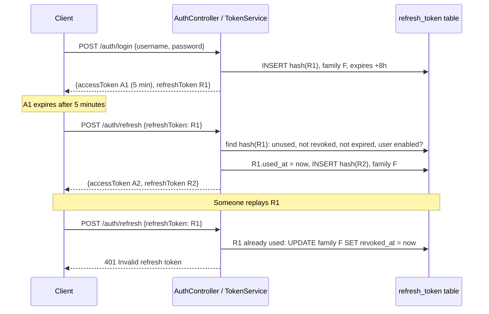

# Lesson 3B — Refresh Tokens

> **Short-lived passes, and a way to renew them that you can take away.**
> Lesson 3 ended with a problem: a token outlives a disabled account. The fix
> is to make access tokens short (5 minutes) and give the client a second,
> long-lived **refresh token** to get new ones. Unlike a JWT, a refresh token
> lives in the database, so it can be revoked.

```
POST /api/v1/auth/login     → { accessToken (JWT, 5 min), refreshToken (opaque, 8 h) }
POST /api/v1/auth/refresh   → { new accessToken, NEW refreshToken }   ← the old one is now dead
POST /api/v1/auth/logout    → 204, the refresh token and its family are revoked
```

| Duration | Builds on | You should know |
| --- | --- | --- |
| About 2 hours | [Lesson 3 — Tokens and JWT](03-jwt.md) | `TokenService`, `JwtEncoder`, `@Transactional` |

**Contents:** [Goals](#goals) · [Concepts](#concepts) · [Request flow](#request-flow) ·
[Upgrade checklist](#upgrade-checklist) · [Build it](#build-it) · [Try it](#try-it) ·
[Test it](#test-it) · [Common mistakes](#common-mistakes) · [Exercises](#exercises) ·
[Quiz](#quiz) · [Next lectures](#next-lectures)

---

## Goals

By the end of this lesson you can:

- Explain why access tokens should be short and refresh tokens long, and why only one of them can be revoked.
- Explain why a refresh token is an opaque random string, not a JWT, and why the database stores only its SHA-256 hash.
- Implement **rotation**: every refresh token works exactly once.
- Implement **reuse detection**: a second use of the same refresh token revokes the whole family.
- Implement logout, and say precisely what it does and doesn't end.
- Explain why `noRollbackFor` is essential here, and why the automated tests can't catch its absence.

### Lesson plan

| Time (min) | Activity |
| --- | --- |
| 0–20 | Concepts: two tokens, two lifetimes; opaque vs JWT; hash, rotation, families |
| 20–30 | Request flow: login, refresh, reuse, logout |
| 30–75 | Build it: table, entity, repository, `TokenService`, endpoints |
| 75–95 | Try it live: rotate, replay a stolen token, log out, disable |
| 95–120 | Tests, the `noRollbackFor` experiment, exercises, quiz |

---

## Concepts

### Two tokens, two jobs

| | Access token | Refresh token |
| --- | --- | --- |
| Looks like | JWT: `eyJhbGci…` | 43 random characters: `i4qh7uYFXtz2d45K-YX0_qx5…` |
| Sent to | Every API call, as `Authorization: Bearer` | Only `/auth/refresh` and `/auth/logout`, in the body |
| Lifetime | **5 minutes** | **8 hours** |
| Checked by | Signature and `exp`, no database | A row in `refresh_token` |
| Can be revoked? | **No**: it's valid until `exp` | **Yes**: set `revoked_at` |

A 5-minute access token that can't be revoked is fine, because it's gone in 5
minutes. An 8-hour token must be revocable, so it goes in the database. **Each
token's lifetime matches whether it can be revoked.**

This is the answer to Lesson 3's trade-off. A disabled user's refresh fails, so
the most they keep is one access-token lifetime: **5 minutes, not 30.**

### Why not make the refresh token a JWT too?

A JWT's selling point is that the server doesn't need to look it up. But a refresh
token *must* be looked up, to check it hasn't been revoked or used. A JWT would
add a readable payload and a signature, and buy nothing. So a refresh token is
just 32 random bytes from `SecureRandom`, base64url-encoded. It means nothing
without its database row.

### Store the hash, not the token

The table keeps `SHA-256(token)`, never the token. If someone steals a backup of
the database, they get hashes, which can't be sent to `/auth/refresh`.

> **Why SHA-256 here, when Lesson 1 insisted on BCrypt for passwords?**
> Passwords are short and guessable, so the hash must be slow to stop guessing.
> A refresh token is 256 random bits: guessing is hopeless, so slowness buys
> nothing. And we look the token up *by* its hash. That's impossible with BCrypt,
> which salts each hash differently.

### Rotation and reuse detection

**Rotation:** every refresh returns a *new* refresh token and marks the old one
`used_at`. Each refresh token works once.

**Reuse detection:** if a token that was already used arrives again, two parties
have held it. One is the real user, and one stole it. The server can't tell
which, so it revokes **every token in that family**, meaning every token
rotated from the same login. The thief is out; the real user logs in again.

```
login ──► R1 ──refresh──► R2 ──refresh──► R3        family a150c92e…
                                                     all share family_id
attacker replays R1  ──►  R1 is used  ──►  revoke R1, R2, R3  ──►  401
```

A real family from the demo database, after the smoke test replayed its first token:

```
  token_hash   | created  |   used   | revoked
---------------+----------+----------+----------
 cb080d7fe082… | 15:47:37 | 15:47:37 | 15:47:37     ← R1: used, then replayed
 77efea77f6e7… | 15:47:37 |          | 15:47:37     ← R2: revoked because R1 was replayed
```

### What logout does, precisely

`POST /auth/logout` revokes the refresh token and its family, so no new access
tokens can be obtained. **The current access token keeps working until it
expires, at most 5 minutes.** The client should also throw it away. Ask the
class: *is that acceptable for PIS?* The answer is the same trade-off as Lesson 3.

---

## Request flow



---

## Upgrade checklist

Starting from the end of Lesson 3.

| | File | Change |
| --- | --- | --- |
| ➕ | `db/migration/V6__create_refresh_token.sql` | New table |
| ➕ | `model/RefreshToken.java` | Entity plus `hash(...)` |
| ➕ | `repository/RefreshTokenRepository.java` | `findByTokenHash`, `revokeFamily` |
| ➕ | `exception/InvalidRefreshTokenException.java` | New |
| ➕ | `dto/RefreshRequest.java` | New |
| ✏️ | `dto/TokenResponse.java` | Add `refreshToken` |
| ✏️ | `config/JwtProperties.java` | Add `refreshExpiry` |
| ✏️ | `application.yml`, `application-test.yml` | `expiry: 5m` (main only), `refresh-expiry: 8h` |
| ✏️ | `service/TokenService.java` | `login`, `refresh`, `logout`, `issue` |
| ✏️ | `controller/AuthController.java` | `/refresh`, `/logout` |
| ✏️ | `config/SecurityConfig.java` | Permit `/auth/refresh` and `/auth/logout` |
| ✏️ | `exception/GlobalExceptionHandler.java` | `InvalidRefreshTokenException` → 401 |
| ➕ | `RefreshTokenTest.java` | New, 9 tests |

The test profile keeps `expiry: 30m`, so `JwtTest`'s `expiresIn == 1800` is unchanged.

---

## Build it

### 1 · The table

```sql
-- src/main/resources/db/migration/V6__create_refresh_token.sql
-- Refresh tokens: long-lived, so they must be revocable, so they live in the database.
--
-- token_hash is SHA-256 of the token, never the token itself: a leaked table
-- must not hand out working tokens.
-- family_id links every token produced by rotation from one login. If a token
-- that was already exchanged is presented again, the whole family is revoked.

CREATE TABLE refresh_token (
    id          UUID          PRIMARY KEY,
    token_hash  VARCHAR(64)   NOT NULL,
    user_id     UUID          NOT NULL REFERENCES app_user (id) ON DELETE CASCADE,
    family_id   UUID          NOT NULL,
    expires_at  TIMESTAMPTZ   NOT NULL,
    created_at  TIMESTAMPTZ   NOT NULL,
    used_at     TIMESTAMPTZ,              -- exchanged for a new pair (rotation)
    revoked_at  TIMESTAMPTZ,              -- logout, disabled account, or reuse detected
    CONSTRAINT uk_refresh_token_hash UNIQUE (token_hash)
);

CREATE INDEX idx_refresh_token_family ON refresh_token (family_id);
```

`VARCHAR(64)`: a SHA-256 digest is 32 bytes, which is 64 hex characters.

### 2 · The entity

```java
// model/RefreshToken.java
@Entity
@Table(name = "refresh_token", uniqueConstraints =
        @UniqueConstraint(name = "uk_refresh_token_hash", columnNames = "token_hash"))
@Data
@NoArgsConstructor(access = AccessLevel.PROTECTED)
@ToString(of = { "id", "familyId", "expiresAt" }) // never the hash, never the user graph
public class RefreshToken {

    @Id
    @GeneratedValue(strategy = GenerationType.UUID)
    private UUID id;

    @Column(name = "token_hash", nullable = false, length = 64)
    private String tokenHash;

    @ManyToOne(fetch = FetchType.LAZY, optional = false)
    @JoinColumn(name = "user_id")
    private AppUser user;

    @Column(name = "family_id", nullable = false)
    private UUID familyId;

    @Column(name = "expires_at", nullable = false)
    private Instant expiresAt;

    @Column(name = "created_at", nullable = false)
    private Instant createdAt;

    @Column(name = "used_at")
    private Instant usedAt;

    @Column(name = "revoked_at")
    private Instant revokedAt;

    public RefreshToken(String tokenHash, AppUser user, UUID familyId, Instant expiresAt) {
        this.tokenHash = tokenHash;
        this.user = user;
        this.familyId = familyId;
        this.expiresAt = expiresAt;
        this.createdAt = Instant.now();
    }

    /**
     * SHA-256, not BCrypt. The token is 256 random bits, so nobody can guess it
     * and a slow hash buys nothing; and we must look it up BY its hash, which a
     * salted BCrypt hash doesn't allow.
     */
    public static String hash(String token) {
        try {
            byte[] digest = MessageDigest.getInstance("SHA-256")
                    .digest(token.getBytes(StandardCharsets.UTF_8));
            return HexFormat.of().formatHex(digest);
        } catch (NoSuchAlgorithmException e) {
            throw new IllegalStateException("Every JVM has SHA-256", e);
        }
    }
}
```

It doesn't extend `Auditable`: nobody "edits" a refresh token, and its own
columns (`used_at`, `revoked_at`) are the audit trail.

### 3 · The repository

```java
// repository/RefreshTokenRepository.java
public interface RefreshTokenRepository extends JpaRepository<RefreshToken, UUID> {

    Optional<RefreshToken> findByTokenHash(String tokenHash);

    /** Kill every token that descends from one login. */
    @Modifying(flushAutomatically = true, clearAutomatically = true)
    @Query("UPDATE RefreshToken r SET r.revokedAt = :now WHERE r.familyId = :familyId AND r.revokedAt IS NULL")
    int revokeFamily(@Param("familyId") UUID familyId, @Param("now") Instant now);
}
```

A bulk `UPDATE` goes straight to the database and bypasses the entities Hibernate
has in memory. `flushAutomatically` writes pending changes first, and
`clearAutomatically` drops the stale in-memory copies afterwards.

### 4 · Supporting pieces

```java
// exception/InvalidRefreshTokenException.java
/** Unknown, expired, used, revoked, or belonging to a disabled account. The client can't tell which. */
public class InvalidRefreshTokenException extends RuntimeException {
    public InvalidRefreshTokenException() { super("Invalid refresh token"); }
}
```

```java
// dto/RefreshRequest.java
public record RefreshRequest(@NotBlank(message = "refresh token is required") String refreshToken) { }
```

```java
// dto/TokenResponse.java
public record TokenResponse(
        String accessToken,
        String tokenType,
        long expiresIn,
        String refreshToken
) { }
```

```java
// config/JwtProperties.java
/**
 * @param expiry        how long an access token (the JWT) lives
 * @param refreshExpiry how long a refresh token lives, if it is never used
 */
@ConfigurationProperties(prefix = "pis.security.jwt")
public record JwtProperties(String secret, Duration expiry, Duration refreshExpiry) { }
```

```yaml
# application.yml
    jwt:
      secret: ${JWT_SECRET}
      # Short, now that a refresh token can buy a new one: this is the longest
      # a disabled account or a stolen access token keeps working.
      expiry: 5m
      refresh-expiry: 8h
```

```yaml
# application-test.yml — keep expiry: 30m, add:
      refresh-expiry: 8h
```

```java
// exception/GlobalExceptionHandler.java — above the Exception handler
@ExceptionHandler(InvalidRefreshTokenException.class)
public ProblemDetail onInvalidRefreshToken(InvalidRefreshTokenException ex) {
    return problem(HttpStatus.UNAUTHORIZED, "Invalid refresh token",
            "The refresh token is invalid, expired or revoked. Log in again.", "invalid-refresh-token");
}
```

### 5 · `TokenService`: the heart of the lesson

```java
// service/TokenService.java
/**
 * Issues a pair at login: a short-lived JWT access token and a long-lived,
 * revocable refresh token. The refresh token buys a new pair, once.
 */
@RequiredArgsConstructor
@Service
public class TokenService {

    private static final SecureRandom RANDOM = new SecureRandom();

    private final AuthenticationManager authenticationManager;
    private final JwtEncoder jwtEncoder;
    private final JwtProperties properties;
    private final AppUserRepository users;
    private final RefreshTokenRepository refreshTokens;

    @Transactional
    public TokenResponse login(String username, String password) {
        // The same check as HTTP Basic: DatabaseUserDetailsService + BCrypt.
        // Wrong password, unknown user or disabled account throws AuthenticationException.
        Authentication auth = authenticationManager.authenticate(
                UsernamePasswordAuthenticationToken.unauthenticated(username, password));

        AppUser user = users.findByUsername(auth.getName()).orElseThrow();
        return issue(user, UUID.randomUUID());   // a new login starts a new family
    }

    /**
     * Rotation: every refresh token works exactly once. A second use means two
     * parties hold the same token, so one of them stole it. We can't tell
     * which, so the whole family dies and the real user logs in again.
     *
     * noRollbackFor: the revocation must be committed even though we then
     * throw. Without it, the exception rolls the revocation back.
     */
    @Transactional(noRollbackFor = InvalidRefreshTokenException.class)
    public TokenResponse refresh(String presented) {
        RefreshToken current = refreshTokens.findByTokenHash(RefreshToken.hash(presented))
                .orElseThrow(InvalidRefreshTokenException::new);
        Instant now = Instant.now();

        if (current.getUsedAt() != null) {                      // reuse: assume theft
            refreshTokens.revokeFamily(current.getFamilyId(), now);
            throw new InvalidRefreshTokenException();
        }
        if (current.getRevokedAt() != null || current.getExpiresAt().isBefore(now)) {
            throw new InvalidRefreshTokenException();
        }

        AppUser user = current.getUser();
        if (!user.isEnabled()) {                                // closes the Lesson 3 gap
            refreshTokens.revokeFamily(current.getFamilyId(), now);
            throw new InvalidRefreshTokenException();
        }

        current.setUsedAt(now);
        return issue(user, current.getFamilyId());
    }

    /** Ends this login everywhere it was refreshed. The access token lives on until it expires. */
    @Transactional
    public void logout(String presented) {
        // No error for an unknown token: logout should never tell a caller what exists.
        refreshTokens.findByTokenHash(RefreshToken.hash(presented))
                .ifPresent(token -> refreshTokens.revokeFamily(token.getFamilyId(), Instant.now()));
    }

    private TokenResponse issue(AppUser user, UUID familyId) {
        Instant now = Instant.now();

        // Roles are read from the database on every login AND every refresh,
        // so a role change reaches the user within one access-token lifetime.
        List<String> roles = user.getRoles().stream().map(Enum::name).sorted().toList();

        JwtClaimsSet claims = JwtClaimsSet.builder()
                .issuer("pis")
                .subject(user.getUsername())      // becomes Authentication.getName() on later requests
                .issuedAt(now)
                .expiresAt(now.plus(properties.expiry()))
                .claim("roles", roles)
                .build();

        // Without an explicit header Spring would pick RS256, which needs a private key we don't have.
        JwsHeader header = JwsHeader.with(MacAlgorithm.HS256).build();
        String accessToken = jwtEncoder.encode(JwtEncoderParameters.from(header, claims)).getTokenValue();

        // Opaque, not a JWT: it means nothing without a row in refresh_token.
        byte[] bytes = new byte[32];
        RANDOM.nextBytes(bytes);
        String refreshToken = Base64.getUrlEncoder().withoutPadding().encodeToString(bytes);
        refreshTokens.save(new RefreshToken(RefreshToken.hash(refreshToken), user, familyId,
                now.plus(properties.refreshExpiry())));

        return new TokenResponse(accessToken, "Bearer", properties.expiry().toSeconds(), refreshToken);
    }
}
```

Points to walk through with the class:

- **Order of checks in `refresh`.** "Used" comes first, because reuse is the
  dangerous case and must revoke the family even if the token has also expired.
- **`noRollbackFor`.** A `RuntimeException` normally rolls back the transaction,
  including the `revokeFamily` we just ran. Then the attacker's replay fails, but
  the family stays alive. [Exercise 2](#2--break-it-on-purpose--understanding) shows this live.
- **Roles are re-read at every refresh.** Change a user's roles, and they arrive
  within 5 minutes, without a new login.
- **`SecureRandom`**, never `Random`. `Random` is predictable.

### 6 · Endpoints and rules

```java
// controller/AuthController.java — add next to login
@Operation(summary = "Refresh",
           description = "Trade a refresh token for a new pair. Each refresh token works once. "
                   + "Send no Authorization header: the refresh token in the body is the credential.")
@PostMapping("/refresh")
public TokenResponse refresh(@Valid @RequestBody RefreshRequest request) {
    return tokenService.refresh(request.refreshToken());
}

@Operation(summary = "Log out", description = "Revokes the refresh token and every token rotated from it.")
@PostMapping("/logout")
@ResponseStatus(HttpStatus.NO_CONTENT)
public void logout(@Valid @RequestBody RefreshRequest request) {
    tokenService.logout(request.refreshToken());
}
```

```java
// config/SecurityConfig.java — replace the login permitAll line
// You can't need a token to get a token. For refresh and logout,
// the refresh token in the request body is the credential.
.requestMatchers(HttpMethod.POST, "/api/v1/auth/login",
        "/api/v1/auth/refresh", "/api/v1/auth/logout").permitAll()
```

`/refresh` must be public: it's called exactly when the access token has expired.

---

## Try it

Start the app. Note that `expiresIn` is now **300**.

**Log in and keep both tokens**

```bash
LOGIN=$(curl -s -X POST localhost:8080/api/v1/auth/login -H 'Content-Type: application/json' \
  -d '{"username":"officer","password":"officer123"}')
echo "$LOGIN" | jq '{tokenType, expiresIn, refreshToken}'
R1=$(echo "$LOGIN" | jq -r .refreshToken)
```
```json
{
  "tokenType": "Bearer",
  "expiresIn": 300,
  "refreshToken": "i4qh7uYFXtz2d45K-YX0_qx5t0YFjlJczVIgrrbli-o"
}
```

**Refresh: a new pair, and a different refresh token**

```bash
PAIR=$(curl -s -X POST localhost:8080/api/v1/auth/refresh -H 'Content-Type: application/json' \
  -d "{\"refreshToken\":\"$R1\"}")
R2=$(echo "$PAIR" | jq -r .refreshToken)
echo "R1=$R1"; echo "R2=$R2"
```

**Replay R1, the way an attacker who stole it would → `401`, and R2 dies too**

```bash
curl -s -X POST localhost:8080/api/v1/auth/refresh -H 'Content-Type: application/json' \
  -d "{\"refreshToken\":\"$R1\"}" | jq '{status, title}'
curl -s -o /dev/null -w '%{http_code}\n' -X POST localhost:8080/api/v1/auth/refresh \
  -H 'Content-Type: application/json' -d "{\"refreshToken\":\"$R2\"}"
```
```
{ "status": 401, "title": "Invalid refresh token" }
401
```

**Look at the table: no token anywhere, only hashes**

```bash
psql -d pmis -c "SELECT left(token_hash,12)||'…' AS token_hash, family_id, used_at IS NOT NULL AS used,
                        revoked_at IS NOT NULL AS revoked FROM refresh_token ORDER BY created_at DESC LIMIT 4;"
```

**Log out**

```bash
R3=$(curl -s -X POST localhost:8080/api/v1/auth/login -H 'Content-Type: application/json' \
  -d '{"username":"officer","password":"officer123"}' | jq -r .refreshToken)
curl -s -o /dev/null -w 'logout:  %{http_code}\n' -X POST localhost:8080/api/v1/auth/logout \
  -H 'Content-Type: application/json' -d "{\"refreshToken\":\"$R3\"}"
curl -s -o /dev/null -w 'refresh: %{http_code}\n' -X POST localhost:8080/api/v1/auth/refresh \
  -H 'Content-Type: application/json' -d "{\"refreshToken\":\"$R3\"}"
```
```
logout:  204
refresh: 401
```

The whole sequence, plus the disabled-account check, is in `smoke-lesson3b.sh`.

---

## Test it

`RefreshTokenTest`, 9 tests:

| Test | Expect |
| --- | --- |
| Login returns an opaque refresh token (43 characters, no dots) next to the JWT | 200 |
| The database has the hash, not the token | — |
| Refresh returns a new pair, and the new access token works | 200 |
| Replaying a used refresh token revokes the whole family | 401, 401 |
| Logout revokes the refresh token | 204, then 401 |
| A disabled account can't refresh | 401 |
| A role change arrives with the next refresh | new `roles` claim |
| An expired refresh token | 401 |
| An access token sent as a refresh token | 401 |

```java
@SpringBootTest
@AutoConfigureMockMvc
@ActiveProfiles("test")
@Transactional
class RefreshTokenTest {

    @Autowired MockMvc mvc;
    @Autowired AppUserRepository users;
    @Autowired RefreshTokenRepository refreshTokens;
    @Autowired PasswordEncoder encoder;

    /** accessToken and refreshToken from one response. */
    record Pair(String access, String refresh) { }

    @BeforeEach
    void createOfficer() {
        users.save(new AppUser("officer", encoder.encode("officer-pass"), "Test Officer", Set.of(Role.OFFICER)));
    }

    private Pair login() throws Exception {
        return pair(mvc.perform(post("/api/v1/auth/login")
                .contentType(MediaType.APPLICATION_JSON)
                .content("{ \"username\": \"officer\", \"password\": \"officer-pass\" }")));
    }

    private ResultActions refresh(String refreshToken) throws Exception {
        return mvc.perform(post("/api/v1/auth/refresh")
                .contentType(MediaType.APPLICATION_JSON)
                .content("{ \"refreshToken\": \"%s\" }".formatted(refreshToken)));
    }

    private static Pair pair(ResultActions result) throws Exception {
        String body = result.andExpect(status().isOk()).andReturn().getResponse().getContentAsString();
        return new Pair(JsonPath.read(body, "$.accessToken"), JsonPath.read(body, "$.refreshToken"));
    }

    private static String rolesIn(String accessToken) {
        String payload = new String(Base64.getUrlDecoder().decode(accessToken.split("\\.")[1]), StandardCharsets.UTF_8);
        return JsonPath.read(payload, "$.roles").toString();
    }

    @Test
    void login_returns_an_opaque_refresh_token_next_to_the_access_token() throws Exception {
        Pair tokens = login();

        assertThat(tokens.access()).contains(".");                 // a JWT: header.payload.signature
        assertThat(tokens.refresh()).doesNotContain(".").hasSize(43);  // 32 random bytes, base64url
    }

    @Test
    void the_refresh_token_is_stored_only_as_a_hash() throws Exception {
        Pair tokens = login();

        assertThat(refreshTokens.findByTokenHash(tokens.refresh())).isEmpty();
        assertThat(refreshTokens.findByTokenHash(RefreshToken.hash(tokens.refresh()))).isPresent();
    }

    @Test
    void refresh_returns_a_new_pair_that_works() throws Exception {
        Pair first = login();
        Pair second = pair(refresh(first.refresh()));

        assertThat(second.refresh()).isNotEqualTo(first.refresh());
        mvc.perform(get("/api/v1/users/me").header(HttpHeaders.AUTHORIZATION, "Bearer " + second.access()))
            .andExpect(status().isOk())
            .andExpect(jsonPath("$.username").value("officer"));
    }

    @Test
    void reusing_a_refresh_token_revokes_the_whole_family() throws Exception {
        Pair first = login();
        Pair second = pair(refresh(first.refresh()));      // first.refresh is now used

        refresh(first.refresh())                           // an attacker replays the old one
            .andExpect(status().isUnauthorized())
            .andExpect(jsonPath("$.title").value("Invalid refresh token"));

        refresh(second.refresh())                          // and the real user is logged out too
            .andExpect(status().isUnauthorized());
    }

    @Test
    void logout_revokes_the_refresh_token() throws Exception {
        Pair tokens = login();

        mvc.perform(post("/api/v1/auth/logout")
                .contentType(MediaType.APPLICATION_JSON)
                .content("{ \"refreshToken\": \"%s\" }".formatted(tokens.refresh())))
            .andExpect(status().isNoContent());

        refresh(tokens.refresh()).andExpect(status().isUnauthorized());
    }

    @Test
    void a_disabled_account_cannot_refresh() throws Exception {
        Pair tokens = login();
        users.findByUsername("officer").orElseThrow().setEnabled(false);
        users.flush();

        refresh(tokens.refresh()).andExpect(status().isUnauthorized());
    }

    @Test
    void a_role_change_arrives_with_the_next_refresh() throws Exception {
        Pair before = login();
        assertThat(rolesIn(before.access())).isEqualTo("[\"OFFICER\"]");

        users.findByUsername("officer").orElseThrow().getRoles().add(Role.APPROVER);
        users.flush();

        Pair after = pair(refresh(before.refresh()));
        assertThat(rolesIn(after.access())).isEqualTo("[\"APPROVER\",\"OFFICER\"]");
    }

    @Test
    void an_expired_refresh_token_is_rejected() throws Exception {
        AppUser officer = users.findByUsername("officer").orElseThrow();
        refreshTokens.save(new RefreshToken(RefreshToken.hash("expired-token"), officer, UUID.randomUUID(),
                Instant.now().minus(1, ChronoUnit.MINUTES)));

        refresh("expired-token").andExpect(status().isUnauthorized());
    }

    @Test
    void an_access_token_is_not_a_refresh_token() throws Exception {
        Pair tokens = login();

        refresh(tokens.access())
            .andExpect(status().isUnauthorized())
            .andExpect(jsonPath("$.detail", not(org.hamcrest.Matchers.containsString("SQL"))));
    }
}
```

Static imports: `assertThat`, `org.hamcrest.Matchers.not`, `MockMvcRequestBuilders.*`,
`MockMvcResultMatchers.*`.

```bash
mvn test
# SecurityTest 12 · UserApiTest 9 · JwtTest 9 · RefreshTokenTest 9 · SupplierApiTest 6 · InvoiceRepositoryTest 3
# Tests run: 48, Failures: 0, Errors: 0, Skipped: 0
```

> **A limit of these tests.** Each test runs inside one transaction that is rolled
> back at the end. So they can't tell whether `revokeFamily` would actually have
> been *committed*. A test that needs real commits needs a real server: that's
> what the smoke script is for. See Exercise 2.

---

## Common mistakes

<details>
<summary><b><code>/auth/refresh</code> returns 401 even with a valid refresh token</b></summary>

The client also sent its old, expired `Authorization: Bearer …` header. The
bearer filter tries to decode it *before* the `permitAll()` rule is considered,
and rejects the request. This is easy to reproduce:

```
with stale Bearer header: 401
without header:           200
```

Front ends that add the header to every request by default must skip it for
`/auth/refresh`, `/auth/login` and `/auth/logout`.
</details>

<details>
<summary><b>Reuse detection "works" but the real user stays logged in</b></summary>

`noRollbackFor = InvalidRefreshTokenException.class` is missing, so throwing the
exception rolled back the family revocation. See Exercise 2.
</details>

<details>
<summary><b>Storing the refresh token itself in the table</b></summary>

Then a database backup is a bag of working sessions. Store `RefreshToken.hash(token)`,
and look it up the same way.
</details>

<details>
<summary><b>Using <code>new Random()</code> to generate the token</b></summary>

`java.util.Random` is predictable from a few outputs. Always use `SecureRandom`.
</details>

<details>
<summary><b>Access token still works after logout</b></summary>

Correct behaviour: logout revokes the *refresh* token. The access token is a JWT
that nothing looks up, so it lives until `exp`. That's why it's only 5 minutes long.
</details>

<details>
<summary><b>The <code>refresh_token</code> table keeps growing</b></summary>

Every login and refresh adds a row. Delete rows whose `expires_at` has passed,
for example with a nightly `@Scheduled` job: `DELETE FROM refresh_token WHERE expires_at < now() - interval '7 days'`.
Keeping a week of dead rows helps when investigating an incident.
</details>

---

## Exercises

### 1 · Read the table — *warm-up*

Log in as officer twice, refresh once from the first login, then replay the
first refresh token. Query `refresh_token` and answer: how many families are
there? Which rows have `used_at`, which have `revoked_at`, and why?

<details>
<summary>Solution</summary>

Two families, one per login. Family 1 has two rows: R1 (used, then revoked when
it was replayed) and R2 (revoked, never used). Family 2 has one row: neither used
nor revoked, because the second login is untouched by the replay. **Reuse revokes
one family, not every session the user has.**
</details>

### 2 · Break it on purpose — *understanding*

Change `@Transactional(noRollbackFor = InvalidRefreshTokenException.class)` to
plain `@Transactional` on `refresh`.

1. Run `mvn test`. What happens?
2. Restart the app and run `smoke-lesson3b.sh`. What happens?
3. Explain the difference. Put it back afterwards.

<details>
<summary>Solution</summary>

1. **All 48 tests still pass.**
2. The smoke script fails one step:
   ```
   PASS  401  old refresh token used again (theft?)
   FAIL  200  ...so the newest one is revoked too (expected 401)
   ```
3. The exception rolls back the transaction, including `revokeFamily`. The replay
   is refused, but the family survives, so the thief can keep trying with any
   newer token they capture.

   The tests miss it because each test wraps everything in **one** transaction
   that only ends when the test does. The service joins it, and the revocation
   stays visible for the rest of the test even though the transaction is now
   marked for rollback. Only a real server, where each request commits on its
   own, shows the bug. That's why this course pairs unit tests with smoke scripts.
</details>

### 3 · Log out everywhere — *core*

Add `POST /api/v1/auth/logout-all`. It's authenticated with the **access token**,
has no body, and revokes every refresh token the user has, on every device. Test
it with two logins by `approver`.

<details>
<summary>Solution</summary>

```java
// RefreshTokenRepository
@Modifying(flushAutomatically = true, clearAutomatically = true)
@Query("UPDATE RefreshToken r SET r.revokedAt = :now WHERE r.user = :user AND r.revokedAt IS NULL")
int revokeAllFor(@Param("user") AppUser user, @Param("now") Instant now);
```

```java
// TokenService
@Transactional
public void logoutEverywhere(String username) {
    users.findByUsername(username).ifPresent(user -> refreshTokens.revokeAllFor(user, Instant.now()));
}
```

```java
// AuthController
@PostMapping("/logout-all")
@ResponseStatus(HttpStatus.NO_CONTENT)
public void logoutEverywhere(Authentication authentication) {
    tokenService.logoutEverywhere(authentication.getName());
}
```

```java
// SecurityConfig: right after the permitAll() line for login/refresh/logout
// Uses the access token: any logged-in user, whatever their role.
.requestMatchers(HttpMethod.POST, "/api/v1/auth/logout-all").authenticated()
```

**Try it without the `SecurityConfig` rule first.** The approver gets **403**:
the request falls through to `.requestMatchers("/api/v1/**").hasRole("OFFICER")`,
the general rule for writes. It's Lesson 1's rule-order lesson again.

```java
@Test
void logout_everywhere_revokes_every_session() throws Exception {
    String laptop = loginBody("approver", "approver-pass");
    String phone = loginBody("approver", "approver-pass");

    mvc.perform(post("/api/v1/auth/logout-all")
            .header(HttpHeaders.AUTHORIZATION, "Bearer " + JsonPath.read(phone, "$.accessToken")))
        .andExpect(status().isNoContent());

    assertThat(refreshStatus(JsonPath.read(laptop, "$.refreshToken"))).isEqualTo(401);
    assertThat(refreshStatus(JsonPath.read(phone, "$.refreshToken"))).isEqualTo(401);
}
```

`loginBody` returns the login response JSON, and `refreshStatus` returns the
status code of a refresh call. Write both as small helpers, like `login()` above.
</details>

### 4 · Discuss: where does the client keep the refresh token? — *discussion*

A mobile app can use the phone's secure storage. A browser has `localStorage`
(readable by any script on the page) or an `HttpOnly` cookie (invisible to
scripts, but sent automatically). List what each option protects against and
what it exposes. Which would you choose for a PIS web front end?

<details>
<summary>Discussion points</summary>

- `localStorage`: one XSS bug and the attacker can copy the refresh token and use
  it from anywhere for 8 hours. Reuse detection helps only if the real user
  refreshes first.
- `HttpOnly; Secure; SameSite=Strict` cookie scoped to `/api/v1/auth`: scripts
  can't read it. But the browser sends it automatically, so CSRF matters again
  for `/refresh` and `/logout`. `SameSite=Strict` removes most of that risk.
- A common pattern is to keep the access token in memory only, the refresh token
  in an `HttpOnly` cookie, and call `/refresh` on page load.
</details>

### 5 · A session that ends — *stretch*

Right now each refresh issues a new refresh token valid for **8 hours from now**.
A user who refreshes every few minutes is never asked to log in again: the
session never ends. Change it so that every token in a family expires **8 hours
after the original login**, however often it's rotated. Prove it with a test.

<details>
<summary>Solution</summary>

Pass the deadline into `issue` instead of computing it there:

```java
// login
return issue(user, UUID.randomUUID(), Instant.now().plus(properties.refreshExpiry()));

// refresh
current.setUsedAt(now);
return issue(user, current.getFamilyId(), current.getExpiresAt());   // the family keeps its deadline

// issue
private TokenResponse issue(AppUser user, UUID familyId, Instant refreshExpiresAt) {
    ...
    refreshTokens.save(new RefreshToken(RefreshToken.hash(refreshToken), user, familyId, refreshExpiresAt));
```

```java
@Test
void rotation_keeps_the_family_deadline() throws Exception {
    String first = JsonPath.read(loginBody("officer", "officer-pass"), "$.refreshToken");
    var deadline = refreshTokens.findByTokenHash(RefreshToken.hash(first)).orElseThrow().getExpiresAt();

    String body = mvc.perform(post("/api/v1/auth/refresh").contentType(MediaType.APPLICATION_JSON)
            .content("{ \"refreshToken\": \"%s\" }".formatted(first)))
        .andExpect(status().isOk()).andReturn().getResponse().getContentAsString();
    String second = JsonPath.read(body, "$.refreshToken");

    assertThat(refreshTokens.findByTokenHash(RefreshToken.hash(second)).orElseThrow().getExpiresAt())
        .isEqualTo(deadline);
}
```

This is the difference between a **sliding** session (the current code: stay
active and it never ends) and an **absolute** one (a full working day, then log
in again). For a procurement system, an absolute limit is the safer default.
</details>

---

## Quiz

**1. Why can the access token be a JWT, while the refresh token can't usefully be one?**\
a) JWTs are too long  b) The refresh token must be looked up anyway to check revocation, so a signed payload adds nothing  c) Spring doesn't support JWT refresh tokens

**2. The `refresh_token` table leaks. What can the attacker do?**\
a) Refresh as any user  b) Nothing directly: it holds SHA-256 hashes, and the endpoint needs the token itself  c) Read everyone's passwords

**3. Why SHA-256 for refresh tokens, but BCrypt for passwords?**\
a) SHA-256 is newer  b) The token is 256 random bits, so it can't be guessed, and it must be found by its hash  c) BCrypt can't hash long strings

**4. An old refresh token that was already used arrives again. What does PIS do?**\
a) Issues a new pair  b) Refuses it, and revokes every token in its family  c) Disables the user

**5. A user logs out. How long does their current access token keep working?**\
a) It stops immediately  b) Until its `exp`, at most 5 minutes  c) 8 hours

**6. Why does removing `noRollbackFor` not break any of the 48 tests?**\
a) The tests don't call `/refresh`  b) Each test runs in one transaction that's rolled back at the end, so the revocation stays visible inside the test either way  c) `noRollbackFor` does nothing

<details>
<summary>Answers</summary>

1. **b.** A JWT's benefit is skipping the lookup. A refresh token can't skip it.
2. **b.** Working tokens can't be reconstructed from the hashes.
3. **b.** Slowness protects guessable secrets. A random 256-bit token isn't guessable.
4. **b.** Two holders means one is a thief. Revoking the family locks out both.
5. **b.** Logout revokes the refresh token. Nothing looks up the access token.
6. **b.** Only a real server, committing each request, shows the difference.
</details>

---

## Next lectures

The PIS project now has everything a single application needs: users, roles,
an audit trail, access tokens and refresh tokens. **PIS issues its own tokens.**

The next three lectures move token issuing *out* of the application. Each one
is a separate project:

| Lecture | Who issues tokens | What PIS becomes |
| --- | --- | --- |
| **4 — Spring Authorization Server** | A second Spring Boot app you build | A pure resource server (RS256, public keys) |
| **5 — Keycloak** | An identity server in Docker | A resource server trusting Keycloak |
| **6 — Log in with Google / GitHub** | Google or GitHub | An OAuth2 *client* |
