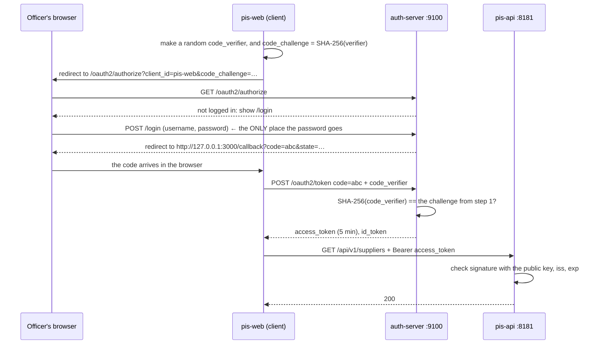
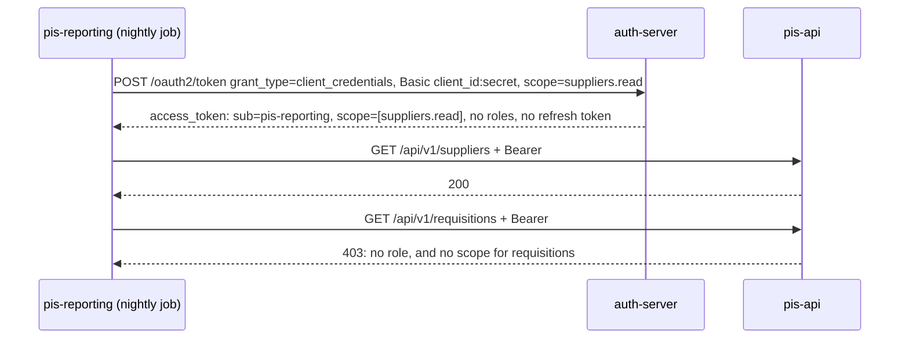

# Lecture 4 — OAuth2 with Spring Authorization Server

> **Take the keys away from the application.**
> Until now PIS checked passwords, kept users, and signed its own tokens. In this
> lecture a separate **authorization server** does all of that, and PIS becomes a
> **resource server**: it only checks tokens, using the authorization server's
> *public* key. PIS never sees a password again.

```
            ┌─────────────────────────┐         ┌──────────────────────────┐
 browser ──►│  auth-server  :9100     │         │  pis-api  :8181          │
 or job     │  users, clients, login  │ tokens  │  suppliers, requisitions │
            │  signs with PRIVATE key │────────►│  checks with PUBLIC key  │
            └─────────────────────────┘         └──────────────────────────┘
```

| Duration | Builds on | Project |
| --- | --- | --- |
| About 3 hours | Lessons 1–3B (the PIS security course) | `pis-lecture4-authorization-server/`, separate from PIS |

**Contents:** [Goals](#goals) · [Concepts](#concepts) · [The flows](#the-flows) ·
[The project](#the-project) · [Build the authorization server](#build-the-authorization-server) ·
[Turn PIS into a resource server](#turn-pis-into-a-resource-server) · [Try it](#try-it) ·
[Test it](#test-it) · [Common mistakes](#common-mistakes) · [Exercises](#exercises) ·
[Quiz](#quiz) · [Next lecture](#next-lecture)

---

## Goals

By the end of this lecture you can:

- Name the four OAuth2 roles and say which application plays each one in PIS.
- Choose the right grant: **authorization code + PKCE** for people, **client credentials** for machines.
- Explain what PKCE protects against, and why a browser app can't have a client secret.
- Tell a **scope** (what the *application* may do) from a **role** (what the *person* may do).
- Tell an **access token** (for APIs) from an **ID token** (OpenID Connect, for the client).
- Build an authorization server with Spring Authorization Server, and register clients.
- Turn an API into a resource server with one property: `issuer-uri`.
- Explain RS256, JWKS and `kid`, and what happens when the signing key changes.

### Lesson plan

| Time (min) | Activity |
| --- | --- |
| 0–25 | Concepts: why a separate server; the four roles; clients; scopes vs roles; tokens |
| 25–45 | The flows: authorization code + PKCE, client credentials, refresh |
| 45–95 | Build the authorization server |
| 95–120 | Turn PIS into a resource server |
| 120–150 | Try it: every flow with curl, and one login in a real browser |
| 150–180 | Tests, exercises, quiz |

---

## Concepts

### Why a separate server?

At the end of Lesson 3B, PIS did two jobs: it ran procurement, **and** it was an
identity provider (users, passwords, token signing, refresh tokens). That's fine
for one application. It stops being fine when:

| Situation | Problem with "every app does its own login" |
| --- | --- |
| A second system (inventory, HR) needs the same users | Two user tables, two passwords per person |
| A nightly reporting job needs PIS data | There's no *person* to log in as |
| A partner builds an app on top of PIS | You'd have to give them your users' passwords |
| One person leaves | Disable them in every system, one by one |

OAuth2 separates **who you are** (the authorization server) from **what you're
using** (the APIs). Every application trusts the same server.

### The four roles

| OAuth2 role | Meaning | In this lecture |
| --- | --- | --- |
| **Resource owner** | The person whose data or rights are being used | officer, approver, admin |
| **Client** | The application asking for a token | `pis-web`, `pis-bff`, `pis-reporting` |
| **Authorization server** | Logs people in, issues tokens | `auth-server` on port 9100 |
| **Resource server** | The API that accepts tokens | `pis-api` on port 8181 |

The word *client* trips people up: it means an **application**, not a person.

### Public and confidential clients

| Client | Where it runs | Can it keep a secret? | So it uses |
| --- | --- | --- | --- |
| `pis-web` | In the browser (JavaScript) | **No**: anyone can read the code | Authorization code + **PKCE**, no secret |
| `pis-bff` | On a server (backend-for-frontend) | Yes | Authorization code + PKCE + **client secret**; gets **refresh tokens** |
| `pis-reporting` | A nightly job, no user | Yes | **Client credentials** |

### Scopes and roles are different things

| | Scope | Role |
| --- | --- | --- |
| Answers | What may this **application** do? | What may this **person** do? |
| Set by | The client registration, and what the user agrees to | The person's account |
| In the token | `"scope": ["suppliers.read"]` | `"roles": ["OFFICER"]` (our own claim) |
| In Spring | `SCOPE_suppliers.read` | `ROLE_OFFICER` |

The reporting job has a scope and no roles: there's no person. An officer using
`pis-web` has both. PIS checks both.

### Two kinds of token, two audiences

| | Access token | ID token (OpenID Connect) |
| --- | --- | --- |
| For | The **API** (resource server) | The **client** application |
| Says | "The bearer may do X" | "This person logged in, at this time" |
| Sent to PIS? | Yes, as `Authorization: Bearer` | **Never** |
| Has `roles` here? | Yes | No |

Real claims from this project, after the officer logged in through `pis-web`:

```json
// access token
{"sub":"officer","aud":"pis-web","scope":["openid","profile","pis"],"roles":["OFFICER"],
 "iss":"http://localhost:9100","exp":1790258674,"iat":1790258374,"jti":"3c6399b5-…"}

// ID token
{"sub":"officer","aud":"pis-web","azp":"pis-web","auth_time":1790258374,
 "iss":"http://localhost:9100","exp":1790260174,"iat":1790258374,"sid":"8hnyf-…"}
```

### RS256, JWKS and `kid`

Lesson 3 used **HS256**: one shared secret, held by whoever signs *and* whoever
checks. With several APIs that would mean copying the secret everywhere, and
every API could then *mint* tokens.

This lecture uses **RS256**, which uses a key pair:

- the **private** key signs tokens, and never leaves `auth-server`;
- the **public** key checks them, and is published for anyone at `/oauth2/jwks`;
- every token's header carries a **`kid`** (key ID), saying which key signed it.

`pis-api` downloads the public keys once, caches them, and downloads again only
when a token arrives with a `kid` it doesn't know. PIS can **check** tokens but
can never **create** one.

---

## The flows

### Authorization code + PKCE: a person logs in



**What PKCE protects against:** the code travels through the browser, so it can
leak through browser history, logs, or a malicious app on a phone. Without PKCE,
whoever steals the code can exchange it. With PKCE, the exchange also needs the
`code_verifier`, which never left the real client.

### Client credentials: a machine, no person



### Refresh: the same idea as Lesson 3B, done by the server

`pis-bff` gets a refresh token. Rotation is on (`reuseRefreshTokens(false)`):
each refresh token works once, just as you built by hand in Lesson 3B. The
difference is that you don't write it any more; you configure it.

---

## The project

```
pis-lecture4-authorization-server/
├── auth-server/                        Spring Authorization Server, :9100
│   └── src/main/java/tz/co/hmy/auth/
│       ├── AuthServerApplication.java
│       └── config/
│           ├── AuthProperties.java     pis.auth.* from application.yml
│           ├── SecurityConfig.java     two filter chains, users, password encoder
│           ├── ClientConfig.java       the three registered clients
│           └── TokenConfig.java        RSA key, issuer, the "roles" claim
├── pis-api/                            PIS as a resource server, :8181
├── smoke/smoke-lecture4.sh             every flow, with curl
└── LECTURE.md                          this file
```

`pis-api` is the finished PIS from Lesson 3B with its login machinery **removed**:

| Removed from PIS | Now done by |
| --- | --- |
| `AppUser`, `app_user` tables, `DatabaseUserDetailsService`, `UserController`, `AdminAccountInitializer` | auth-server's users |
| `AuthController`, `TokenService`, `JwtConfig`, `JWT_SECRET` | auth-server's `/oauth2/token` and RSA key |
| `RefreshToken`, `refresh_token` table | auth-server's refresh tokens |
| HTTP Basic | Nothing: PIS accepts only Bearer tokens |

What stays: every `hasRole(...)` rule, the problem-detail errors, and
`created_by`, which is now the token's `sub`.

---

## Build the authorization server

### 1 · Dependencies

```xml
<!-- auth-server/pom.xml -->
<dependency>
    <groupId>org.springframework.boot</groupId>
    <artifactId>spring-boot-starter-oauth2-authorization-server</artifactId>
</dependency>
<dependency>
    <groupId>org.springframework.boot</groupId>
    <artifactId>spring-boot-starter-web</artifactId>
</dependency>
<dependency>
    <groupId>org.springframework.boot</groupId>
    <artifactId>spring-boot-starter-actuator</artifactId>
</dependency>
<dependency>
    <groupId>me.paulschwarz</groupId>
    <artifactId>spring-dotenv</artifactId>
    <version>4.0.0</version>
</dependency>
```

### 2 · Configuration

```yaml
# auth-server/src/main/resources/application.yml
server:
  port: ${SERVER_PORT:9100}

pis:
  auth:
    # The "iss" claim in every token. Resource servers must use exactly this URL.
    issuer: ${AUTH_ISSUER:http://localhost:9100}
    users:
      officer-password: ${OFFICER_PASSWORD}
      approver-password: ${APPROVER_PASSWORD}
      admin-password: ${ADMIN_PASSWORD}
    clients:
      bff-secret: ${PIS_BFF_SECRET}
      reporting-secret: ${PIS_REPORTING_SECRET}
      # Where the browser is sent back with the authorization code.
      redirect-uri: ${PIS_REDIRECT_URI:http://127.0.0.1:3000/callback}
```

```bash
# auth-server/.env
OFFICER_PASSWORD=officer123
APPROVER_PASSWORD=approver123
ADMIN_PASSWORD=admin123
PIS_BFF_SECRET=bff-secret-123
PIS_REPORTING_SECRET=reporting-secret-123
```

```java
// config/AuthProperties.java
@ConfigurationProperties(prefix = "pis.auth")
public record AuthProperties(String issuer, Users users, Clients clients) {

    public record Users(String officerPassword, String approverPassword, String adminPassword) { }

    public record Clients(String bffSecret, String reportingSecret, String redirectUri) { }
}
```

`AuthServerApplication` carries `@ConfigurationPropertiesScan` so this record is picked up.

> **Why `127.0.0.1` and not `localhost` in the redirect URI?** OAuth 2.1 guidance
> for local apps is to use the loopback IP: `localhost` can be re-pointed in a
> hosts file, `127.0.0.1` can't.

### 3 · Two filter chains

```java
// config/SecurityConfig.java
/**
 * Two filter chains, checked in @Order:
 *
 *   1. The OAuth2 endpoints: /oauth2/authorize, /oauth2/token, /oauth2/jwks,
 *      /.well-known/openid-configuration, /userinfo ... built by Spring Authorization Server.
 *   2. Everything else, mainly the login page where a person types their password.
 *
 * This server is the ONLY place a user's password is ever typed or checked.
 * PIS never sees it; PIS only sees tokens this server signed.
 */
@Configuration
public class SecurityConfig {

    @Bean
    @Order(1)
    public SecurityFilterChain authorizationServerChain(HttpSecurity http) throws Exception {
        OAuth2AuthorizationServerConfigurer authorizationServer =
                OAuth2AuthorizationServerConfigurer.authorizationServer();

        http
                .securityMatcher(authorizationServer.getEndpointsMatcher())
                .with(authorizationServer, server -> server
                        .oidc(Customizer.withDefaults()))     // OpenID Connect: id_token, /userinfo, discovery
                .authorizeHttpRequests(auth -> auth.anyRequest().authenticated())
                // A browser that isn't logged in yet is sent to the login page,
                // and comes back to /oauth2/authorize afterwards.
                .exceptionHandling(ex -> ex.defaultAuthenticationEntryPointFor(
                        new LoginUrlAuthenticationEntryPoint("/login"), browsersOnly()));
        return http.build();
    }

    /**
     * Requests that explicitly ask for HTML. curl and most API clients send
     * "Accept: *\/*", which would otherwise match too, and they would get a 302
     * to an HTML login page instead of a 401 they can act on.
     */
    private static MediaTypeRequestMatcher browsersOnly() {
        MediaTypeRequestMatcher matcher = new MediaTypeRequestMatcher(MediaType.TEXT_HTML);
        matcher.setIgnoredMediaTypes(Set.of(MediaType.ALL));
        return matcher;
    }

    @Bean
    @Order(2)
    public SecurityFilterChain loginChain(HttpSecurity http) throws Exception {
        http
                .authorizeHttpRequests(auth -> auth
                        .requestMatchers("/actuator/health").permitAll()
                        .anyRequest().authenticated())
                // Spring's built-in login page. It has CSRF protection, because here
                // a browser with a session cookie really is involved.
                .formLogin(Customizer.withDefaults());
        return http.build();
    }

    /**
     * The same three users as PIS Lesson 1. Kept in memory so this lecture
     * stays about OAuth2; Lesson 2's app_user table would plug in here instead.
     */
    @Bean
    public UserDetailsService users(AuthProperties properties, PasswordEncoder encoder) {
        AuthProperties.Users u = properties.users();
        return new InMemoryUserDetailsManager(
                User.withUsername("officer").password(encoder.encode(u.officerPassword()))
                        .roles("OFFICER").build(),
                User.withUsername("approver").password(encoder.encode(u.approverPassword()))
                        .roles("APPROVER").build(),
                User.withUsername("admin").password(encoder.encode(u.adminPassword()))
                        .roles("ADMIN", "APPROVER", "OFFICER").build());
    }

    @Bean
    public PasswordEncoder passwordEncoder() {
        return PasswordEncoderFactories.createDelegatingPasswordEncoder();
    }
}
```

> **The `browsersOnly()` matcher came from a real bug** found while building
> this lecture. Without `setIgnoredMediaTypes(Set.of(MediaType.ALL))`, curl's
> `Accept: */*` counts as "wants HTML". A client calling `/oauth2/token` with a
> missing secret then got a **302 to the login page** instead of a **401**.

### 4 · Registered clients

```java
// config/ClientConfig.java
/**
 * Every application allowed to ask for tokens must be registered here first.
 * Three clients, one of each kind OAuth2 cares about:
 *
 *   pis-web        a browser app. It can't keep a secret (anyone can read its
 *                  JavaScript), so it is PUBLIC and must use PKCE instead.
 *   pis-bff        a backend-for-frontend: server code, so it CAN keep a secret.
 *                  Confidential clients also get refresh tokens.
 *   pis-reporting  a nightly job with no user at all: client credentials.
 */
@Configuration
public class ClientConfig {

    @Bean
    public RegisteredClientRepository registeredClients(AuthProperties properties, PasswordEncoder encoder) {
        AuthProperties.Clients c = properties.clients();

        // Short access tokens, like Lesson 3B. Refresh tokens rotate: each works once.
        TokenSettings userTokens = TokenSettings.builder()
                .accessTokenTimeToLive(Duration.ofMinutes(5))
                .refreshTokenTimeToLive(Duration.ofHours(8))
                .reuseRefreshTokens(false)
                .build();

        RegisteredClient web = RegisteredClient.withId(UUID.randomUUID().toString())
                .clientId("pis-web")
                .clientAuthenticationMethod(ClientAuthenticationMethod.NONE)   // public: no secret
                .authorizationGrantType(AuthorizationGrantType.AUTHORIZATION_CODE)
                .redirectUri(c.redirectUri())
                .scope(OidcScopes.OPENID)
                .scope(OidcScopes.PROFILE)
                .scope("pis")
                .clientSettings(ClientSettings.builder()
                        .requireProofKey(true)                    // PKCE is mandatory
                        .requireAuthorizationConsent(false)       // our own app: no "allow access?" screen
                        .build())
                .tokenSettings(userTokens)
                .build();

        RegisteredClient bff = RegisteredClient.withId(UUID.randomUUID().toString())
                .clientId("pis-bff")
                .clientSecret(encoder.encode(c.bffSecret()))       // stored hashed, like a password
                .clientAuthenticationMethod(ClientAuthenticationMethod.CLIENT_SECRET_BASIC)
                .authorizationGrantType(AuthorizationGrantType.AUTHORIZATION_CODE)
                .authorizationGrantType(AuthorizationGrantType.REFRESH_TOKEN)
                .redirectUri(c.redirectUri())
                .scope(OidcScopes.OPENID)
                .scope(OidcScopes.PROFILE)
                .scope("pis")
                .clientSettings(ClientSettings.builder()
                        .requireProofKey(true)                    // PKCE for confidential clients too (OAuth 2.1)
                        .requireAuthorizationConsent(false)
                        .build())
                .tokenSettings(userTokens)
                .build();

        RegisteredClient reporting = RegisteredClient.withId(UUID.randomUUID().toString())
                .clientId("pis-reporting")
                .clientSecret(encoder.encode(c.reportingSecret()))
                .clientAuthenticationMethod(ClientAuthenticationMethod.CLIENT_SECRET_BASIC)
                .authorizationGrantType(AuthorizationGrantType.CLIENT_CREDENTIALS)
                .scope("suppliers.read")                          // this job may only read suppliers
                .tokenSettings(TokenSettings.builder()
                        .accessTokenTimeToLive(Duration.ofMinutes(5))
                        .build())
                .build();

        return new InMemoryRegisteredClientRepository(web, bff, reporting);
    }
}
```

Notice that the same `PasswordEncoder` hashes both **user passwords** and
**client secrets**. A client secret *is* a password, for an application.

### 5 · Keys, issuer and the `roles` claim

```java
// config/TokenConfig.java
/**
 * RS256: the PRIVATE key signs tokens and never leaves this server. The PUBLIC
 * key is published at /oauth2/jwks, and every resource server fetches it from
 * there to check signatures. Compare Lesson 3: one shared HS256 secret that
 * both sides had to hold.
 */
@Configuration
public class TokenConfig {

    /**
     * A new key pair on every start, so every restart invalidates every token.
     * Fine for a lecture; production loads a stored key and rotates it on a schedule.
     */
    @Bean
    public JWKSource<SecurityContext> jwkSource() {
        KeyPair keyPair = generateRsaKey();
        RSAKey rsaKey = new RSAKey.Builder((RSAPublicKey) keyPair.getPublic())
                .privateKey((RSAPrivateKey) keyPair.getPrivate())
                .keyID(UUID.randomUUID().toString())             // "kid": which key signed this token
                .build();
        return new ImmutableJWKSet<>(new JWKSet(rsaKey));
    }

    /** Used by the OpenID Connect /userinfo endpoint to read the access token. */
    @Bean
    public JwtDecoder jwtDecoder(JWKSource<SecurityContext> jwkSource) {
        return OAuth2AuthorizationServerConfiguration.jwtDecoder(jwkSource);
    }

    @Bean
    public AuthorizationServerSettings authorizationServerSettings(AuthProperties properties) {
        return AuthorizationServerSettings.builder().issuer(properties.issuer()).build();
    }

    /**
     * Adds "roles": ["OFFICER"] to access tokens issued for a PERSON, so PIS's
     * hasRole(...) rules from Lesson 1 keep working. Machine tokens (client
     * credentials) have no user and therefore no roles, only scopes.
     */
    @Bean
    public OAuth2TokenCustomizer<JwtEncodingContext> rolesClaim() {
        return context -> {
            if (!OAuth2TokenType.ACCESS_TOKEN.equals(context.getTokenType())) {
                return;
            }
            List<String> roles = context.getPrincipal().getAuthorities().stream()
                    .map(GrantedAuthority::getAuthority)
                    .filter(authority -> authority.startsWith("ROLE_"))
                    .map(authority -> authority.substring("ROLE_".length()))
                    .sorted()
                    .toList();
            if (!roles.isEmpty()) {
                context.getClaims().claim("roles", roles);
            }
        };
    }

    private static KeyPair generateRsaKey() {
        try {
            KeyPairGenerator generator = KeyPairGenerator.getInstance("RSA");
            generator.initialize(2048);
            return generator.generateKeyPair();
        } catch (NoSuchAlgorithmException e) {
            throw new IllegalStateException(e);
        }
    }
}
```

> **"Every restart invalidates every token" is only half true.** `pis-api`
> caches the public key. An old token keeps working until `pis-api` meets a token
> with a new `kid` and downloads the keys again. See [Exercise 4](#4--rotate-the-key--understanding).

---

## Turn PIS into a resource server

### 1 · One property replaces a whole lesson

```yaml
# pis-api/src/main/resources/application.yml
spring:
  security:
    oauth2:
      resourceserver:
        jwt:
          # The only place PIS names its authorization server. Spring reads
          # <issuer>/.well-known/openid-configuration, finds the public keys
          # (jwks_uri), and rejects any token whose "iss" is different.
          issuer-uri: ${AUTH_ISSUER:http://localhost:9100}
```

That replaces Lesson 3's `JwtConfig`, `JwtProperties` and `JWT_SECRET`. PIS has
**no secret at all** now: a public key isn't a secret.

### 2 · `SecurityConfig`: roles and scopes

```java
// pis-api/src/main/java/tz/co/hmy/pis/config/SecurityConfig.java
@Bean
public SecurityFilterChain filterChain(HttpSecurity http) throws Exception {
    return http
            .csrf(AbstractHttpConfigurer::disable)
            .sessionManagement(s -> s.sessionCreationPolicy(SessionCreationPolicy.STATELESS))

            // First match wins, as in every lesson so far.
            .authorizeHttpRequests(auth -> auth
                    .requestMatchers("/actuator/health", "/swagger-ui.html", "/swagger-ui/**",
                            "/v3/api-docs/**").permitAll()

                    // Who is this token for? Users and machine clients alike.
                    .requestMatchers(HttpMethod.GET, "/api/v1/me").authenticated()

                    .requestMatchers(HttpMethod.POST, "/api/v1/requisitions/*/approve",
                            "/api/v1/requisitions/*/reject").hasRole("APPROVER")
                    .requestMatchers(HttpMethod.PATCH, "/api/v1/suppliers/*/status").hasRole("APPROVER")
                    .requestMatchers(HttpMethod.DELETE, "/api/v1/**").hasRole("ADMIN")

                    // Reading suppliers: any PIS user, or a machine client granted
                    // the suppliers.read scope (the nightly reporting job).
                    .requestMatchers(HttpMethod.GET, "/api/v1/suppliers/**")
                            .hasAnyAuthority("ROLE_OFFICER", "ROLE_APPROVER", "ROLE_ADMIN", "SCOPE_suppliers.read")
                    // Everything else to read: people only.
                    .requestMatchers(HttpMethod.GET, "/api/v1/**").hasAnyRole("OFFICER", "APPROVER", "ADMIN")
                    .requestMatchers("/api/v1/**").hasRole("OFFICER")

                    .anyRequest().denyAll())

            .oauth2ResourceServer(rs -> rs
                    .jwt(jwt -> jwt.jwtAuthenticationConverter(jwtAuthenticationConverter()))
                    .authenticationEntryPoint(problemHandler)
                    .accessDeniedHandler(problemHandler))
            .exceptionHandling(ex -> ex
                    .authenticationEntryPoint(problemHandler)
                    .accessDeniedHandler(problemHandler))
            .build();
}

/**
 * Two kinds of permission arrive in a token, and PIS uses both:
 *   "roles": ["OFFICER"]          what the PERSON may do    → ROLE_OFFICER
 *   "scope": "suppliers.read"     what the CLIENT was granted → SCOPE_suppliers.read
 */
private JwtAuthenticationConverter jwtAuthenticationConverter() {
    JwtGrantedAuthoritiesConverter scopes = new JwtGrantedAuthoritiesConverter();   // "scope" → SCOPE_x

    JwtGrantedAuthoritiesConverter roles = new JwtGrantedAuthoritiesConverter();
    roles.setAuthoritiesClaimName("roles");
    roles.setAuthorityPrefix("ROLE_");

    Converter<Jwt, Collection<GrantedAuthority>> both = jwt -> {
        Collection<GrantedAuthority> authorities = new ArrayList<>(scopes.convert(jwt));
        authorities.addAll(roles.convert(jwt));
        return authorities;
    };

    JwtAuthenticationConverter converter = new JwtAuthenticationConverter();
    converter.setJwtGrantedAuthoritiesConverter(both);
    return converter;
}
```

One rule changed from Lesson 1: "any `GET` needs any logged-in user" became
"any `GET` needs a **person**". Otherwise the reporting job, which *is*
authenticated, could read every requisition. **Authenticated no longer means
"a person".**

### 3 · "Who am I?" comes from the token

PIS has no users table any more, so `/api/v1/me` reports what the token says:

```java
// pis-api/src/main/java/tz/co/hmy/pis/controller/MeController.java
@GetMapping
public Map<String, Object> me(@AuthenticationPrincipal Jwt jwt, JwtAuthenticationToken authentication) {
    Map<String, Object> me = new LinkedHashMap<>();
    me.put("subject", jwt.getSubject());                        // username, or client id for a machine
    me.put("client", jwt.getClaimAsStringList("aud"));          // which application asked for the token
    me.put("issuer", jwt.getClaimAsString("iss"));
    me.put("expiresAt", jwt.getExpiresAt());
    me.put("authorities", authentication.getAuthorities().stream()
            .map(GrantedAuthority::getAuthority).sorted().toList());
    return me;
}
```

```json
{"subject":"officer","client":["pis-web"],"issuer":"http://localhost:9100",
 "authorities":["ROLE_OFFICER","SCOPE_openid","SCOPE_pis","SCOPE_profile"]}

{"subject":"pis-reporting","client":["pis-reporting"],"issuer":"http://localhost:9100",
 "authorities":["SCOPE_suppliers.read"]}
```

`AuditorAware` from Lesson 2 is unchanged. It still uses `Authentication.getName()`,
which is the token's `sub`, so `created_by` is `officer`.

### 4 · Smaller changes

- `ProblemDetailSecurityHandler`: the Basic branch is gone. A 401 with no token
  now says `WWW-Authenticate: Bearer`.
- `GlobalExceptionHandler`: the login and refresh-token handlers are gone.
- `OpenApiConfig`: only the `bearerAuth` scheme.
- Migrations: `V4__create_app_user` and `V6__create_refresh_token` are gone, and
  the audit-columns migration is renumbered `V4`. This is a **new** project with
  its own database (`pmis_oauth`). Never renumber migrations in a database that
  has already run them.

---

## Try it

Start `auth-server`, then `pis-api` (see the project README).

### Client credentials: the reporting job

```bash
TOKEN=$(curl -s -u pis-reporting:reporting-secret-123 \
  -d grant_type=client_credentials -d scope=suppliers.read \
  localhost:9100/oauth2/token | jq -r .access_token)

curl -s -H "Authorization: Bearer $TOKEN" localhost:8181/api/v1/me | jq -c
curl -s -o /dev/null -w 'suppliers:    %{http_code}\n' -H "Authorization: Bearer $TOKEN" localhost:8181/api/v1/suppliers
curl -s -o /dev/null -w 'requisitions: %{http_code}\n' -H "Authorization: Bearer $TOKEN" localhost:8181/api/v1/requisitions
```
```
{"subject":"pis-reporting","client":["pis-reporting"],"issuer":"http://localhost:9100",...,"authorities":["SCOPE_suppliers.read"]}
suppliers:    200
requisitions: 403
```

### Authorization code + PKCE, in a real browser

This is the flow students should *see* once, with their own eyes.

**1. Make a PKCE pair** (the client's job):

```bash
VERIFIER=$(openssl rand -base64 48 | tr -d '=+/\n' | cut -c1-64)
CHALLENGE=$(printf '%s' "$VERIFIER" | openssl dgst -sha256 -binary | base64 | tr '/+' '_-' | tr -d '=\n')
echo "http://localhost:9100/oauth2/authorize?response_type=code&client_id=pis-web&redirect_uri=http://127.0.0.1:3000/callback&scope=openid%20profile%20pis&state=xyz&code_challenge=$CHALLENGE&code_challenge_method=S256"
```

**2. Open the printed URL in a browser.** You get the auth server's login page.
Log in as `officer` / `officer123`.

**3. The browser is sent to `http://127.0.0.1:3000/callback?code=…&state=xyz`.**
Nothing runs on port 3000, so the page fails to load. That's fine: **the code is
in the address bar.** Copy it.

**4. Exchange the code** (the client's job again), within a few minutes:

```bash
CODE=paste-the-code-here
curl -s -d grant_type=authorization_code -d "code=$CODE" \
  -d redirect_uri=http://127.0.0.1:3000/callback -d client_id=pis-web \
  -d "code_verifier=$VERIFIER" localhost:9100/oauth2/token | jq
```

**5. Use it:**

```bash
AT=paste-the-access_token-here
curl -s -H "Authorization: Bearer $AT" localhost:8181/api/v1/me | jq -c
```

Ask the class: **where did the password go?** Only to port 9100. `pis-api`
never saw it, and neither did the code in the address bar.

### Every flow at once

`smoke/smoke-lecture4.sh` does all of the above with curl, including the login
form (it keeps a cookie jar and posts the CSRF token like a browser would):

```
--- the authorization server
PASS  200  discovery document
PASS  200  public keys (JWKS)
--- client credentials: the reporting job, no user
PASS       reporting token: "sub":"pis-reporting" "scope":["suppliers.read"]
PASS  200  reporting job reads suppliers
PASS  403  reporting job cannot read requisitions
PASS  401  wrong client secret
--- authorization code + PKCE: pis-web, a public browser app
PASS       officer logged in, got code 44Tb_GFt-ohY…
PASS  400  code with the WRONG PKCE verifier
PASS       officer token: "sub":"officer" "roles":["OFFICER"]
PASS       id_token issued (OpenID Connect)
PASS       no refresh token for a public client
PASS  200  /userinfo on the auth server
--- pis-api trusts the auth server's token
PASS  401  no token
PASS  401  Basic auth is gone
PASS  200  /me
PASS  200  officer reads requisitions
PASS  403  officer cannot approve
PASS  201  new supplier createdBy = officer (the token's sub)
--- authorization code + PKCE + secret: pis-bff, which gets refresh tokens
PASS       confidential client got a refresh token
PASS  404  approver can approve
PASS       refresh returned a NEW refresh token (rotation)
PASS  400  old refresh token again
PASS  401  refresh without the client secret
--- a replayed code: the auth server revokes, PIS doesn't notice
PASS  400  the same code a second time
PASS  401  ...so the auth server revoked its token
PASS  200  ...but PIS still accepts it (JWT: signature only)
--- a token from somewhere else
PASS  401  officer token edited to ADMIN
```

> **Discuss the "replayed code" section with the class.** Using an authorization
> code twice is a sign of theft, so the auth server revokes the tokens that code
> produced, and its own `/userinfo` refuses them. **PIS still accepts the token**,
> because PIS only checks the signature and the expiry. It's the same trade-off as
> Lesson 3, now between two servers. The fixes are also the same: short access
> tokens, or asking the auth server on every request (token *introspection*,
> `/oauth2/introspect`), which costs a network call per request.

---

## Test it

**auth-server, `AuthServerTest`: 8 tests, no browser needed.**

| Test | Expect |
| --- | --- |
| Discovery document lists issuer, token endpoint, JWKS | 200 |
| JWKS has the public key (`n`) and **not** the private key (`d`) | 200 |
| Reporting client gets a token: `sub=pis-reporting`, scope, no roles, no refresh token | 200 |
| Wrong client secret | 401 `invalid_client` |
| Reporting client asks for a scope it wasn't given | 400 `invalid_scope` |
| `pis-web` without a PKCE challenge | 302 back to the app with `error=invalid_request` |
| Unregistered `redirect_uri` is never redirected to | 400, no `Location` |
| A correct request sends the browser to the login page | 302 to `/login` |

```java
@Test
void the_public_key_is_published_and_the_private_key_is_not() throws Exception {
    mvc.perform(get("/oauth2/jwks"))
        .andExpect(status().isOk())
        .andExpect(jsonPath("$.keys[0].kty").value("RSA"))
        .andExpect(jsonPath("$.keys[0].n").exists())      // public modulus
        .andExpect(jsonPath("$.keys[0].d").doesNotExist()); // private exponent: never
}

/*
 * /oauth2/authorize reads its parameters from the QUERY STRING. MockMvc's
 * .param(...) on a GET doesn't put them there, so they go in a URI template,
 * which also encodes the space in "openid pis" correctly.
 */
private static final String AUTHORIZE = "/oauth2/authorize?response_type=code&client_id=pis-web"
        + "&redirect_uri={redirect}&scope={scope}&state=s1";
private static final String CHALLENGE =
        "&code_challenge=E9Melhoa2OwvFrEMTJguCHaoeK1t8URWbuGJSstw-cM&code_challenge_method=S256";

@Test
void the_browser_client_must_use_pkce() throws Exception {
    // No code_challenge. The redirect_uri is registered, so the error is sent back to the app.
    mvc.perform(get(AUTHORIZE, "http://127.0.0.1:3000/callback", "openid pis"))
        .andExpect(status().is3xxRedirection())
        .andExpect(header().string(HttpHeaders.LOCATION, startsWith("http://127.0.0.1:3000/callback?error=invalid_request")))
        .andExpect(header().string(HttpHeaders.LOCATION, containsString("code_challenge")));
}

@Test
void an_unregistered_redirect_uri_is_never_redirected_to() throws Exception {
    // An attacker's site must never receive anything, so the server answers
    // with an error itself instead of redirecting.
    mvc.perform(get(AUTHORIZE + CHALLENGE, "https://evil.example.com/steal", "openid pis"))
        .andExpect(status().isBadRequest())
        .andExpect(header().doesNotExist(HttpHeaders.LOCATION));
}
```

**pis-api, `ResourceServerTest`: 6 tests, using `jwt()`.** They need no running
auth server: `jwt()` hands Spring a ready-made token and skips decoding.

```java
/** What pis-reporting gets: no person, no roles, only the scope it was registered for. */
private static RequestPostProcessor reportingJob() {
    return jwt()
            .jwt(token -> token.subject("pis-reporting").claim("scope", "suppliers.read"))
            .authorities(new SimpleGrantedAuthority("SCOPE_suppliers.read"));
}

@Test
void the_reporting_job_may_read_suppliers_and_nothing_else() throws Exception {
    mvc.perform(get("/api/v1/suppliers").with(reportingJob()))
        .andExpect(status().isOk());
    mvc.perform(get("/api/v1/requisitions").with(reportingJob()))
        .andExpect(status().isForbidden());
    mvc.perform(post("/api/v1/suppliers").with(reportingJob())
            .contentType(MediaType.APPLICATION_JSON).content("{}"))
        .andExpect(status().isForbidden());
}
```

The other five cover: no token (401 with `WWW-Authenticate: Bearer`), Basic auth
refused, `/me`, roles driving the Lesson 1 rules, and `createdBy` equal to the
token's subject. With `SupplierApiTest` and `InvoiceRepositoryTest`, `pis-api`
runs **15 tests**.

**Unit tests vs the smoke script.** The tests prove each server's rules on their
own. Only the smoke script proves the two servers **agree**: a real token, signed
by the real key, accepted by the real resource server.

---

## Common mistakes

<details>
<summary><b>Every token is rejected: "The Issuer … did not match the requested issuer"</b></summary>

`issuer-uri` in `pis-api` must match the auth server's issuer **character for
character**. `http://localhost:9100` and `http://127.0.0.1:9100` are different
issuers. `pis-api` still starts, but every request gets 401, and the log says:

```
The Issuer "http://localhost:9100" provided in the configuration did not match
the requested issuer "http://127.0.0.1:9100"
```
</details>

<details>
<summary><b>pis-api returns 401 for every token right after the auth server restarts</b></summary>

`TokenConfig` makes a new RSA key on every start, so tokens signed before the
restart can't be verified once `pis-api` downloads the new keys. Log in again.
In production, load a stored key.
</details>

<details>
<summary><b><code>/oauth2/token</code> returns 302 to <code>/login</code> instead of 401</b></summary>

The login redirect matched a non-browser request, because `Accept: */*` looks like
"accepts HTML". Use the `browsersOnly()` matcher from step 3.
</details>

<details>
<summary><b>The browser lands on <code>/callback?error=invalid_request</code> without a login page</b></summary>

`pis-web` requires PKCE. The authorize URL needs `code_challenge` and
`code_challenge_method=S256`. Because the `redirect_uri` is registered, the
server sends the error back to the app instead of showing it.
</details>

<details>
<summary><b>An authorize test passes, but for the wrong reason</b></summary>

This happened while building the lecture. `/oauth2/authorize` reads its
parameters from the **query string**. MockMvc's `get(...).param("client_id", ...)`
doesn't put them there, so the server saw *no* parameters and answered 400,
which looked like the expected result. Build the URL with a URI template
instead, as `AuthServerTest` does, and check the test fails when you break
the code it protects: with `requireProofKey(false)`, `the_browser_client_must_use_pkce` fails.
</details>

<details>
<summary><b>"invalid_grant" when exchanging the code</b></summary>

One of these: the code was already used (codes work once); it's older than 5
minutes; the `code_verifier` doesn't match the challenge; or the `redirect_uri`
differs from the one used at `/oauth2/authorize`.
</details>

<details>
<summary><b>The reporting job can read everything</b></summary>

A rule like `.requestMatchers(HttpMethod.GET, "/api/v1/**").authenticated()`
lets in *any* valid token, including machine tokens. Say who you mean:
`hasAnyRole(...)` for people, `hasAuthority("SCOPE_...")` for clients.
</details>

<details>
<summary><b>Sending the ID token to the API</b></summary>

It's signed by the same server and would pass the signature check, but it has
no roles and wasn't meant for an API. Always send the `access_token`.
</details>

<details>
<summary><b>Port already in use</b></summary>

Lecture 4 uses 9100 and 8181 because 9000 (php-fpm) and 8080–8081 are often
taken. `lsof -i :9100` shows who has a port.
</details>

---

## Exercises

### 1 · Read the tokens — *warm-up*

Log in as `approver` through `pis-bff` (use the smoke script's `authorize`
function, or the browser steps). Decode the access token and the ID token.

1. Which claims appear in only one of them?
2. How long does each one live?
3. Why doesn't the ID token have `roles`?

<details>
<summary>Solution</summary>

1. Only the access token has `scope` and `roles`. Only the ID token has `azp`,
   `auth_time` and `sid`.
2. Access token: 5 minutes (`accessTokenTimeToLive`). ID token: 30 minutes, the
   Spring Authorization Server default.
3. The ID token tells the *client* who logged in. It isn't for making API
   decisions, and the `rolesClaim()` customizer only touches access tokens.
</details>

### 2 · Break it: the wrong issuer — *understanding*

Start `pis-api` with `AUTH_ISSUER=http://127.0.0.1:9100`. Both addresses reach
the same auth server. What happens, and why?

<details>
<summary>Solution</summary>

`pis-api` starts, but every request with a token gets **401**, and the log shows:

```
IllegalStateException: The Issuer "http://localhost:9100" provided in the configuration
did not match the requested issuer "http://127.0.0.1:9100"
```

The discovery document says the issuer is `http://localhost:9100`. The
resource server checks that this is *exactly* the issuer it was told to trust,
or it would trust any server that serves a similar-looking document.
</details>

### 3 · A new scope for the reporting job — *core*

The reporting job now also needs to read requisitions, but still not purchase
orders. Change **both** projects. Prove it with curl, and with a test in
`ResourceServerTest`.

<details>
<summary>Solution</summary>

```java
// auth-server ClientConfig, the pis-reporting client
.scope("suppliers.read")
.scope("requisitions.read")
```

```java
// pis-api SecurityConfig, above the "Everything else to read: people only" rule
.requestMatchers(HttpMethod.GET, "/api/v1/requisitions/**")
        .hasAnyAuthority("ROLE_OFFICER", "ROLE_APPROVER", "ROLE_ADMIN", "SCOPE_requisitions.read")
```

```bash
TOKEN=$(curl -s -u pis-reporting:reporting-secret-123 -d grant_type=client_credentials \
  -d "scope=suppliers.read requisitions.read" localhost:9100/oauth2/token | jq -r .access_token)
curl -s -o /dev/null -w '%{http_code}\n' -H "Authorization: Bearer $TOKEN" localhost:8181/api/v1/requisitions      # 200
curl -s -o /dev/null -w '%{http_code}\n' -H "Authorization: Bearer $TOKEN" localhost:8181/api/v1/purchase-orders   # 403
```

Two projects, two changes. The auth server decides what a client *may ask for*.
The resource server decides what each scope *allows*. Neither can do the
other's job.
</details>

### 4 · Rotate the key — *understanding*

1. Get a reporting token. Call `/api/v1/suppliers` with it.
2. Restart **only** `auth-server`. Call `/api/v1/suppliers` again with the **old** token.
3. Get a **new** token and call with it. Then call with the **old** one again.

Explain each result.

<details>
<summary>Solution</summary>

```
old token, before restart:                         200
old token, after restart:                          200   ← pis-api still has the old key cached
new token (unknown kid → pis-api downloads keys):  200
old token again:                                   401   ← the old key is gone from the new key set
```

`pis-api` caches the key set and only downloads it again when a token's `kid`
isn't in the cache. That makes key **rotation** smooth. In production, the auth
server publishes the new key *next to* the old one for a while, so tokens signed
with either key are accepted during the switch.
</details>

### 5 · Show a consent screen — *stretch*

Imagine `pis-web` were a partner's app, not your own. Turn on
`requireAuthorizationConsent(true)` for it, log in through the browser, and
describe what the officer now sees. When should consent be on?

<details>
<summary>Solution</summary>

After logging in, the officer sees Spring Authorization Server's **"Consent
required"** page, listing the scopes `profile` and `pis` with checkboxes, and
must approve before any code is issued. (`openid` isn't listed: it's always
granted with an OpenID Connect login.)

Consent belongs on **third-party** clients: the user is handing *someone else's*
application access to their data. For your organisation's own apps it's usually
off, as it is here, because the organisation already decided.
</details>

---

## Quiz

**1. Which application is the *authorization server* in this lecture?**\
a) `pis-api`  b) `auth-server`  c) The officer's browser

**2. Why can't `pis-web` have a client secret?**\
a) Secrets are only for admins  b) It runs in the browser, where anyone can read it  c) PKCE and secrets can't be combined

**3. What does PKCE stop?**\
a) Password guessing  b) Someone who stole the authorization code from exchanging it  c) Expired tokens

**4. The reporting job's token has `SCOPE_suppliers.read` and no roles. Why no roles?**\
a) Roles are only in ID tokens  b) There's no person: client credentials has no user  c) It's a bug

**5. What does `pis-api` need from the auth server to verify a token?**\
a) The shared secret  b) Its public key, from `/oauth2/jwks`  c) A call to `/oauth2/introspect` for every request

**6. An authorization code is used twice. The auth server revokes the tokens. What does `pis-api` do with the first access token?**\
a) Rejects it immediately  b) Accepts it until it expires: `pis-api` only checks signature and expiry  c) Asks the auth server

**7. Which token do you send to `pis-api`?**\
a) The ID token  b) The access token  c) Either

<details>
<summary>Answers</summary>

1. **b.** `pis-api` is the resource server. The browser runs the client.
2. **b.** A secret shipped to every browser isn't a secret. PKCE replaces it.
3. **b.** The exchange needs the `code_verifier`, which never left the real client.
4. **b.** Roles describe a person. Scopes describe what the client may do.
5. **b.** RS256: the public key checks, the private key signs, and only the auth server has that one.
6. **b.** The same trade-off as Lesson 3. Introspection would close it, at the cost of a call per request.
7. **b.** The ID token is for the client, not the API.
</details>

---

## Next lecture

**Lecture 5 — Keycloak.** The authorization server you just built, as a
ready-made product that most organisations actually run. `pis-api` stays
almost the same: the `issuer-uri` changes, and the roles claim moves.
