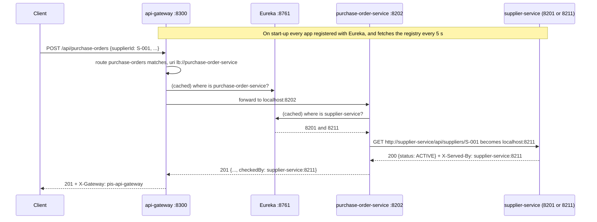

# Lecture 5 — API Gateway and Service Discovery (Eureka)

> **Services that find each other by name, behind one front door.**
> PIS splits into two services: one owns suppliers, the other owns purchase
> orders. They find each other through **Eureka**, a registry where every
> service signs in, and clients reach them through an **API gateway**, a single
> address that forwards each request to whichever copy of a service is running.

```
            ┌──────────────────────────────┐
            │ discovery-server  :8761      │  ◄── every app registers here,
            │ (Eureka registry)            │      and asks here where the others are
            └──────────────────────────────┘
                 ▲            ▲           ▲
client ──► api-gateway :8300  │           │
            │  /api/suppliers/** ──► supplier-service  :8201, :8211   (two copies)
            │  /api/purchase-orders/** ──► purchase-order-service :8202 ──┘
            │                               calls http://supplier-service/... BY NAME
```

| Duration | Builds on | Project |
| --- | --- | --- |
| About 3 hours | Spring Boot REST basics | `pis-lecture5-gateway-eureka/`, four apps |

**Contents:** [Goals](#goals) · [Concepts](#concepts) · [Request flow](#request-flow) ·
[Build it](#build-it) · [Try it](#try-it) · [When a copy goes away](#when-a-copy-goes-away) ·
[Test it](#test-it) · [Common mistakes](#common-mistakes) · [Exercises](#exercises) ·
[Quiz](#quiz) · [Smoke test](#smoke-test)

> **Complete files.** Every code block is a complete file with its `package` and
> `import` lines, taken from the tested project.

---

## Goals

By the end of this lecture you can:

- Explain why services shouldn't know each other's host and port, and what a service registry does instead.
- Run a Eureka server, and register services with it by name.
- Call another service **by name** with a `@LoadBalanced` `RestClient`, and explain what the annotation does.
- Put an API gateway in front of several services, with routes that point at service names (`lb://`).
- See client-side load balancing spread calls across copies of a service.
- Measure what happens when a copy stops, or crashes, and make it invisible to users with retries.
- Answer honestly when another service is down: 503, not 500.
- Test services that depend on discovery, with no Eureka running.

### Lesson plan

| Time (min) | Activity |
| --- | --- |
| 0–25 | Concepts: why discovery; registry, heartbeats, leases; client-side load balancing; the gateway |
| 25–35 | Request flow |
| 35–110 | Build it: discovery server, supplier-service, purchase-order-service, gateway |
| 110–140 | Try it: five terminals; load balancing; a copy stops, a copy crashes |
| 140–180 | Tests, exercises, quiz |

---

## Concepts

### Why not just call `http://localhost:8201`?

| Hard-coded address | Service discovery |
| --- | --- |
| purchase-order-service must know supplier-service runs on `localhost:8201` | It asks for **`supplier-service`**, a name |
| A second copy on 8211 gets no traffic until someone edits config | A second copy registers itself, and gets traffic in seconds |
| A copy moves, crashes or is replaced: every caller's config is wrong | The registry always has the current list |
| Works on one laptop | Works on many servers, containers, cloud machines |

### Eureka: a phone book that keeps itself up to date

| Step | What happens | Setting in this project |
| --- | --- | --- |
| **Register** | On start-up, each app sends its name, host and port to Eureka | automatic: the Eureka client starter is on the classpath |
| **Renew** | Every few seconds it sends a heartbeat: "I'm still here" | `lease-renewal-interval-in-seconds: 5` (default 30) |
| **Expire** | No heartbeat for a while, and Eureka removes it | `lease-expiration-duration-in-seconds: 15` (default 90) |
| **Fetch** | Every client keeps a copy of the registry, refreshed regularly | `registry-fetch-interval-seconds: 5` (default 30) |
| **Cancel** | On a clean shutdown (Ctrl+C), an app unregisters at once | automatic |

The short timings here are for teaching, so you see changes while you watch.
Production keeps Eureka's defaults, which are gentler on a big registry.

### Client-side load balancing

Eureka doesn't forward any traffic: it only answers "where is `supplier-service`?"
with a list. The **caller** picks one copy from the list, taking turns
(round robin). That's Spring Cloud LoadBalancer, and it runs inside every caller:
the gateway, and purchase-order-service.

### The API gateway

| Without a gateway | With a gateway |
| --- | --- |
| Clients need the address of every service | Clients know one address: `:8300` |
| Each service must handle cross-cutting work (CORS, auth, rate limits) | It can be done once, at the door |
| Moving a path to another service breaks clients | Change one route |

A route says: requests whose **path** matches go to a **service name**:

```
/api/suppliers/**          →  lb://supplier-service
/api/purchase-orders/**    →  lb://purchase-order-service
```

`lb://` means "a name, not an address: ask Eureka, then load-balance".

---

## Request flow



---

## Build it

All four apps use Spring Boot 3.5.6 and **Spring Cloud 2025.0.3**, the Spring
Cloud release line built for Boot 3.5. Each `pom.xml` imports the Spring Cloud
BOM, so no Spring Cloud dependency needs its own version number.

### 1 · The discovery server

```xml
<?xml version="1.0" encoding="UTF-8"?>
<!-- discovery-server/pom.xml -->
<project xmlns="http://maven.apache.org/POM/4.0.0"
         xmlns:xsi="http://www.w3.org/2001/XMLSchema-instance"
         xsi:schemaLocation="http://maven.apache.org/POM/4.0.0 https://maven.apache.org/xsd/maven-4.0.0.xsd">
    <modelVersion>4.0.0</modelVersion>

    <parent>
        <groupId>org.springframework.boot</groupId>
        <artifactId>spring-boot-starter-parent</artifactId>
        <version>3.5.6</version>
        <relativePath/>
    </parent>

    <groupId>tz.co.hmy</groupId>
    <artifactId>discovery-server</artifactId>
    <version>0.0.1-SNAPSHOT</version>
    <name>PIS Discovery Server</name>
    <description>Eureka: the registry every PIS service registers in</description>

    <properties>
        <java.version>17</java.version>
        <!-- The Spring Cloud release line built for Spring Boot 3.5 -->
        <spring-cloud.version>2025.0.3</spring-cloud.version>
    </properties>

    <dependencyManagement>
        <dependencies>
            <dependency>
                <groupId>org.springframework.cloud</groupId>
                <artifactId>spring-cloud-dependencies</artifactId>
                <version>${spring-cloud.version}</version>
                <type>pom</type>
                <scope>import</scope>
            </dependency>
        </dependencies>
    </dependencyManagement>

    <dependencies>
        <dependency>
            <groupId>org.springframework.cloud</groupId>
            <artifactId>spring-cloud-starter-netflix-eureka-server</artifactId>
        </dependency>
        <dependency>
            <groupId>org.springframework.boot</groupId>
            <artifactId>spring-boot-starter-actuator</artifactId>
        </dependency>
        <dependency>
            <groupId>org.springframework.boot</groupId>
            <artifactId>spring-boot-starter-test</artifactId>
            <scope>test</scope>
        </dependency>
    </dependencies>

    <build>
        <plugins>
            <plugin>
                <groupId>org.springframework.boot</groupId>
                <artifactId>spring-boot-maven-plugin</artifactId>
            </plugin>
        </plugins>
    </build>
</project>
```

```java
// discovery-server/src/main/java/tz/co/hmy/discovery/DiscoveryServerApplication.java
package tz.co.hmy.discovery;

import org.springframework.boot.SpringApplication;
import org.springframework.boot.autoconfigure.SpringBootApplication;
import org.springframework.cloud.netflix.eureka.server.EnableEurekaServer;

/**
 * The service registry. Every other service registers here on start-up, renews
 * its lease with a heartbeat, and asks here where the others are.
 * Dashboard: http://localhost:8761
 */
@SpringBootApplication
@EnableEurekaServer
public class DiscoveryServerApplication {

    public static void main(String[] args) {
        SpringApplication.run(DiscoveryServerApplication.class, args);
    }
}
```

```yaml
# discovery-server/src/main/resources/application.yml
server:
  port: 8761                     # the conventional Eureka port

spring:
  application:
    name: discovery-server

eureka:
  instance:
    hostname: localhost
  client:
    # This IS the registry: it doesn't register with itself or fetch from anyone.
    register-with-eureka: false
    fetch-registry: false
  server:
    # Development settings, so a stopped service disappears in seconds, not minutes.
    # Production keeps the defaults (self-preservation on, 60 s eviction).
    enable-self-preservation: false
    eviction-interval-timer-in-ms: 5000
    response-cache-update-interval-ms: 3000

management:
  endpoints:
    web:
      exposure:
        include: health
```

### 2 · supplier-service

Its data lives in memory: this lecture is about finding services, not storing data.

```xml
<?xml version="1.0" encoding="UTF-8"?>
<!-- supplier-service/pom.xml -->
<project xmlns="http://maven.apache.org/POM/4.0.0"
         xmlns:xsi="http://www.w3.org/2001/XMLSchema-instance"
         xsi:schemaLocation="http://maven.apache.org/POM/4.0.0 https://maven.apache.org/xsd/maven-4.0.0.xsd">
    <modelVersion>4.0.0</modelVersion>

    <parent>
        <groupId>org.springframework.boot</groupId>
        <artifactId>spring-boot-starter-parent</artifactId>
        <version>3.5.6</version>
        <relativePath/>
    </parent>

    <groupId>tz.co.hmy</groupId>
    <artifactId>supplier-service</artifactId>
    <version>0.0.1-SNAPSHOT</version>
    <name>PIS Supplier Service</name>
    <description>Owns suppliers. Registers in Eureka as supplier-service</description>

    <properties>
        <java.version>17</java.version>
        <!-- The Spring Cloud release line built for Spring Boot 3.5 -->
        <spring-cloud.version>2025.0.3</spring-cloud.version>
    </properties>

    <dependencyManagement>
        <dependencies>
            <dependency>
                <groupId>org.springframework.cloud</groupId>
                <artifactId>spring-cloud-dependencies</artifactId>
                <version>${spring-cloud.version}</version>
                <type>pom</type>
                <scope>import</scope>
            </dependency>
        </dependencies>
    </dependencyManagement>

    <dependencies>
        <dependency>
            <groupId>org.springframework.boot</groupId>
            <artifactId>spring-boot-starter-web</artifactId>
        </dependency>
        <dependency>
            <groupId>org.springframework.cloud</groupId>
            <artifactId>spring-cloud-starter-netflix-eureka-client</artifactId>
        </dependency>
        <dependency>
            <groupId>org.springframework.boot</groupId>
            <artifactId>spring-boot-starter-actuator</artifactId>
        </dependency>
        <dependency>
            <groupId>org.springframework.boot</groupId>
            <artifactId>spring-boot-starter-test</artifactId>
            <scope>test</scope>
        </dependency>
    </dependencies>

    <build>
        <plugins>
            <plugin>
                <groupId>org.springframework.boot</groupId>
                <artifactId>spring-boot-maven-plugin</artifactId>
            </plugin>
        </plugins>
    </build>
</project>
```

```yaml
# supplier-service/src/main/resources/application.yml
server:
  port: ${PORT:8201}             # run a second copy with  PORT=8211 mvn spring-boot:run

spring:
  application:
    name: supplier-service       # the name it registers under, and the name others call it by

eureka:
  client:
    service-url:
      defaultZone: ${EUREKA_URL:http://localhost:8761/eureka}
    registry-fetch-interval-seconds: 5        # development: notice changes in seconds
  instance:
    hostname: localhost
    instance-id: ${spring.application.name}:${server.port}   # unique per copy
    lease-renewal-interval-in-seconds: 5      # heartbeat every 5 s (default 30)
    lease-expiration-duration-in-seconds: 15  # gone after 15 s of silence (default 90)

management:
  endpoints:
    web:
      exposure:
        include: health, info
```

`instance-id` includes the port, so two copies on one machine register as two
instances. `PORT` lets you start the second copy without editing anything.

```java
// supplier-service/src/main/java/tz/co/hmy/supplier/SupplierServiceApplication.java
package tz.co.hmy.supplier;

import org.springframework.boot.SpringApplication;
import org.springframework.boot.autoconfigure.SpringBootApplication;

/**
 * Owns suppliers. With the Eureka client on the classpath it registers itself
 * as "supplier-service" (spring.application.name) on start-up: no annotation needed.
 */
@SpringBootApplication
public class SupplierServiceApplication {

    public static void main(String[] args) {
        SpringApplication.run(SupplierServiceApplication.class, args);
    }
}
```

```java
// supplier-service/src/main/java/tz/co/hmy/supplier/Supplier.java
package tz.co.hmy.supplier;

/** A supplier. Kept in memory: this lecture is about finding services, not storing data. */
public record Supplier(String id, String name, String tin, SupplierStatus status) { }
```

```java
// supplier-service/src/main/java/tz/co/hmy/supplier/SupplierStatus.java
package tz.co.hmy.supplier;

public enum SupplierStatus { ACTIVE, SUSPENDED }
```

```java
// supplier-service/src/main/java/tz/co/hmy/supplier/SupplierRepository.java
package tz.co.hmy.supplier;

import org.springframework.stereotype.Repository;

import java.util.List;
import java.util.Map;
import java.util.Optional;
import java.util.TreeMap;

/**
 * Three fixed suppliers, the same in every copy of this service, so it doesn't
 * matter which copy answers. (With a real database, every copy would share it.)
 */
@Repository
public class SupplierRepository {

    private final Map<String, Supplier> suppliers = new TreeMap<>(Map.of(
            "S-001", new Supplier("S-001", "Kisiwa ICT Consultants", "101-201-301", SupplierStatus.ACTIVE),
            "S-002", new Supplier("S-002", "Unguja Stationers Ltd", "555-666-777", SupplierStatus.ACTIVE),
            "S-003", new Supplier("S-003", "Pemba Hardware Ltd", "888-777-666", SupplierStatus.SUSPENDED)));

    public List<Supplier> findAll() {
        return List.copyOf(suppliers.values());
    }

    public Optional<Supplier> findById(String id) {
        return Optional.ofNullable(suppliers.get(id));
    }
}
```

```java
// supplier-service/src/main/java/tz/co/hmy/supplier/SupplierController.java
package tz.co.hmy.supplier;

import org.springframework.http.HttpStatus;
import org.springframework.http.ProblemDetail;
import org.springframework.web.bind.annotation.*;

import java.util.List;

@RestController
@RequestMapping("/api/suppliers")
public class SupplierController {

    private final SupplierRepository suppliers;

    public SupplierController(SupplierRepository suppliers) {
        this.suppliers = suppliers;
    }

    @GetMapping
    public List<Supplier> findAll() {
        return suppliers.findAll();
    }

    @GetMapping("/{id}")
    public Supplier findById(@PathVariable String id) {
        return suppliers.findById(id).orElseThrow(() -> new SupplierNotFoundException(id));
    }

    @ExceptionHandler(SupplierNotFoundException.class)
    @ResponseStatus(HttpStatus.NOT_FOUND)
    public ProblemDetail notFound(SupplierNotFoundException ex) {
        ProblemDetail problem = ProblemDetail.forStatusAndDetail(HttpStatus.NOT_FOUND, ex.getMessage());
        problem.setTitle("Supplier not found");
        return problem;
    }

    static class SupplierNotFoundException extends RuntimeException {
        SupplierNotFoundException(String id) { super("No supplier with id " + id); }
    }
}
```

This filter is how you'll **see** load balancing: every response names the copy that answered.

```java
// supplier-service/src/main/java/tz/co/hmy/supplier/ServedByFilter.java
package tz.co.hmy.supplier;

import jakarta.servlet.FilterChain;
import jakarta.servlet.ServletException;
import jakarta.servlet.http.HttpServletRequest;
import jakarta.servlet.http.HttpServletResponse;
import org.springframework.beans.factory.annotation.Value;
import org.springframework.stereotype.Component;
import org.springframework.web.filter.OncePerRequestFilter;

import java.io.IOException;

/**
 * Stamps every response with which copy of this service answered, e.g.
 * "X-Served-By: supplier-service:8211". Two copies run in this lecture, and
 * this header is how you SEE the load balancer spreading the calls.
 */
@Component
public class ServedByFilter extends OncePerRequestFilter {

    private final String instance;

    public ServedByFilter(@Value("${spring.application.name}") String name,
                          @Value("${server.port}") String port) {
        this.instance = name + ":" + port;
    }

    @Override
    protected void doFilterInternal(HttpServletRequest request, HttpServletResponse response,
                                    FilterChain chain) throws ServletException, IOException {
        response.setHeader("X-Served-By", instance);
        chain.doFilter(request, response);
    }
}
```

### 3 · purchase-order-service: calling another service by name

```xml
<?xml version="1.0" encoding="UTF-8"?>
<!-- purchase-order-service/pom.xml -->
<project xmlns="http://maven.apache.org/POM/4.0.0"
         xmlns:xsi="http://www.w3.org/2001/XMLSchema-instance"
         xsi:schemaLocation="http://maven.apache.org/POM/4.0.0 https://maven.apache.org/xsd/maven-4.0.0.xsd">
    <modelVersion>4.0.0</modelVersion>

    <parent>
        <groupId>org.springframework.boot</groupId>
        <artifactId>spring-boot-starter-parent</artifactId>
        <version>3.5.6</version>
        <relativePath/>
    </parent>

    <groupId>tz.co.hmy</groupId>
    <artifactId>purchase-order-service</artifactId>
    <version>0.0.1-SNAPSHOT</version>
    <name>PIS Purchase Order Service</name>
    <description>Owns purchase orders. Finds supplier-service through Eureka</description>

    <properties>
        <java.version>17</java.version>
        <!-- The Spring Cloud release line built for Spring Boot 3.5 -->
        <spring-cloud.version>2025.0.3</spring-cloud.version>
    </properties>

    <dependencyManagement>
        <dependencies>
            <dependency>
                <groupId>org.springframework.cloud</groupId>
                <artifactId>spring-cloud-dependencies</artifactId>
                <version>${spring-cloud.version}</version>
                <type>pom</type>
                <scope>import</scope>
            </dependency>
        </dependencies>
    </dependencyManagement>

    <dependencies>
        <dependency>
            <groupId>org.springframework.boot</groupId>
            <artifactId>spring-boot-starter-web</artifactId>
        </dependency>
        <dependency>
            <groupId>org.springframework.boot</groupId>
            <artifactId>spring-boot-starter-validation</artifactId>
        </dependency>
        <dependency>
            <groupId>org.springframework.cloud</groupId>
            <artifactId>spring-cloud-starter-netflix-eureka-client</artifactId>
        </dependency>
        <!-- Lets the load balancer retry a failed call on the next copy of the service -->
        <dependency>
            <groupId>org.springframework.retry</groupId>
            <artifactId>spring-retry</artifactId>
        </dependency>
        <dependency>
            <groupId>org.springframework.boot</groupId>
            <artifactId>spring-boot-starter-actuator</artifactId>
        </dependency>
        <dependency>
            <groupId>org.springframework.boot</groupId>
            <artifactId>spring-boot-starter-test</artifactId>
            <scope>test</scope>
        </dependency>
    </dependencies>

    <build>
        <plugins>
            <plugin>
                <groupId>org.springframework.boot</groupId>
                <artifactId>spring-boot-maven-plugin</artifactId>
            </plugin>
        </plugins>
    </build>
</project>
```

```yaml
# purchase-order-service/src/main/resources/application.yml
server:
  port: ${PORT:8202}

spring:
  application:
    name: purchase-order-service
  cloud:
    loadbalancer:
      cache:
        ttl: 5s                  # development: re-read the instance list every 5 s (default 35 s)
      retry:
        # With spring-retry on the classpath, a failed call to one copy of
        # supplier-service is tried once more, on the NEXT copy. Only GETs are
        # retried (retry-on-all-operations stays false), and every call to
        # supplier-service is a GET.
        max-retries-on-same-service-instance: 0
        max-retries-on-next-service-instance: 1

eureka:
  client:
    service-url:
      defaultZone: ${EUREKA_URL:http://localhost:8761/eureka}
    registry-fetch-interval-seconds: 5
  instance:
    hostname: localhost
    instance-id: ${spring.application.name}:${server.port}
    lease-renewal-interval-in-seconds: 5
    lease-expiration-duration-in-seconds: 15

management:
  endpoints:
    web:
      exposure:
        include: health, info
```

The one annotation this lecture is about:

```java
// purchase-order-service/src/main/java/tz/co/hmy/purchaseorder/ClientConfig.java
package tz.co.hmy.purchaseorder;

import org.springframework.cloud.client.loadbalancer.LoadBalanced;
import org.springframework.context.annotation.Bean;
import org.springframework.context.annotation.Configuration;
import org.springframework.web.client.RestClient;

@Configuration
public class ClientConfig {

    /**
     * @LoadBalanced is the whole trick. Every RestClient built from this
     * builder treats the host in a URL as a SERVICE NAME: before sending, it
     * asks Eureka for the running copies of that service, picks one (round
     * robin), and swaps in its real host and port.
     */
    @Bean
    @LoadBalanced
    RestClient.Builder loadBalancedRestClientBuilder() {
        return RestClient.builder();
    }
}
```

```java
// purchase-order-service/src/main/java/tz/co/hmy/purchaseorder/SupplierClient.java
package tz.co.hmy.purchaseorder;

import org.springframework.http.ResponseEntity;
import org.springframework.stereotype.Component;
import org.springframework.web.client.HttpClientErrorException;
import org.springframework.web.client.RestClient;
import org.springframework.web.client.RestClientException;

import java.util.Optional;

/**
 * Talks to supplier-service. Notice the base URL: a service NAME, not a host
 * and port. Nothing in this service knows where supplier-service runs, or how
 * many copies there are.
 */
@Component
public class SupplierClient {

    private final RestClient http;

    public SupplierClient(RestClient.Builder loadBalanced) {
        this.http = loadBalanced.baseUrl("http://supplier-service").build();
    }

    /** The supplier, and which copy of supplier-service answered. Empty if it doesn't exist. */
    public Optional<SupplierLookup> find(String supplierId) {
        try {
            ResponseEntity<SupplierView> response = http.get()
                    .uri("/api/suppliers/{id}", supplierId)
                    .retrieve()
                    .toEntity(SupplierView.class);
            return Optional.of(new SupplierLookup(response.getBody(),
                    response.getHeaders().getFirst("X-Served-By")));
        } catch (HttpClientErrorException.NotFound e) {
            return Optional.empty();
        } catch (RestClientException | IllegalStateException | IllegalArgumentException e) {
            // RestClientException: the copy we reached failed, or couldn't be reached.
            // IllegalStateException / IllegalArgumentException: the load balancer found no
            // running copy at all. Which of the two depends on whether retries are on
            // (spring-retry on the classpath: "Service Instance cannot be null").
            throw new SupplierServiceUnavailableException(e);
        }
    }

    /** The fields this service needs from a supplier. Unknown JSON fields are ignored. */
    public record SupplierView(String id, String name, String status) {
        boolean isActive() { return "ACTIVE".equals(status); }
    }

    public record SupplierLookup(SupplierView supplier, String servedBy) { }

    public static class SupplierServiceUnavailableException extends RuntimeException {
        SupplierServiceUnavailableException(Throwable cause) {
            super("supplier-service is not available", cause);
        }
    }
}
```

> **Three outcomes, three answers.** The supplier exists: use it. It doesn't
> (404): that's the client's mistake, a 422. supplier-service can't be reached,
> or no copy is running: that's nobody's mistake, but the order can't be
> checked, so it's a **503**. Never guess, and never create an order nobody checked.

```java
// purchase-order-service/src/main/java/tz/co/hmy/purchaseorder/PurchaseOrderService.java
package tz.co.hmy.purchaseorder;

import org.springframework.stereotype.Service;

import java.math.BigDecimal;
import java.time.Instant;
import java.util.List;
import java.util.Map;
import java.util.Optional;
import java.util.concurrent.ConcurrentSkipListMap;
import java.util.concurrent.atomic.AtomicInteger;

/** The business rule that needs the OTHER service: only an ACTIVE supplier can receive an order. */
@Service
public class PurchaseOrderService {

    private final SupplierClient suppliers;
    private final Map<String, PurchaseOrder> orders = new ConcurrentSkipListMap<>();
    private final AtomicInteger sequence = new AtomicInteger();

    public PurchaseOrderService(SupplierClient suppliers) {
        this.suppliers = suppliers;
    }

    public PurchaseOrder create(PurchaseOrderRequest request) {
        SupplierClient.SupplierLookup lookup = suppliers.find(request.supplierId())
                .orElseThrow(() -> new BusinessRuleException("Unknown supplier " + request.supplierId()));
        if (!lookup.supplier().isActive()) {
            throw new BusinessRuleException("Supplier " + request.supplierId() + " is "
                    + lookup.supplier().status() + ", so it can't receive purchase orders");
        }

        String id = "PO-%04d".formatted(sequence.incrementAndGet());
        BigDecimal total = request.unitPrice().multiply(BigDecimal.valueOf(request.quantity()));
        PurchaseOrder order = new PurchaseOrder(id, request.supplierId(), lookup.supplier().name(),
                request.item(), request.quantity(), request.unitPrice(), total,
                lookup.servedBy(), Instant.now());
        orders.put(id, order);
        return order;
    }

    public List<PurchaseOrder> findAll() {
        return List.copyOf(orders.values());
    }

    public Optional<PurchaseOrder> findById(String id) {
        return Optional.ofNullable(orders.get(id));
    }

    public static class BusinessRuleException extends RuntimeException {
        BusinessRuleException(String message) { super(message); }
    }
}
```

```java
// purchase-order-service/src/main/java/tz/co/hmy/purchaseorder/PurchaseOrderController.java
package tz.co.hmy.purchaseorder;

import jakarta.validation.Valid;
import org.springframework.http.HttpStatus;
import org.springframework.http.ProblemDetail;
import org.springframework.http.ResponseEntity;
import org.springframework.web.bind.MethodArgumentNotValidException;
import org.springframework.web.bind.annotation.*;
import org.springframework.web.util.UriComponentsBuilder;

import java.util.List;

@RestController
@RequestMapping("/api/purchase-orders")
public class PurchaseOrderController {

    private final PurchaseOrderService orders;

    public PurchaseOrderController(PurchaseOrderService orders) {
        this.orders = orders;
    }

    @PostMapping
    public ResponseEntity<PurchaseOrder> create(@Valid @RequestBody PurchaseOrderRequest request,
                                                UriComponentsBuilder uri) {
        PurchaseOrder created = orders.create(request);
        return ResponseEntity.created(uri.path("/api/purchase-orders/{id}").buildAndExpand(created.id()).toUri())
                .body(created);
    }

    @GetMapping
    public List<PurchaseOrder> findAll() {
        return orders.findAll();
    }

    @GetMapping("/{id}")
    public ResponseEntity<PurchaseOrder> findById(@PathVariable String id) {
        return ResponseEntity.of(orders.findById(id));
    }

    @ExceptionHandler(PurchaseOrderService.BusinessRuleException.class)
    @ResponseStatus(HttpStatus.UNPROCESSABLE_ENTITY)
    public ProblemDetail businessRule(PurchaseOrderService.BusinessRuleException ex) {
        return problem(HttpStatus.UNPROCESSABLE_ENTITY, "Business rule violated", ex.getMessage());
    }

    /** The other service is down. Say so honestly: 503, not 500, and not a made-up answer. */
    @ExceptionHandler(SupplierClient.SupplierServiceUnavailableException.class)
    @ResponseStatus(HttpStatus.SERVICE_UNAVAILABLE)
    public ProblemDetail supplierServiceDown(SupplierClient.SupplierServiceUnavailableException ex) {
        return problem(HttpStatus.SERVICE_UNAVAILABLE, "Supplier service unavailable",
                "Suppliers can't be checked right now. Try again shortly.");
    }

    @ExceptionHandler(MethodArgumentNotValidException.class)
    @ResponseStatus(HttpStatus.BAD_REQUEST)
    public ProblemDetail invalid(MethodArgumentNotValidException ex) {
        return problem(HttpStatus.BAD_REQUEST, "Validation failed",
                ex.getBindingResult().getFieldErrors().get(0).getDefaultMessage());
    }

    private static ProblemDetail problem(HttpStatus status, String title, String detail) {
        ProblemDetail problem = ProblemDetail.forStatusAndDetail(status, detail);
        problem.setTitle(title);
        return problem;
    }
}
```

```java
// purchase-order-service/src/main/java/tz/co/hmy/purchaseorder/PurchaseOrder.java
package tz.co.hmy.purchaseorder;

import java.math.BigDecimal;
import java.time.Instant;

/**
 * A purchase order. It copies the supplier's name at the time of ordering: this
 * service never reads the supplier table, it asks supplier-service.
 *
 * @param checkedBy which copy of supplier-service confirmed the supplier
 */
public record PurchaseOrder(String id, String supplierId, String supplierName, String item,
                            int quantity, BigDecimal unitPrice, BigDecimal total,
                            String checkedBy, Instant createdAt) { }
```

```java
// purchase-order-service/src/main/java/tz/co/hmy/purchaseorder/PurchaseOrderRequest.java
package tz.co.hmy.purchaseorder;

import jakarta.validation.constraints.DecimalMin;
import jakarta.validation.constraints.Min;
import jakarta.validation.constraints.NotBlank;
import jakarta.validation.constraints.NotNull;

import java.math.BigDecimal;

public record PurchaseOrderRequest(
        @NotBlank(message = "supplierId is required") String supplierId,
        @NotBlank(message = "item is required") String item,
        @Min(value = 1, message = "quantity must be at least 1") int quantity,
        @NotNull(message = "unitPrice is required") @DecimalMin(value = "0.00", message = "unitPrice cannot be negative") BigDecimal unitPrice
) { }
```

```java
// purchase-order-service/src/main/java/tz/co/hmy/purchaseorder/PurchaseOrderServiceApplication.java
package tz.co.hmy.purchaseorder;

import org.springframework.boot.SpringApplication;
import org.springframework.boot.autoconfigure.SpringBootApplication;

/** Owns purchase orders. Registers in Eureka as "purchase-order-service". */
@SpringBootApplication
public class PurchaseOrderServiceApplication {

    public static void main(String[] args) {
        SpringApplication.run(PurchaseOrderServiceApplication.class, args);
    }
}
```

### 4 · The API gateway

Spring Cloud Gateway runs on **WebFlux**, the reactive web stack, so its
`pom.xml` must not contain `spring-boot-starter-web` (common mistakes).

```xml
<?xml version="1.0" encoding="UTF-8"?>
<!-- api-gateway/pom.xml -->
<project xmlns="http://maven.apache.org/POM/4.0.0"
         xmlns:xsi="http://www.w3.org/2001/XMLSchema-instance"
         xsi:schemaLocation="http://maven.apache.org/POM/4.0.0 https://maven.apache.org/xsd/maven-4.0.0.xsd">
    <modelVersion>4.0.0</modelVersion>

    <parent>
        <groupId>org.springframework.boot</groupId>
        <artifactId>spring-boot-starter-parent</artifactId>
        <version>3.5.6</version>
        <relativePath/>
    </parent>

    <groupId>tz.co.hmy</groupId>
    <artifactId>api-gateway</artifactId>
    <version>0.0.1-SNAPSHOT</version>
    <name>PIS API Gateway</name>
    <description>The single front door: routes requests to services found in Eureka</description>

    <properties>
        <java.version>17</java.version>
        <!-- The Spring Cloud release line built for Spring Boot 3.5 -->
        <spring-cloud.version>2025.0.3</spring-cloud.version>
    </properties>

    <dependencyManagement>
        <dependencies>
            <dependency>
                <groupId>org.springframework.cloud</groupId>
                <artifactId>spring-cloud-dependencies</artifactId>
                <version>${spring-cloud.version}</version>
                <type>pom</type>
                <scope>import</scope>
            </dependency>
        </dependencies>
    </dependencyManagement>

    <dependencies>
        <!-- Spring Cloud Gateway, reactive (WebFlux). Never add spring-boot-starter-web here. -->
        <dependency>
            <groupId>org.springframework.cloud</groupId>
            <artifactId>spring-cloud-starter-gateway-server-webflux</artifactId>
        </dependency>
        <dependency>
            <groupId>org.springframework.cloud</groupId>
            <artifactId>spring-cloud-starter-netflix-eureka-client</artifactId>
        </dependency>
        <dependency>
            <groupId>org.springframework.boot</groupId>
            <artifactId>spring-boot-starter-actuator</artifactId>
        </dependency>
        <dependency>
            <groupId>org.springframework.boot</groupId>
            <artifactId>spring-boot-starter-test</artifactId>
            <scope>test</scope>
        </dependency>
    </dependencies>

    <build>
        <plugins>
            <plugin>
                <groupId>org.springframework.boot</groupId>
                <artifactId>spring-boot-maven-plugin</artifactId>
            </plugin>
        </plugins>
    </build>
</project>
```

```java
// api-gateway/src/main/java/tz/co/hmy/gateway/ApiGatewayApplication.java
package tz.co.hmy.gateway;

import org.springframework.boot.SpringApplication;
import org.springframework.boot.autoconfigure.SpringBootApplication;

/**
 * The single front door. Clients call only this, on port 8300. It looks at
 * each request's path, picks the service that owns it, asks Eureka where a
 * copy of that service runs, and forwards the request. The routes are in
 * application.yml.
 */
@SpringBootApplication
public class ApiGatewayApplication {

    public static void main(String[] args) {
        SpringApplication.run(ApiGatewayApplication.class, args);
    }
}
```

The routes are configuration, not code:

```yaml
# api-gateway/src/main/resources/application.yml
server:
  port: ${PORT:8300}

spring:
  application:
    name: api-gateway
  cloud:
    loadbalancer:
      cache:
        ttl: 5s
    gateway:
      server:
        webflux:
          routes:
            # lb:// means "a service name: ask Eureka, then load-balance across its copies".
            - id: suppliers
              uri: lb://supplier-service
              predicates:
                - Path=/api/suppliers/**
            - id: purchase-orders
              uri: lb://purchase-order-service
              predicates:
                - Path=/api/purchase-orders/**
          default-filters:
            # Added to every response, so you can see a request came through the gateway.
            - AddResponseHeader=X-Gateway, pis-api-gateway
            # If a copy can't be reached, try again: the load balancer picks the NEXT copy.
            # GET only: repeating a POST could create the same purchase order twice.
            - name: Retry
              args:
                retries: 2
                methods: GET
                series: SERVER_ERROR
                exceptions: java.io.IOException, java.util.concurrent.TimeoutException

eureka:
  client:
    service-url:
      defaultZone: ${EUREKA_URL:http://localhost:8761/eureka}
    registry-fetch-interval-seconds: 5
  instance:
    hostname: localhost
    instance-id: ${spring.application.name}:${server.port}
    lease-renewal-interval-in-seconds: 5
    lease-expiration-duration-in-seconds: 15

management:
  endpoint:
    gateway:
      access: read-only              # off by default: switch it on, read-only
  endpoints:
    web:
      exposure:
        include: health, gateway     # /actuator/gateway/routes lists the routes above
```

> **Why retry only `GET`?** A `GET` can be repeated safely. Repeating a `POST`
> could create the same purchase order twice. Inside purchase-order-service,
> the supplier lookup is a `GET`, so its load balancer retries it too.

---

## Try it

Start the five apps (see the project `README.md`), wait about 15 seconds, then
set these once:

```bash
EUREKA=http://localhost:8761      # discovery-server
GATEWAY=http://localhost:8300     # api-gateway: the only address a client needs
JSON='Content-Type: application/json'
```

Open the Eureka dashboard too: http://localhost:8761. Every step below is the
real output of a run.

**1 · Who is registered in Eureka?** Every app registers itself on start-up. Two copies of supplier-service are running.

```bash
curl -s -H 'Accept: application/json' $EUREKA/eureka/apps \
  | jq -r '.applications.application[] | "\(.name): \([.instance[].instanceId] | sort | join(", "))"'
```
```
SUPPLIER-SERVICE: supplier-service:8201, supplier-service:8211
API-GATEWAY: api-gateway:8300
PURCHASE-ORDER-SERVICE: purchase-order-service:8202
```

**2 · The gateway's routes** Two routes, each pointing at a service NAME (`lb://`), not an address.

```bash
curl -s $GATEWAY/actuator/gateway/routes | jq -c '.[] | {route_id, uri}'
```
```
{"route_id":"suppliers","uri":"lb://supplier-service"}
{"route_id":"purchase-orders","uri":"lb://purchase-order-service"}
```

**3 · A request through the gateway** The client only knows port 8300. The response says which copy answered, and that it came through the gateway.

```bash
curl -s -D - -o /dev/null $GATEWAY/api/suppliers/S-001 | grep -iE '^(HTTP|x-served-by|x-gateway)'
```
```
HTTP/1.1 200 OK
X-Served-By: supplier-service:8211
X-Gateway: pis-api-gateway
```

**4 · Load balancing: six calls, two copies** Round robin: the gateway asks Eureka for the copies and takes turns.

```bash
for i in 1 2 3 4 5 6; do
  curl -s -D - -o /dev/null $GATEWAY/api/suppliers | grep -i '^x-served-by'
done
```
```
X-Served-By: supplier-service:8201
X-Served-By: supplier-service:8211
X-Served-By: supplier-service:8201
X-Served-By: supplier-service:8211
X-Served-By: supplier-service:8201
X-Served-By: supplier-service:8211
```

**5 · A purchase order: one service asks the other, by name** purchase-order-service calls `http://supplier-service/...`. Eureka turns the name into a running copy, and `checkedBy` shows which one.

```bash
curl -s -X POST -H "$JSON" $GATEWAY/api/purchase-orders \
  -d '{"supplierId":"S-001","item":"Laptop","quantity":2,"unitPrice":2500000.00}' | jq -c '{id, supplierName, total, checkedBy}'
```
```
{"id":"PO-0009","supplierName":"Kisiwa ICT Consultants","total":5000000.00,"checkedBy":"supplier-service:8201"}
```

**6 · The next order is checked by the other copy** Load balancing works between services too, not just at the gateway.

```bash
for i in 1 2; do
  curl -s -X POST -H "$JSON" $GATEWAY/api/purchase-orders \
    -d '{"supplierId":"S-002","item":"Paper","quantity":5,"unitPrice":12000}' | jq -c '{id, checkedBy}'
done
```
```
{"id":"PO-0010","checkedBy":"supplier-service:8211"}
{"id":"PO-0011","checkedBy":"supplier-service:8201"}
```

**7 · A rule that needs the other service** Only an ACTIVE supplier can receive an order, and only supplier-service knows the status.

```bash
curl -s -X POST -H "$JSON" $GATEWAY/api/purchase-orders \
  -d '{"supplierId":"S-003","item":"Cement","quantity":10,"unitPrice":18000}' | jq -c '{status, detail}'
curl -s -X POST -H "$JSON" $GATEWAY/api/purchase-orders \
  -d '{"supplierId":"S-999","item":"Cement","quantity":10,"unitPrice":18000}' | jq -c '{status, detail}'
```
```
{"status":422,"detail":"Supplier S-003 is SUSPENDED, so it can't receive purchase orders"}
{"status":422,"detail":"Unknown supplier S-999"}
```

The full set of steps, including the unit tests and stopping a copy, is in the
[testing guide](../procurement-information-system_v1.0/docs/lessons/TESTING.md).

---

## When a copy goes away

This was measured on the running project, sending a request through the gateway
every half second. First **without** the gateway's Retry filter:

| What happened | Requests that failed | For how long | Why |
| --- | --- | --- | --- |
| A copy stopped cleanly (Ctrl+C) | about half | **5 seconds** | It unregistered at once, but the gateway's load balancer cached the list for 5 s |
| A copy **crashed** (`kill -9`) | about half | **about 37 seconds** | No goodbye: 15 s for the lease to expire, a 5 s eviction pass, 3 s server cache, 5 s registry fetch, 5 s load-balancer cache |

Then **with** retries (the `Retry` filter in the gateway, and spring-retry in
purchase-order-service), crashing a copy during a 40-second run:

```
GET  /api/suppliers through gateway: 74 ok, 0 failed
POST /api/purchase-orders (supplier lookup inside): 74 ok, 0 failed
```

A failed call to one copy is simply tried on the next. And with **no** copy of
supplier-service running at all:

```
GET  /api/suppliers          → 503 (from the gateway)
POST /api/purchase-orders    → 503 "Supplier service unavailable"
```

> **What a real bug looked like.** That second 503 was a **500** at first. With
> spring-retry on the classpath, the load balancer reports "no copy found" as an
> `IllegalArgumentException` ("Service Instance cannot be null"), and the client
> only expected an `IllegalStateException`. A test now runs with no
> supplier-service registered at all, so it can't come back.

---

## Test it

The tests need **no Eureka**. Spring Cloud's `SimpleDiscoveryClient` maps a service
name to a fixed address, here a tiny stub server the test starts. The code under
test is unchanged: it still calls `http://supplier-service/...`, and the load
balancer still resolves the name. Only the phone book is different.

```java
// purchase-order-service/src/test/java/tz/co/hmy/purchaseorder/PurchaseOrderApiTest.java
package tz.co.hmy.purchaseorder;

import com.sun.net.httpserver.HttpServer;
import org.junit.jupiter.api.AfterAll;
import org.junit.jupiter.api.Test;
import org.springframework.beans.factory.annotation.Autowired;
import org.springframework.boot.test.autoconfigure.web.servlet.AutoConfigureMockMvc;
import org.springframework.boot.test.context.SpringBootTest;
import org.springframework.http.MediaType;
import org.springframework.test.context.DynamicPropertyRegistry;
import org.springframework.test.context.DynamicPropertySource;
import org.springframework.test.web.servlet.MockMvc;

import java.io.IOException;
import java.io.OutputStream;
import java.net.InetSocketAddress;
import java.nio.charset.StandardCharsets;
import java.util.List;
import java.util.concurrent.CopyOnWriteArrayList;

import static org.assertj.core.api.Assertions.assertThat;
import static org.springframework.test.web.servlet.request.MockMvcRequestBuilders.get;
import static org.springframework.test.web.servlet.request.MockMvcRequestBuilders.post;
import static org.springframework.test.web.servlet.result.MockMvcResultMatchers.*;

/**
 * No Eureka in tests. Instead, Spring Cloud's SimpleDiscoveryClient maps the
 * NAME "supplier-service" to a tiny stub server started below. The code under
 * test is unchanged: it still calls http://supplier-service/..., and the load
 * balancer still resolves the name. Only the phone book is different.
 */
@SpringBootTest(properties = "eureka.client.enabled=false")
@AutoConfigureMockMvc
class PurchaseOrderApiTest {

    private static final List<String> STUB_REQUESTS = new CopyOnWriteArrayList<>();
    private static final HttpServer SUPPLIER_STUB = startStub();

    @DynamicPropertySource
    static void supplierServiceIsTheStub(DynamicPropertyRegistry registry) {
        registry.add("spring.cloud.discovery.client.simple.instances.supplier-service[0].uri",
                () -> "http://localhost:" + SUPPLIER_STUB.getAddress().getPort());
    }

    @AfterAll
    static void stopStub() {
        SUPPLIER_STUB.stop(0);
    }

    @Autowired MockMvc mvc;

    private static String order(String supplierId) {
        return """
                { "supplierId": "%s", "item": "Laptop", "quantity": 2, "unitPrice": 2500000.00 }
                """.formatted(supplierId);
    }

    @Test
    void an_order_for_an_active_supplier_is_created_after_asking_supplier_service() throws Exception {
        mvc.perform(post("/api/purchase-orders").contentType(MediaType.APPLICATION_JSON).content(order("S-001")))
            .andExpect(status().isCreated())
            .andExpect(header().exists("Location"))
            .andExpect(jsonPath("$.supplierName").value("Kisiwa ICT Consultants"))
            .andExpect(jsonPath("$.total").value(5000000.00))
            .andExpect(jsonPath("$.checkedBy").value("supplier-stub"));

        // The name "supplier-service" really was resolved to the stub, and the stub was asked.
        assertThat(STUB_REQUESTS).contains("/api/suppliers/S-001");
    }

    @Test
    void a_suspended_supplier_is_refused() throws Exception {
        mvc.perform(post("/api/purchase-orders").contentType(MediaType.APPLICATION_JSON).content(order("S-003")))
            .andExpect(status().isUnprocessableEntity())
            .andExpect(jsonPath("$.detail").value("Supplier S-003 is SUSPENDED, so it can't receive purchase orders"));
    }

    @Test
    void an_unknown_supplier_is_refused() throws Exception {
        mvc.perform(post("/api/purchase-orders").contentType(MediaType.APPLICATION_JSON).content(order("S-999")))
            .andExpect(status().isUnprocessableEntity())
            .andExpect(jsonPath("$.detail").value("Unknown supplier S-999"));
    }

    @Test
    void a_failing_supplier_service_is_a_503_not_a_500() throws Exception {
        mvc.perform(post("/api/purchase-orders").contentType(MediaType.APPLICATION_JSON).content(order("S-500")))
            .andExpect(status().isServiceUnavailable())
            .andExpect(jsonPath("$.title").value("Supplier service unavailable"));
    }

    @Test
    void an_invalid_order_never_reaches_supplier_service() throws Exception {
        int before = STUB_REQUESTS.size();
        mvc.perform(post("/api/purchase-orders").contentType(MediaType.APPLICATION_JSON)
                .content("{ \"supplierId\": \"S-001\", \"item\": \"Laptop\", \"quantity\": 0, \"unitPrice\": 1 }"))
            .andExpect(status().isBadRequest());
        assertThat(STUB_REQUESTS).hasSize(before);
    }

    @Test
    void created_orders_can_be_listed_and_fetched() throws Exception {
        String location = mvc.perform(post("/api/purchase-orders").contentType(MediaType.APPLICATION_JSON).content(order("S-002")))
                .andExpect(status().isCreated()).andReturn().getResponse().getHeader("Location");

        mvc.perform(get(location)).andExpect(status().isOk()).andExpect(jsonPath("$.supplierId").value("S-002"));
        mvc.perform(get("/api/purchase-orders")).andExpect(status().isOk());
        mvc.perform(get("/api/purchase-orders/PO-9999")).andExpect(status().isNotFound());
    }

    // ------------------------------------------------------------ the stub supplier-service

    private static HttpServer startStub() {
        try {
            HttpServer server = HttpServer.create(new InetSocketAddress("localhost", 0), 0);
            server.createContext("/api/suppliers/", exchange -> {
                String path = exchange.getRequestURI().getPath();
                STUB_REQUESTS.add(path);
                String id = path.substring("/api/suppliers/".length());
                String body = switch (id) {
                    case "S-001" -> "{\"id\":\"S-001\",\"name\":\"Kisiwa ICT Consultants\",\"tin\":\"101-201-301\",\"status\":\"ACTIVE\"}";
                    case "S-002" -> "{\"id\":\"S-002\",\"name\":\"Unguja Stationers Ltd\",\"tin\":\"555-666-777\",\"status\":\"ACTIVE\"}";
                    case "S-003" -> "{\"id\":\"S-003\",\"name\":\"Pemba Hardware Ltd\",\"tin\":\"888-777-666\",\"status\":\"SUSPENDED\"}";
                    default -> null;
                };
                int status = "S-500".equals(id) ? 500 : body == null ? 404 : 200;
                byte[] bytes = (body == null ? "{}" : body).getBytes(StandardCharsets.UTF_8);
                exchange.getResponseHeaders().add("Content-Type", "application/json");
                exchange.getResponseHeaders().add("X-Served-By", "supplier-stub");
                exchange.sendResponseHeaders(status, bytes.length);
                try (OutputStream out = exchange.getResponseBody()) { out.write(bytes); }
            });
            server.start();
            return server;
        } catch (IOException e) {
            throw new IllegalStateException(e);
        }
    }
}
```

```java
// purchase-order-service/src/test/java/tz/co/hmy/purchaseorder/NoSupplierServiceTest.java
package tz.co.hmy.purchaseorder;

import org.junit.jupiter.api.Test;
import org.springframework.beans.factory.annotation.Autowired;
import org.springframework.boot.test.autoconfigure.web.servlet.AutoConfigureMockMvc;
import org.springframework.boot.test.context.SpringBootTest;
import org.springframework.http.MediaType;
import org.springframework.test.web.servlet.MockMvc;

import static org.springframework.test.web.servlet.request.MockMvcRequestBuilders.post;
import static org.springframework.test.web.servlet.result.MockMvcResultMatchers.jsonPath;
import static org.springframework.test.web.servlet.result.MockMvcResultMatchers.status;

/**
 * Every copy of supplier-service is down: the registry has no instance of it.
 * The honest answer is 503, not a 500, and certainly not an order nobody checked.
 */
@SpringBootTest(properties = "eureka.client.enabled=false")   // and no simple instances: supplier-service is unknown
@AutoConfigureMockMvc
class NoSupplierServiceTest {

    @Autowired MockMvc mvc;

    @Test
    void with_no_copy_of_supplier_service_running_an_order_is_a_503() throws Exception {
        mvc.perform(post("/api/purchase-orders").contentType(MediaType.APPLICATION_JSON)
                .content("{ \"supplierId\": \"S-001\", \"item\": \"Paper\", \"quantity\": 1, \"unitPrice\": 12000 }"))
            .andExpect(status().isServiceUnavailable())
            .andExpect(jsonPath("$.title").value("Supplier service unavailable"));
    }
}
```

```java
// api-gateway/src/test/java/tz/co/hmy/gateway/GatewayRoutingTest.java
package tz.co.hmy.gateway;

import com.sun.net.httpserver.HttpServer;
import org.junit.jupiter.api.AfterAll;
import org.junit.jupiter.api.Test;
import org.springframework.beans.factory.annotation.Autowired;
import org.springframework.boot.test.autoconfigure.web.reactive.AutoConfigureWebTestClient;
import org.springframework.boot.test.context.SpringBootTest;
import org.springframework.http.MediaType;
import org.springframework.test.context.DynamicPropertyRegistry;
import org.springframework.test.context.DynamicPropertySource;
import org.springframework.test.web.reactive.server.WebTestClient;

import java.io.IOException;
import java.io.OutputStream;
import java.net.InetSocketAddress;
import java.nio.charset.StandardCharsets;

/**
 * The gateway, for real, with no Eureka: SimpleDiscoveryClient maps both
 * service names to one stub server that answers as either service. The routes
 * in application.yml are unchanged and still say lb://supplier-service.
 */
@SpringBootTest(webEnvironment = SpringBootTest.WebEnvironment.RANDOM_PORT,
                properties = "eureka.client.enabled=false")
@AutoConfigureWebTestClient
class GatewayRoutingTest {

    private static final HttpServer STUB = startStub();

    @DynamicPropertySource
    static void bothServicesAreTheStub(DynamicPropertyRegistry registry) {
        String uri = "http://localhost:" + STUB.getAddress().getPort();
        registry.add("spring.cloud.discovery.client.simple.instances.supplier-service[0].uri", () -> uri);
        registry.add("spring.cloud.discovery.client.simple.instances.purchase-order-service[0].uri", () -> uri);
    }

    @AfterAll
    static void stopStub() {
        STUB.stop(0);
    }

    @Autowired WebTestClient web;

    @Test
    void supplier_paths_go_to_supplier_service() {
        web.get().uri("/api/suppliers/S-001").exchange()
            .expectStatus().isOk()
            .expectHeader().valueEquals("X-Served-By", "stub-as-supplier-service")   // the service's own header passes through
            .expectHeader().valueEquals("X-Gateway", "pis-api-gateway")              // and the gateway adds its own
            .expectBody().jsonPath("$.path").isEqualTo("/api/suppliers/S-001");      // the path is forwarded unchanged
    }

    @Test
    void purchase_order_paths_go_to_purchase_order_service_with_their_body() {
        web.post().uri("/api/purchase-orders").contentType(MediaType.APPLICATION_JSON)
            .bodyValue("{\"supplierId\":\"S-001\"}").exchange()
            .expectStatus().isCreated()
            .expectHeader().valueEquals("X-Served-By", "stub-as-purchase-order-service")
            .expectBody().jsonPath("$.received").isEqualTo("{\"supplierId\":\"S-001\"}");
    }

    @Test
    void a_path_no_route_matches_is_a_404() {
        web.get().uri("/api/invoices").exchange().expectStatus().isNotFound();
    }

    @Test
    void the_routes_can_be_inspected() {
        web.get().uri("/actuator/gateway/routes").exchange()
            .expectStatus().isOk()
            .expectBody()
            .jsonPath("$[?(@.route_id == 'suppliers')].uri").isEqualTo("lb://supplier-service")
            .jsonPath("$[?(@.route_id == 'purchase-orders')].uri").isEqualTo("lb://purchase-order-service");
    }

    /** One stub that answers as whichever service the path belongs to. */
    private static HttpServer startStub() {
        try {
            HttpServer server = HttpServer.create(new InetSocketAddress("localhost", 0), 0);
            server.createContext("/api/", exchange -> {
                String path = exchange.getRequestURI().getPath();
                boolean orders = path.startsWith("/api/purchase-orders");
                String received = new String(exchange.getRequestBody().readAllBytes(), StandardCharsets.UTF_8);
                String body = "{\"path\":\"" + path + "\",\"received\":" + (received.isEmpty() ? "null" : "\"" + received.replace("\"", "\\\"") + "\"") + "}";
                byte[] bytes = body.getBytes(StandardCharsets.UTF_8);
                exchange.getResponseHeaders().add("Content-Type", "application/json");
                exchange.getResponseHeaders().add("X-Served-By", orders ? "stub-as-purchase-order-service" : "stub-as-supplier-service");
                exchange.sendResponseHeaders(orders && "POST".equals(exchange.getRequestMethod()) ? 201 : 200, bytes.length);
                try (OutputStream out = exchange.getResponseBody()) { out.write(bytes); }
            });
            server.start();
            return server;
        } catch (IOException e) {
            throw new IllegalStateException(e);
        }
    }
}
```

```java
// supplier-service/src/test/java/tz/co/hmy/supplier/SupplierApiTest.java
package tz.co.hmy.supplier;

import org.junit.jupiter.api.Test;
import org.springframework.beans.factory.annotation.Autowired;
import org.springframework.boot.test.autoconfigure.web.servlet.AutoConfigureMockMvc;
import org.springframework.boot.test.context.SpringBootTest;
import org.springframework.test.web.servlet.MockMvc;

import static org.springframework.test.web.servlet.request.MockMvcRequestBuilders.get;
import static org.springframework.test.web.servlet.result.MockMvcResultMatchers.*;

@SpringBootTest(properties = { "server.port=8201", "eureka.client.enabled=false" })   // no Eureka server in tests
@AutoConfigureMockMvc
class SupplierApiTest {

    @Autowired MockMvc mvc;

    @Test
    void lists_the_three_suppliers() throws Exception {
        mvc.perform(get("/api/suppliers"))
            .andExpect(status().isOk())
            .andExpect(jsonPath("$.length()").value(3))
            .andExpect(jsonPath("$[0].id").value("S-001"));
    }

    @Test
    void returns_one_supplier_with_its_status() throws Exception {
        mvc.perform(get("/api/suppliers/S-003"))
            .andExpect(status().isOk())
            .andExpect(jsonPath("$.name").value("Pemba Hardware Ltd"))
            .andExpect(jsonPath("$.status").value("SUSPENDED"));
    }

    @Test
    void an_unknown_supplier_is_a_404_problem() throws Exception {
        mvc.perform(get("/api/suppliers/S-999"))
            .andExpect(status().isNotFound())
            .andExpect(jsonPath("$.title").value("Supplier not found"));
    }

    @Test
    void every_response_says_which_copy_answered() throws Exception {
        mvc.perform(get("/api/suppliers"))
            .andExpect(header().string("X-Served-By", "supplier-service:8201"));
    }
}
```

```java
// discovery-server/src/test/java/tz/co/hmy/discovery/DiscoveryServerTest.java
package tz.co.hmy.discovery;

import org.junit.jupiter.api.Test;
import org.springframework.beans.factory.annotation.Autowired;
import org.springframework.boot.test.context.SpringBootTest;
import org.springframework.boot.test.web.client.TestRestTemplate;
import org.springframework.http.HttpEntity;
import org.springframework.http.HttpHeaders;
import org.springframework.http.HttpMethod;
import org.springframework.http.HttpStatus;
import org.springframework.http.MediaType;
import org.springframework.http.ResponseEntity;

import java.util.List;

import static org.assertj.core.api.Assertions.assertThat;

@SpringBootTest(webEnvironment = SpringBootTest.WebEnvironment.RANDOM_PORT)
class DiscoveryServerTest {

    @Autowired TestRestTemplate http;

    @Test
    void the_registry_answers_and_starts_empty() {
        HttpHeaders headers = new HttpHeaders();
        headers.setAccept(List.of(MediaType.APPLICATION_JSON));
        ResponseEntity<String> apps = http.exchange("/eureka/apps", HttpMethod.GET, new HttpEntity<>(headers), String.class);

        assertThat(apps.getStatusCode()).isEqualTo(HttpStatus.OK);
        assertThat(apps.getBody()).contains("\"applications\"").doesNotContain("\"instance\"");
    }

    @Test
    void the_dashboard_is_served() {
        ResponseEntity<String> page = http.getForEntity("/", String.class);

        assertThat(page.getStatusCode()).isEqualTo(HttpStatus.OK);
        assertThat(page.getBody()).contains("Eureka");
    }
}
```

| App | Tests | Covers |
| --- | --- | --- |
| discovery-server | 2 | The registry answers; the dashboard is served |
| supplier-service | 4 | List, one, 404 problem, the `X-Served-By` header |
| purchase-order-service | 7 | Order after asking supplier-service by name; suspended and unknown suppliers; 503 when it fails or isn't registered; validation |
| api-gateway | 4 | Both routes, headers both ways, 404 for no route, the routes endpoint |

---

## Common mistakes

<details>
<summary><b>The gateway won't start: "Spring MVC found on classpath, which is incompatible with Spring Cloud Gateway"</b></summary>

`spring-boot-starter-web` is in the gateway's `pom.xml`. The gateway runs on
WebFlux; remove the MVC starter. (Checked: with it added, every gateway test fails with exactly this message.)
</details>

<details>
<summary><b>Every call to the other service is a 503, and the log says <code>UnknownHostException: supplier-service</code></b></summary>

The `RestClient.Builder` isn't `@LoadBalanced`, so `supplier-service` is treated
as a real hostname. See Exercise 2.
</details>

<details>
<summary><b>"No instances available" right after starting</b></summary>

A new app needs a few seconds to register, and every client needs a few seconds
to fetch the registry. Wait about 15 seconds after the last app starts.
</details>

<details>
<summary><b>A test can't resolve <code>${spring.application.name}</code></b></summary>

A file named `application.yml` in `src/test/resources` **replaces** the main one,
it doesn't add to it. This happened while building the lecture. Put test-only
settings in `@SpringBootTest(properties = …)`, or in `application-test.yml` with a profile.
</details>

<details>
<summary><b>A file you deleted still has an effect</b></summary>

Maven never deletes from `target/`. Run `mvn clean test` after deleting resources.
</details>

<details>
<summary><b><code>/actuator/gateway/routes</code> is a 404</b></summary>

Exposing the endpoint isn't enough: it's off by default. Set
`management.endpoint.gateway.access: read-only`, as `application.yml` does.
</details>

<details>
<summary><b>An ERROR line about <code>MacOSDnsServerAddressStreamProvider</code> on a Mac</b></summary>

Harmless. Netty, under the gateway, looks for a native macOS DNS library, falls
back to the system resolver, and carries on.
</details>

<details>
<summary><b>A crashed copy keeps getting requests for half a minute</b></summary>

That's how leases work: Eureka can't tell a crash from a slow heartbeat until the
lease expires. Retries make it invisible (see *When a copy goes away*).
</details>

---

## Exercises

### 1 · Read the registry — *warm-up*

Open http://localhost:8761. How many instances does each app have? Then fetch
`$EUREKA/eureka/apps/SUPPLIER-SERVICE` with `Accept: application/json` and find
`leaseInfo`. What do `renewalIntervalInSecs` and `durationInSecs` mean, and where
did those numbers come from?

<details>
<summary>Solution</summary>

SUPPLIER-SERVICE has 2, the others 1 each. `renewalIntervalInSecs: 5` is how
often the copy sends a heartbeat; `durationInSecs: 15` is how long Eureka waits
without one before removing it. Both come from `eureka.instance.*` in
supplier-service's `application.yml`; the defaults would be 30 and 90.
</details>

### 2 · Break it: remove `@LoadBalanced` — *understanding*

In purchase-order-service's `ClientConfig`, comment out `@LoadBalanced`. Run
`mvn test`. Which tests fail, and why do three still pass?

<details>
<summary>Solution</summary>

Four fail, each with `Status expected:<…> but was:<503>`:

```
a_suspended_supplier_is_refused                                     expected 422, was 503
an_unknown_supplier_is_refused                                      expected 422, was 503
an_order_for_an_active_supplier_is_created_after_asking_supplier_service   expected 201, was 503
created_orders_can_be_listed_and_fetched                            expected 201, was 503
```

Without the annotation, `http://supplier-service` is an ordinary URL, and there is
no computer called `supplier-service`. The client can't connect, which the code
correctly reports as 503. Three tests still pass, because none of them needs a
successful call: `an_invalid_order_never_reaches_supplier_service` (it's refused
before any call), and the two tests that *expect* a 503,
`a_failing_supplier_service_is_a_503_not_a_500` and
`with_no_copy_of_supplier_service_running_an_order_is_a_503`. A test that only checks
failure can pass for the wrong reason; that's why the success tests matter.
</details>

### 3 · Scale out — *core*

Start a **third** copy of supplier-service on port 8221. What did you have to
change in the gateway or in purchase-order-service? Send 9 requests through the
gateway and count which copy answered.

<details>
<summary>Solution</summary>

```bash
cd supplier-service && PORT=8221 mvn spring-boot:run
```

Nothing else changes. After about 15 seconds:

```
registry: supplier-service:8201, supplier-service:8211, supplier-service:8221
9 calls through the gateway:
   3 supplier-service:8201
   3 supplier-service:8211
   3 supplier-service:8221
```

That's the point of discovery: capacity is added by starting a copy, not by
editing callers.
</details>

### 4 · The failover experiment — *core*

Remove the `Retry` default filter from the gateway, restart it, and send a
request every half second while you stop a supplier copy with Ctrl+C. Then put
the filter back and repeat, this time crashing a copy with `kill -9 <pid>`
(`lsof -ti tcp:8211` gives the pid).

<details>
<summary>Solution</summary>

Without retries, a clean stop gave about **5 seconds** of failures on every
other request, and a crash about **37 seconds**. With the filter, a crash
during a 40-second run gave **74 successful GETs out of 74**. See *When a copy
goes away* for why the numbers are what they are.
</details>

### 5 · Security at the door — *stretch, design*

Lecture 4 made PIS a resource server that checks JWTs. Where should that check
live now: in the gateway, in each service, or both? What does each service
lose if only the gateway checks tokens, and what stops a client calling
`localhost:8201` directly?

<details>
<summary>Discussion points</summary>

Checking at the gateway rejects bad tokens early, in one place. But if only the
gateway checks, anyone who can reach a service's own port skips security
entirely, and the services can't make per-user decisions (Lesson 3C's "nobody
approves their own requisition"). The usual answer is **both**: the gateway
rejects what's obviously invalid, it passes the token on, and each service
still validates it. In production, the services' ports aren't reachable from
outside at all; only the gateway is. This is a design discussion, with no
reference solution in the project.
</details>

---

## Quiz

**1. What does Eureka do with a request for `supplier-service`?**\
a) Forwards it to a running copy  b) Nothing: it only tells callers where the copies are  c) Load-balances it

**2. What does `@LoadBalanced` on a `RestClient.Builder` do?**\
a) Adds retries  b) Treats the host in a URL as a service name, and swaps in a registered copy's address  c) Registers the service in Eureka

**3. A second copy of supplier-service starts. What must change in the gateway?**\
a) A new route  b) Nothing: the route points at the name, and the new copy registers itself  c) A restart

**4. A copy crashes. Why can it keep receiving requests for about half a minute?**\
a) Eureka is slow  b) Without a goodbye, Eureka waits for the lease to expire, and every client caches the list  c) The gateway ignores Eureka

**5. Why does the gateway retry only `GET` requests?**\
a) POST can't be retried  b) Repeating a POST could create the same order twice  c) GETs are faster

**6. supplier-service is completely down. What should creating a purchase order return?**\
a) 500  b) 503: the order can't be checked right now  c) 201, and check later

<details>
<summary>Answers</summary>

1. **b.** Eureka is a phone book. The caller picks the copy and sends the request.
2. **b.** Without it, `supplier-service` is just an unknown hostname.
3. **b.** That's the whole point of discovery.
4. **b.** Lease expiry, eviction, and the caches add up (about 37 s with this project's settings).
5. **b.** Only repeat what's safe to repeat.
6. **b.** Never create an order nobody checked; say honestly that a dependency is down.
</details>

---

## Smoke test

With all five apps running:

```bash
bash smoke/smoke-lecture5.sh
```

The script, `smoke/smoke-lecture5.sh`:

```bash
#!/usr/bin/env bash
# Lecture 5 smoke test: Eureka, two services that find each other, and the API gateway.
# Needs all five running: discovery-server, supplier-service on 8201 AND 8211,
# purchase-order-service, api-gateway (see the README).
EUREKA=${EUREKA:-http://localhost:8761}
GATEWAY=${GATEWAY:-http://localhost:8300}
JSON='Content-Type: application/json'

pass() { echo "PASS  $1"; }
fail() { echo "FAIL  $1"; }
check() {   # check <expected status> <description> <curl args...>
  local want=$1 desc=$2; shift 2
  local got; got=$(curl -s -o /dev/null -w '%{http_code}' "$@")
  [ "$got" = "$want" ] && echo "PASS  $got  $desc" || echo "FAIL  $got  $desc (expected $want)"
}
instances() { curl -s -H 'Accept: application/json' "$EUREKA/eureka/apps/$1" | grep -o '"instanceId":"[^"]*"' | cut -d'"' -f4 | sort | tr '\n' ' '; }
served_by() { curl -s -D - -o /dev/null "$@" | tr -d '\r' | awk -F': ' 'tolower($1)=="x-served-by"{print $2}'; }
order() { curl -s -X POST -H "$JSON" -d "{\"supplierId\":\"$1\",\"item\":\"Laptop\",\"quantity\":2,\"unitPrice\":2500000.00}" "$GATEWAY/api/purchase-orders"; }

echo "--- Eureka: who is registered?"
s=$(instances SUPPLIER-SERVICE); [ "$(echo $s | wc -w)" -ge 2 ] && pass "     supplier-service: $s" || fail "     supplier-service needs 2 copies (8201 and 8211), found: $s"
p=$(instances PURCHASE-ORDER-SERVICE); [ -n "$p" ] && pass "     purchase-order-service: $p" || fail "     purchase-order-service is not registered"
g=$(instances API-GATEWAY); [ -n "$g" ] && pass "     api-gateway: $g" || fail "     api-gateway is not registered"

echo "--- the gateway routes by path"
r=$(curl -s "$GATEWAY/actuator/gateway/routes" | grep -o '"uri":"lb://[^"]*"' | cut -d'"' -f4 | tr '\n' ' ')
echo "$r" | grep -q 'lb://supplier-service' && echo "$r" | grep -q 'lb://purchase-order-service' && pass "     routes: $r" || fail "     routes: $r"
check 200 "GET /api/suppliers through the gateway"              "$GATEWAY/api/suppliers"
h=$(curl -s -D - -o /dev/null "$GATEWAY/api/suppliers/S-001" | tr -d '\r' | grep -i '^x-gateway:')
[ -n "$h" ] && pass "     the gateway marks its responses ($h)" || fail "     no X-Gateway header"
check 404 "a path no route matches"                             "$GATEWAY/api/invoices"

echo "--- load balancing: the gateway spreads calls over both copies"
seen=$(for i in 1 2 3 4 5 6; do served_by "$GATEWAY/api/suppliers"; done | sort -u | tr '\n' ' ')
[ "$(echo $seen | wc -w)" -ge 2 ] && pass "     6 calls answered by: $seen" || fail "     6 calls answered only by: $seen"

echo "--- service to service: purchase-order-service finds supplier-service BY NAME"
o1=$(order S-001); o2=$(order S-001)
echo "$o1" | grep -q '"supplierName":"Kisiwa ICT Consultants"' && pass "201  order created after asking supplier-service" || fail "     order: $o1"
c1=$(echo "$o1" | grep -o '"checkedBy":"[^"]*"' | cut -d'"' -f4); c2=$(echo "$o2" | grep -o '"checkedBy":"[^"]*"' | cut -d'"' -f4)
[ -n "$c1" ] && [ "$c1" != "$c2" ] && pass "     two orders were checked by two copies: $c1, $c2" || fail "     both orders checked by: $c1 $c2"
check 422 "a SUSPENDED supplier is refused (rule needs the other service)" -X POST -H "$JSON" \
      -d '{"supplierId":"S-003","item":"Cement","quantity":10,"unitPrice":18000}' "$GATEWAY/api/purchase-orders"
check 422 "an unknown supplier is refused"                       -X POST -H "$JSON" \
      -d '{"supplierId":"S-999","item":"Cement","quantity":10,"unitPrice":18000}' "$GATEWAY/api/purchase-orders"
```

Expected output:

```
--- Eureka: who is registered?
PASS       supplier-service: supplier-service:8201 supplier-service:8211 
PASS       purchase-order-service: purchase-order-service:8202 
PASS       api-gateway: api-gateway:8300 
--- the gateway routes by path
PASS       routes: lb://supplier-service lb://purchase-order-service 
PASS  200  GET /api/suppliers through the gateway
PASS       the gateway marks its responses (X-Gateway: pis-api-gateway)
PASS  404  a path no route matches
--- load balancing: the gateway spreads calls over both copies
PASS       6 calls answered by: supplier-service:8201 supplier-service:8211 
--- service to service: purchase-order-service finds supplier-service BY NAME
PASS  201  order created after asking supplier-service
PASS       two orders were checked by two copies: supplier-service:8211, supplier-service:8201
PASS  422  a SUSPENDED supplier is refused (rule needs the other service)
PASS  422  an unknown supplier is refused
```
