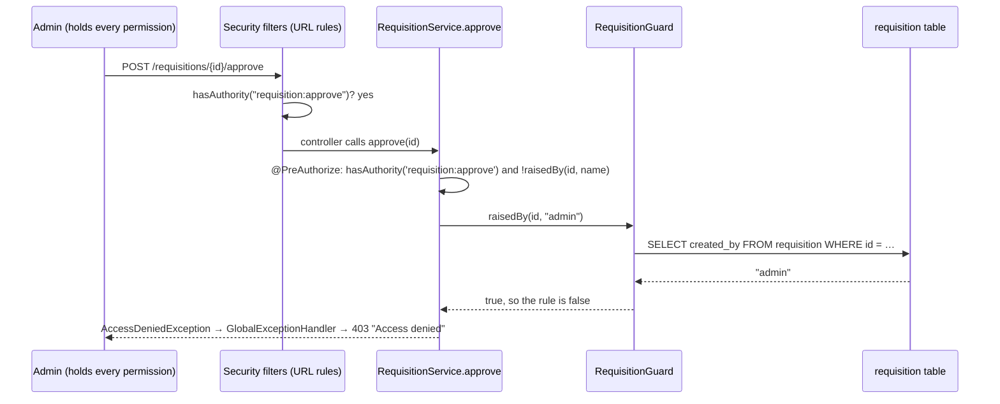

# Lesson 3C — Permissions and Method Security

> **Check what a person may *do*, not what their job title is.**
> Lessons 1–3B used **role-based** rules: `hasRole("APPROVER")`. This lesson
> introduces **permissions** (`requisition:approve`), gives each role a bundle of
> them, and moves the rules that depend on the *record itself* onto the service
> with `@PreAuthorize`: **nobody approves a requisition they raised, not even an admin.**

```
hasRole("APPROVER")                    →  hasAuthority("requisition:approve")
"is this person an approver?"          →  "may this person approve requisitions?"
```

| Duration | Builds on | You should know |
| --- | --- | --- |
| About 2½ hours | [Lesson 3B — Refresh Tokens](03b-refresh-tokens.md) | `SecurityConfig` rules, `created_by` (Lesson 2), JWT claims (Lesson 3) |

**Contents:** [Goals](#goals) · [Concepts](#concepts) · [Request flow](#request-flow) ·
[Upgrade checklist](#upgrade-checklist) · [Build it](#build-it) · [Try it](#try-it) ·
[Test it](#test-it) · [Common mistakes](#common-mistakes) · [Exercises](#exercises) ·
[Quiz](#quiz) · [Smoke test](#smoke-test)

> **Complete files.** Every code block in this lesson is a complete file, with
> its `package` and `import` lines, taken from the tested project. Where a file
> only changes in one place, the block says so and shows that place in full.

---

## Goals

By the end of this lesson you can:

- Explain **RBAC**, **permission-based** and **attribute-based** access control, and when each is the right tool.
- Model permissions as an enum, and roles as bundles of permissions.
- Load roles *and* permissions as Spring authorities, for Basic logins and for JWTs.
- Write URL rules with `hasAuthority(...)` instead of `hasRole(...)`.
- Turn on method security and protect a service method with `@PreAuthorize`.
- Write a rule that looks at the record: *you may not approve what you raised*.
- Make a denied method call return **403**, not 500, and explain why it's needed.
- Test with `@WithRole`, a test annotation that uses the same role → permission mapping as production.

### Lesson plan

| Time (min) | Activity |
| --- | --- |
| 0–25 | Concepts: RBAC, permissions, attributes; URL rules vs method rules |
| 25–35 | Request flow: two checkpoints |
| 35–95 | Build it: permissions, roles, authorities, token claim, rules, `@PreAuthorize`, guard, 403 handler |
| 95–110 | Try it live: approve someone else's requisition, then your own |
| 110–150 | Tests (`@WithRole`), break-it exercises, quiz |

---

## Concepts

### Three ways to decide "may this person do this?"

| | Role-based (RBAC) | Permission-based | Attribute-based (ABAC) |
| --- | --- | --- | --- |
| The rule asks | Is this person an **APPROVER**? | May this person **`requisition:approve`**? | May this person approve **this** requisition? |
| Looks at | The person's job title | The actions the person may take | The person, the action **and the record** |
| In Spring | `hasRole("APPROVER")` | `hasAuthority("requisition:approve")` | `@PreAuthorize("... and !@requisitionGuard.raisedBy(#id, authentication.name)")` |
| In PIS so far | Lessons 1–3B | This lesson | This lesson |

**RBAC** is what Lessons 1–3B built: each rule names a role. It's simple, but the
rule names a *job title*, not an *action*. Let one senior officer approve small
purchases, or add a read-only auditor, and you have to edit rules throughout
the code.

**Permission-based** access control splits that in two:

1. The **code** checks permissions only: `hasAuthority("requisition:approve")`.
2. One **mapping** decides which roles hold which permissions:
   `APPROVER = { requisition:approve, supplier:approve, … }`.

Change the mapping, and every rule follows. Roles don't disappear: they become
**bundles of permissions**, the thing an admin assigns to a person.

**Attribute-based** rules look at the data too. *You may not approve a
requisition you raised* is a **separation of duties** rule, and procurement
audits check for it. No role or permission can express it, because the answer
depends on who created *this* requisition. That's `created_by`, from Lesson 2.

### Two checkpoints: URL rules and method rules

| | URL rules (`SecurityConfig`) | Method rules (`@PreAuthorize`) |
| --- | --- | --- |
| Runs | In a filter, before any controller | Around the service method |
| Protects | One HTTP path | The action, however it's called: controller, scheduled job, another service |
| Can see the record? | No, only the URL | Yes: method arguments (`#id`) and any bean (`@requisitionGuard`) |
| When it says no | 403 from `ProblemDetailSecurityHandler` | `AccessDeniedException` thrown **inside** the controller call |

PIS uses both: URL rules for "which permission does this endpoint need", and a
method rule for the one decision that needs the record.

> **Why the 403 handler matters.** A URL rule rejects the request in a filter,
> so Lesson 1's `ProblemDetailSecurityHandler` answers 403. A method rule throws
> `AccessDeniedException` from *inside* the service, and that lands in
> `GlobalExceptionHandler`. Its catch-all `Exception` handler would turn it into
> a **500**. Exercise 2 shows this happening.

### The mapping in PIS

| Permission | OFFICER | APPROVER | ADMIN |
| --- | :---: | :---: | :---: |
| `supplier:read` | ✓ | ✓ | ✓ |
| `supplier:write` | ✓ | | ✓ |
| `supplier:approve` | | ✓ | ✓ |
| `requisition:read` | ✓ | ✓ | ✓ |
| `requisition:write` | ✓ | | ✓ |
| `requisition:approve` | | ✓ | ✓ |
| `purchase-order:read` | ✓ | ✓ | ✓ |
| `purchase-order:write` | ✓ | | ✓ |
| `invoice:read` | ✓ | ✓ | ✓ |
| `invoice:write` | ✓ | | ✓ |
| `record:delete` | | | ✓ |
| `user:manage` | | | ✓ |

This mapping gives exactly the same access as Lesson 1's role rules. That's
deliberate: the four earlier smoke tests still pass unchanged on this lesson's code.

---

## Request flow



The method body never runs, so the requisition stays `SUBMITTED`. Another
approver can still approve it.

---

## Upgrade checklist

Starting from the end of Lesson 3B.

| | File | Change |
| --- | --- | --- |
| ➕ | `model/Permission.java` | One constant per action |
| ✏️ | `model/Role.java` | Each role carries its permissions |
| ➕ | `security/Authorities.java` | Roles → `ROLE_x` plus permissions, in one place |
| ✏️ | `service/DatabaseUserDetailsService.java` | `.authorities(...)` instead of `.roles(...)` |
| ✏️ | `service/TokenService.java` | Adds a `permissions` claim |
| ✏️ | `config/JwtConfig.java` | Reads `roles` **and** `permissions` from the token |
| ✏️ | `config/SecurityConfig.java` | Every rule uses `hasAuthority(...)` |
| ➕ | `config/MethodSecurityConfig.java` | `@EnableMethodSecurity` |
| ➕ | `security/RequisitionGuard.java` | "Did this user raise this requisition?" |
| ✏️ | `service/RequisitionService.java` | `@PreAuthorize` on `approve` and `reject` |
| ✏️ | `exception/GlobalExceptionHandler.java` | `AccessDeniedException` → 403 |
| ✏️ | `dto/UserResponse.java` | Returns `permissions` |
| ✏️ | `dto/RequisitionResponse.java` | Returns `createdBy`, `updatedBy` |
| ➕ | `WithRole.java`, `WithRoleSecurityContextFactory.java` (tests) | A mock user with the real permissions |
| ✏️ | `SupplierApiTest`, `SecurityTest`, `JwtTest` | Use `@WithRole` or the real permissions |
| ➕ | `PermissionTest.java` | New, 8 tests |

No database migration is needed: roles are still stored by name in `app_user_role`.

---

## Build it

### 1 · The permissions

```java
// model/Permission.java
package tz.co.hmy.pis.model;

/**
 * One permission per action. The code checks these, never role names:
 *   hasAuthority("requisition:approve")   not   hasRole("APPROVER")
 *
 * The string is what Spring Security sees as the authority, and what goes
 * into the JWT's "permissions" claim.
 */
public enum Permission {

    SUPPLIER_READ("supplier:read"),
    SUPPLIER_WRITE("supplier:write"),
    SUPPLIER_APPROVE("supplier:approve"),

    REQUISITION_READ("requisition:read"),
    REQUISITION_WRITE("requisition:write"),
    REQUISITION_APPROVE("requisition:approve"),

    PURCHASE_ORDER_READ("purchase-order:read"),
    PURCHASE_ORDER_WRITE("purchase-order:write"),

    INVOICE_READ("invoice:read"),
    INVOICE_WRITE("invoice:write"),

    RECORD_DELETE("record:delete"),
    USER_MANAGE("user:manage");

    private final String authority;

    Permission(String authority) { this.authority = authority; }

    public String authority() { return authority; }
}
```

### 2 · Roles become bundles of permissions

```java
// model/Role.java
package tz.co.hmy.pis.model;

import java.util.Collections;
import java.util.EnumSet;
import java.util.Set;

import static tz.co.hmy.pis.model.Permission.*;

/**
 * A role is a named bundle of permissions. Stored by name in app_user_role.role.
 *
 * The mapping lives here, in code, so it is reviewed and versioned like code.
 * Changing who may do what is a one-line change in this file, and no rule in
 * SecurityConfig or @PreAuthorize has to change. (Exercise 4 moves it into a table.)
 */
public enum Role {

    /** Raises requisitions, registers suppliers, prepares orders and invoices. */
    OFFICER(EnumSet.of(
            SUPPLIER_READ, SUPPLIER_WRITE,
            REQUISITION_READ, REQUISITION_WRITE,
            PURCHASE_ORDER_READ, PURCHASE_ORDER_WRITE,
            INVOICE_READ, INVOICE_WRITE)),

    /** Approves what officers raise. Reads everything, writes nothing. */
    APPROVER(EnumSet.of(
            SUPPLIER_READ, SUPPLIER_APPROVE,
            REQUISITION_READ, REQUISITION_APPROVE,
            PURCHASE_ORDER_READ,
            INVOICE_READ)),

    ADMIN(EnumSet.allOf(Permission.class));

    private final Set<Permission> permissions;

    Role(Set<Permission> permissions) { this.permissions = Collections.unmodifiableSet(permissions); }

    public Set<Permission> permissions() { return permissions; }
}
```

`EnumSet` is a compact, fast set for enum values. `ADMIN` gets
`EnumSet.allOf(...)`, so a permission added later reaches admins automatically.

### 3 · One place that turns roles into authorities

Basic logins, JWTs and the tests all need the same answer to "which authorities
does this person have?", so it lives in one class.

```java
// security/Authorities.java
package tz.co.hmy.pis.security;

import org.springframework.security.core.GrantedAuthority;
import org.springframework.security.core.authority.SimpleGrantedAuthority;
import tz.co.hmy.pis.model.Permission;
import tz.co.hmy.pis.model.Role;

import java.util.Collection;
import java.util.List;
import java.util.stream.Stream;

/**
 * Roles → authorities, in one place, for every way of logging in.
 *
 * Each role becomes ROLE_<name> (so hasRole still works) and each of its
 * permissions becomes its own authority (for hasAuthority).
 */
public final class Authorities {

    private Authorities() { }

    public static List<GrantedAuthority> of(Collection<Role> roles) {
        Stream<String> roleNames = roles.stream().map(role -> "ROLE_" + role.name());
        return Stream.concat(roleNames, permissions(roles).stream())
                .distinct()
                .sorted()
                .<GrantedAuthority>map(SimpleGrantedAuthority::new)
                .toList();
    }

    /** The union of every role's permissions, e.g. ["requisition:approve", "supplier:read", ...]. */
    public static List<String> permissions(Collection<Role> roles) {
        return roles.stream()
                .flatMap(role -> role.permissions().stream())
                .map(Permission::authority)
                .distinct()
                .sorted()
                .toList();
    }
}
```

### 4 · Basic logins get the permissions

```java
// service/DatabaseUserDetailsService.java
package tz.co.hmy.pis.service;

import lombok.RequiredArgsConstructor;
import org.springframework.security.core.userdetails.User;
import org.springframework.security.core.userdetails.UserDetails;
import org.springframework.security.core.userdetails.UserDetailsService;
import org.springframework.security.core.userdetails.UsernameNotFoundException;
import org.springframework.stereotype.Service;
import org.springframework.transaction.annotation.Transactional;
import tz.co.hmy.pis.model.AppUser;
import tz.co.hmy.pis.repository.AppUserRepository;
import tz.co.hmy.pis.security.Authorities;

/**
 * The bridge between our app_user table and Spring Security.
 *
 * Spring calls loadUserByUsername on every request that carries a Basic header,
 * then compares the password it was sent with the hash we return here.
 * We never compare passwords ourselves.
 */
@RequiredArgsConstructor
@Service
public class DatabaseUserDetailsService implements UserDetailsService {

    private final AppUserRepository users;

    @Override
    @Transactional(readOnly = true) // roles are lazy; read them while the session is open
    public UserDetails loadUserByUsername(String username) {
        AppUser user = users.findByUsername(username.toLowerCase())
                // Same 401 as a wrong password: never tell a caller which usernames exist.
                .orElseThrow(() -> new UsernameNotFoundException("Bad credentials"));

        return User.withUsername(user.getUsername())
                .password(user.getPasswordHash())
                // Not .roles(...): in this builder, roles() and authorities() replace
                // each other, and whichever is called last wins.
                .authorities(Authorities.of(user.getRoles()))
                .disabled(!user.isEnabled())
                .build();
    }
}
```

> ⚠️ **`.roles(...)` and `.authorities(...)` replace each other** in Spring's
> `User` builder. Call `.roles("APPROVER")` after `.authorities(...)`, and the
> user ends up with `ROLE_APPROVER` and **no permissions at all**.

### 5 · Tokens carry the permissions too

`TokenService` changes in one place, inside `issue(...)`. There's one new
`.claim(...)` line, and one new import, `tz.co.hmy.pis.security.Authorities`:

```java
// service/TokenService.java (changed part)
JwtClaimsSet claims = JwtClaimsSet.builder()
        .issuer("pis")
        .subject(user.getUsername())      // becomes Authentication.getName() on later requests
        .issuedAt(now)
        .expiresAt(now.plus(properties.expiry()))
        .claim("roles", roles)
        .claim("permissions", Authorities.permissions(user.getRoles()))   // what the user may DO
        .build();
```

`JwtConfig` reads both claims back. This is the complete file:

```java
// config/JwtConfig.java
package tz.co.hmy.pis.config;

import com.nimbusds.jose.jwk.source.ImmutableSecret;
import org.springframework.boot.context.properties.EnableConfigurationProperties;
import org.springframework.context.annotation.Bean;
import org.springframework.context.annotation.Configuration;
import org.springframework.security.core.GrantedAuthority;
import org.springframework.security.oauth2.jose.jws.MacAlgorithm;
import org.springframework.security.oauth2.jwt.JwtDecoder;
import org.springframework.security.oauth2.jwt.JwtEncoder;
import org.springframework.security.oauth2.jwt.NimbusJwtDecoder;
import org.springframework.security.oauth2.jwt.NimbusJwtEncoder;
import org.springframework.security.oauth2.server.resource.authentication.JwtAuthenticationConverter;
import org.springframework.security.oauth2.server.resource.authentication.JwtGrantedAuthoritiesConverter;

import javax.crypto.SecretKey;
import javax.crypto.spec.SecretKeySpec;
import java.nio.charset.StandardCharsets;
import java.util.ArrayList;
import java.util.Collection;

/**
 * One secret key, used twice: the encoder signs tokens at login, the decoder
 * checks the signature on every request. HS256 is symmetric, so whoever holds
 * the secret can both issue and verify. It never leaves the server.
 */
@Configuration
@EnableConfigurationProperties(JwtProperties.class)
public class JwtConfig {

    @Bean
    public SecretKey jwtSigningKey(JwtProperties properties) {
        byte[] bytes = properties.secret().getBytes(StandardCharsets.UTF_8);
        if (bytes.length < 32) {
            // HS256 is only as strong as its key: 256 bits minimum.
            throw new IllegalStateException("JWT_SECRET must be at least 32 bytes; got " + bytes.length);
        }
        return new SecretKeySpec(bytes, "HmacSHA256");
    }

    @Bean
    public JwtEncoder jwtEncoder(SecretKey jwtSigningKey) {
        return new NimbusJwtEncoder(new ImmutableSecret<>(jwtSigningKey));
    }

    /** Checks signature and expiry on every request. A token that fails either is a 401. */
    @Bean
    public JwtDecoder jwtDecoder(SecretKey jwtSigningKey) {
        return NimbusJwtDecoder.withSecretKey(jwtSigningKey)
                .macAlgorithm(MacAlgorithm.HS256)
                .build();
    }

    /**
     * Two claims become authorities:
     *   "roles":       ["APPROVER"]              → ROLE_APPROVER
     *   "permissions": ["requisition:approve"]   → requisition:approve
     * so hasRole(...) and hasAuthority(...) work the same with a token as with Basic.
     */
    @Bean
    public JwtAuthenticationConverter jwtAuthenticationConverter() {
        JwtGrantedAuthoritiesConverter roles = new JwtGrantedAuthoritiesConverter();
        roles.setAuthoritiesClaimName("roles");
        roles.setAuthorityPrefix("ROLE_");

        JwtGrantedAuthoritiesConverter permissions = new JwtGrantedAuthoritiesConverter();
        permissions.setAuthoritiesClaimName("permissions");
        permissions.setAuthorityPrefix("");                  // the permission IS the authority

        JwtAuthenticationConverter converter = new JwtAuthenticationConverter();
        converter.setJwtGrantedAuthoritiesConverter(jwt -> {
            Collection<GrantedAuthority> authorities = new ArrayList<>(roles.convert(jwt));
            authorities.addAll(permissions.convert(jwt));
            return authorities;
        });
        return converter;
    }
}
```

A real approver token now looks like this:

```json
{"iss":"pis","sub":"approver","roles":["APPROVER"],
 "permissions":["invoice:read","purchase-order:read","requisition:approve","requisition:read",
                "supplier:approve","supplier:read"], "iat":…, "exp":…}
```

### 6 · URL rules check permissions

The complete `SecurityConfig`. Compare `authorizeHttpRequests` with Lesson 3B:
not one `hasRole` is left.

```java
// config/SecurityConfig.java
package tz.co.hmy.pis.config;

import lombok.RequiredArgsConstructor;
import org.springframework.context.annotation.Bean;
import org.springframework.context.annotation.Configuration;
import org.springframework.http.HttpMethod;
import org.springframework.security.authentication.AuthenticationManager;
import org.springframework.security.config.annotation.authentication.configuration.AuthenticationConfiguration;
import org.springframework.security.config.annotation.web.builders.HttpSecurity;
import org.springframework.security.config.annotation.web.configurers.AbstractHttpConfigurer;
import org.springframework.security.config.http.SessionCreationPolicy;
import org.springframework.security.crypto.factory.PasswordEncoderFactories;
import org.springframework.security.crypto.password.PasswordEncoder;
import org.springframework.security.oauth2.server.resource.authentication.JwtAuthenticationConverter;
import org.springframework.security.web.SecurityFilterChain;

/**
 * Two ways to prove who you are, both checked by the same rules:
 *
 *   Authorization: Basic base64(username:password)   password on every request (Lessons 1-2)
 *   Authorization: Bearer <JWT>                      password once, at POST /api/v1/auth/login
 *
 * Base64 and JWT payloads are both readable by anyone, so either is only safe over HTTPS.
 *
 * Two separate questions, answered in two separate places:
 *   Authentication — who are you?       DatabaseUserDetailsService + passwordEncoder()
 *   Authorization  — what may you do?   the rules in filterChain()
 *
 * Users live in the app_user table. DatabaseUserDetailsService is the only
 * UserDetailsService bean, so Spring Security picks it up without being told.
 */
@Configuration
@RequiredArgsConstructor
public class SecurityConfig {

    private final ProblemDetailSecurityHandler problemHandler;
    private final JwtAuthenticationConverter jwtAuthenticationConverter;

    @Bean
    public SecurityFilterChain filterChain(HttpSecurity http) throws Exception {
        return http
                // CSRF protects browser sessions that send cookies automatically.
                // This API has no session and no cookie, so there is nothing to forge.
                .csrf(AbstractHttpConfigurer::disable)
                .sessionManagement(s -> s.sessionCreationPolicy(SessionCreationPolicy.STATELESS))

                // Rules are checked top to bottom and the FIRST match wins,
                // so specific paths go above general ones.
                .authorizeHttpRequests(auth -> auth
                        .requestMatchers("/actuator/health", "/swagger-ui.html", "/swagger-ui/**",
                                "/v3/api-docs/**").permitAll()

                        // You can't need a token to get a token. For refresh and logout,
                        // the refresh token in the request body is the credential.
                        .requestMatchers(HttpMethod.POST, "/api/v1/auth/login",
                                "/api/v1/auth/refresh", "/api/v1/auth/logout").permitAll()

                        // Anyone logged in may ask who they are.
                        .requestMatchers(HttpMethod.GET, "/api/v1/users/me").authenticated()

                        // From here on, every rule names a PERMISSION, never a role.
                        // Which roles hold which permission is decided once, in Role.
                        .requestMatchers("/api/v1/users/**").hasAuthority("user:manage")

                        // Specific actions first: the first match wins.
                        .requestMatchers(HttpMethod.POST, "/api/v1/requisitions/*/approve",
                                "/api/v1/requisitions/*/reject").hasAuthority("requisition:approve")
                        .requestMatchers(HttpMethod.PATCH, "/api/v1/suppliers/*/status").hasAuthority("supplier:approve")
                        .requestMatchers(HttpMethod.DELETE, "/api/v1/**").hasAuthority("record:delete")

                        // Then read and write, one pair per resource.
                        .requestMatchers(HttpMethod.GET, "/api/v1/suppliers/**").hasAuthority("supplier:read")
                        .requestMatchers("/api/v1/suppliers/**").hasAuthority("supplier:write")
                        .requestMatchers(HttpMethod.GET, "/api/v1/requisitions/**").hasAuthority("requisition:read")
                        .requestMatchers("/api/v1/requisitions/**").hasAuthority("requisition:write")
                        .requestMatchers(HttpMethod.GET, "/api/v1/purchase-orders/**").hasAuthority("purchase-order:read")
                        .requestMatchers("/api/v1/purchase-orders/**").hasAuthority("purchase-order:write")
                        .requestMatchers(HttpMethod.GET, "/api/v1/invoices/**").hasAuthority("invoice:read")
                        .requestMatchers("/api/v1/invoices/**").hasAuthority("invoice:write")

                        // Anything not listed above is refused rather than left open.
                        .anyRequest().denyAll())

                .httpBasic(basic -> basic.authenticationEntryPoint(problemHandler))

                // Reads "Authorization: Bearer ...", checks signature and expiry with the
                // JwtDecoder bean, and turns the roles claim into ROLE_ authorities.
                .oauth2ResourceServer(jwt -> jwt
                        .jwt(j -> j.jwtAuthenticationConverter(jwtAuthenticationConverter))
                        .authenticationEntryPoint(problemHandler)   // bad or expired token
                        .accessDeniedHandler(problemHandler))
                .exceptionHandling(ex -> ex
                        .authenticationEntryPoint(problemHandler)   // 401: who are you?
                        .accessDeniedHandler(problemHandler))       // 403: I know you, but no
                .build();
    }

    /**
     * The same AuthenticationManager that HTTP Basic uses (DatabaseUserDetailsService
     * + BCrypt), exposed so TokenService can check a password at login.
     */
    @Bean
    public AuthenticationManager authenticationManager(AuthenticationConfiguration config) throws Exception {
        return config.getAuthenticationManager();
    }

    /**
     * BCrypt by default. Hashes are stored with a prefix, e.g. {bcrypt}$2a$10$...,
     * so the algorithm can be changed later without invalidating existing passwords.
     */
    @Bean
    public PasswordEncoder passwordEncoder() {
        return PasswordEncoderFactories.createDelegatingPasswordEncoder();
    }
}
```

### 7 · Turn on method security

```java
// config/MethodSecurityConfig.java
package tz.co.hmy.pis.config;

import org.springframework.context.annotation.Configuration;
import org.springframework.security.config.annotation.method.configuration.EnableMethodSecurity;

/**
 * Turns on @PreAuthorize. URL rules in SecurityConfig stay the first line of
 * defence; method rules protect the service itself, whichever controller,
 * job or future endpoint calls it.
 */
@Configuration
@EnableMethodSecurity
public class MethodSecurityConfig { }
```

> ⚠️ **Without this class, every `@PreAuthorize` is silently ignored.** There's
> no error and no warning; the method just runs. Exercise 3 shows it.

### 8 · The guard: a rule that reads the record

```java
// security/RequisitionGuard.java
package tz.co.hmy.pis.security;

import lombok.RequiredArgsConstructor;
import org.springframework.stereotype.Component;
import org.springframework.transaction.annotation.Transactional;
import tz.co.hmy.pis.repository.RequisitionRepository;

import java.util.UUID;

/**
 * Rules that depend on the DATA, not just on who the user is.
 *
 * Called from @PreAuthorize as  @requisitionGuard.raisedBy(#id, authentication.name).
 * "raisedBy" means created_by (Lesson 2): the login that created the record,
 * not the requestedBy text the client typed in.
 */
@Component("requisitionGuard")
@RequiredArgsConstructor
public class RequisitionGuard {

    private final RequisitionRepository requisitions;

    @Transactional(readOnly = true)
    public boolean raisedBy(UUID requisitionId, String username) {
        // An unknown id is "not raised by you": the service then answers 404, not 403.
        return requisitions.findById(requisitionId)
                .map(requisition -> username.equals(requisition.getCreatedBy()))
                .orElse(false);
    }
}
```

### 9 · `@PreAuthorize` on the service

`RequisitionService` changes in two methods, plus one import,
`org.springframework.security.access.prepost.PreAuthorize`:

```java
// service/RequisitionService.java (changed part)
/**
 * Two checks before the method runs: the permission, and separation of
 * duties. Whoever raised a requisition may not approve it, even an admin
 * who holds every permission.
 */
@PreAuthorize("hasAuthority('requisition:approve') and !@requisitionGuard.raisedBy(#id, authentication.name)")
@Transactional
public RequisitionResponse approve(UUID id) {
    Requisition requisition = getWithItems(id);
    if (requisition.getStatus() != RequisitionStatus.SUBMITTED) {
        throw new BusinessRuleException("Only a SUBMITTED requisition can be approved");
    }
    requisition.approve();
    return RequisitionResponse.from(requisition);
}

@PreAuthorize("hasAuthority('requisition:approve') and !@requisitionGuard.raisedBy(#id, authentication.name)")
@Transactional
public RequisitionResponse reject(UUID id) {
    Requisition requisition = getWithItems(id);
    if (requisition.getStatus() != RequisitionStatus.SUBMITTED) {
        throw new BusinessRuleException("Only a SUBMITTED requisition can be rejected");
    }
    requisition.reject();
    return RequisitionResponse.from(requisition);
}
```

Reading the expression:

| Part | Meaning |
| --- | --- |
| `hasAuthority('requisition:approve')` | The same check as the URL rule, now on the service itself |
| `@requisitionGuard` | The Spring bean named `requisitionGuard` |
| `#id` | The method's `id` argument (Spring Boot compiles with `-parameters`, so names are kept) |
| `authentication.name` | The logged-in username: Basic or JWT, it's the same |
| `!` | "…and the user did **not** raise it" |

### 10 · A denied method call is a 403

`GlobalExceptionHandler` gets one new handler above the catch-all, and one
import, `org.springframework.security.access.AccessDeniedException`:

```java
// exception/GlobalExceptionHandler.java (changed part)
/**
 * A @PreAuthorize rule said no. That happens INSIDE the service, so unlike a
 * URL rule the exception reaches this class, and without this handler the
 * catch-all below would turn it into a 500.
 */
@ExceptionHandler(AccessDeniedException.class)
public ProblemDetail onAccessDenied(AccessDeniedException ex) {
    return problem(HttpStatus.FORBIDDEN, "Access denied",
            "You may not perform this operation on this record", "forbidden");
}
```

Spring picks the most specific handler, so `AccessDeniedException` goes here,
not to the catch-all.

### 11 · Show permissions and authors in responses

```java
// dto/UserResponse.java
package tz.co.hmy.pis.dto;

import tz.co.hmy.pis.model.AppUser;
import tz.co.hmy.pis.model.Role;
import tz.co.hmy.pis.security.Authorities;

import java.time.Instant;
import java.util.List;
import java.util.Set;
import java.util.UUID;

/** No password and no hash. There is no reason for either to ever leave the server. */
public record UserResponse(
        UUID id,
        String username,
        String fullName,
        boolean enabled,
        Set<Role> roles,
        List<String> permissions,
        Instant createdAt,
        String createdBy
) {
    public static UserResponse from(AppUser u) {
        return new UserResponse(u.getId(), u.getUsername(), u.getFullName(), u.isEnabled(),
                Set.copyOf(u.getRoles()), Authorities.permissions(u.getRoles()),
                u.getCreatedAt(), u.getCreatedBy());
    }
}
```

```java
// dto/RequisitionResponse.java
package tz.co.hmy.pis.dto;

import tz.co.hmy.pis.model.Requisition;
import tz.co.hmy.pis.model.RequisitionStatus;

import java.math.BigDecimal;
import java.time.Instant;
import java.time.LocalDate;
import java.util.List;
import java.util.UUID;

public record RequisitionResponse(
        UUID id,
        String reference,
        String department,
        String requestedBy,
        RequisitionStatus status,
        String justification,
        LocalDate requiredByDate,
        BigDecimal estimatedTotal,
        List<RequisitionItemResponse> items,
        Instant createdAt,
        Instant updatedAt,
        String createdBy,       // the login that raised it: the approval rule checks this
        String updatedBy
) {
    public static RequisitionResponse from(Requisition r) {
        return new RequisitionResponse(
                r.getId(), r.getReference(), r.getDepartment(), r.getRequestedBy(),
                r.getStatus(), r.getJustification(), r.getRequiredByDate(),
                r.getEstimatedTotal(),
                r.getItems().stream().map(RequisitionItemResponse::from).toList(),
                r.getCreatedAt(), r.getUpdatedAt(),
                r.getCreatedBy(), r.getUpdatedBy());
    }
}
```

---

## Try it

Start the app and log in with tokens (Lesson 3). The officer and approver
accounts must exist; the Lesson 2 smoke test creates them.

```bash
JSON='Content-Type: application/json'
token() { curl -s -X POST localhost:8080/api/v1/auth/login -H "$JSON" \
  -d "{\"username\":\"$1\",\"password\":\"$2\"}" | jq -r .accessToken; }
ADMIN=$(token admin admin123); OFFICER=$(token officer officer123); APPROVER=$(token approver approver123)
REQ='{"department":"ICT","requestedBy":"Neema Said","justification":"Laptops","requiredByDate":"2030-12-31",
      "items":[{"description":"Laptop","quantity":1,"unit":"PIECE","estimatedUnitPrice":2500000.00}]}'
```

**What may the approver do?**

```bash
curl -s -H "Authorization: Bearer $APPROVER" localhost:8080/api/v1/users/me | jq '{roles, permissions}'
```
```json
{
  "roles": ["APPROVER"],
  "permissions": ["invoice:read", "purchase-order:read", "requisition:approve",
                  "requisition:read", "supplier:approve", "supplier:read"]
}
```

**An officer raises a requisition, and the approver approves it → `200`**

```bash
ID=$(curl -s -X POST -H "$JSON" -H "Authorization: Bearer $OFFICER" -d "$REQ" \
  localhost:8080/api/v1/requisitions | jq -r .id)
curl -s -X POST -H "Authorization: Bearer $OFFICER" localhost:8080/api/v1/requisitions/$ID/submit | jq -c '{status, createdBy}'
curl -s -X POST -H "Authorization: Bearer $APPROVER" localhost:8080/api/v1/requisitions/$ID/approve | jq -c '{status}'
```
```
{"status":"SUBMITTED","createdBy":"officer"}
{"status":"APPROVED"}
```

**The admin raises one and tries to approve it → `403`**

```bash
ID=$(curl -s -X POST -H "$JSON" -H "Authorization: Bearer $ADMIN" -d "$REQ" \
  localhost:8080/api/v1/requisitions | jq -r .id)
curl -s -o /dev/null -X POST -H "Authorization: Bearer $ADMIN" localhost:8080/api/v1/requisitions/$ID/submit
curl -s -X POST -H "Authorization: Bearer $ADMIN" localhost:8080/api/v1/requisitions/$ID/approve | jq -c '{status, title, detail}'
```
```json
{"status":403,"title":"Access denied","detail":"You may not perform this operation on this record"}
```

The admin holds `requisition:approve`, so the URL rule let the request through.
The **method rule** refused it, because `created_by` is `admin`. Ask the class
why this matters more for an admin than for anyone else.

---

## Test it

### Tests must use the real permissions: `@WithRole`

After step 6, **every test that used `@WithMockUser(roles = "OFFICER")` fails
with 403.** That fake user gets `ROLE_OFFICER` and nothing else, and no
`hasAuthority("supplier:write")` rule accepts it. Tests that log in for real
(`httpBasic`, `/auth/login`) keep passing, because real logins go through
`Authorities`.

One option is to list the permissions in every test,
`@WithMockUser(authorities = {"ROLE_OFFICER", "supplier:read", …})`, but that
copies the mapping into the tests, where it drifts. Instead, build the fake user
from the **same** mapping:

```java
// (test) WithRole.java
package tz.co.hmy.pis;

import org.springframework.security.test.context.support.WithSecurityContext;
import tz.co.hmy.pis.model.Role;

import java.lang.annotation.ElementType;
import java.lang.annotation.Retention;
import java.lang.annotation.RetentionPolicy;
import java.lang.annotation.Target;

/**
 * Like @WithMockUser(roles = "OFFICER"), but the fake user also gets every
 * permission Role.OFFICER has, taken from the same mapping production uses.
 *
 * @WithMockUser(roles = ...) gives ONLY "ROLE_OFFICER", which no
 * hasAuthority("supplier:write") rule accepts.
 */
@Retention(RetentionPolicy.RUNTIME)
@Target({ ElementType.TYPE, ElementType.METHOD })
@WithSecurityContext(factory = WithRoleSecurityContextFactory.class)
public @interface WithRole {

    Role value();

    /** Defaults to the role name in lower case: "officer", "approver", "admin". */
    String username() default "";
}
```

```java
// (test) WithRoleSecurityContextFactory.java
package tz.co.hmy.pis;

import org.springframework.security.authentication.UsernamePasswordAuthenticationToken;
import org.springframework.security.core.GrantedAuthority;
import org.springframework.security.core.context.SecurityContext;
import org.springframework.security.core.context.SecurityContextHolder;
import org.springframework.security.core.userdetails.User;
import org.springframework.security.test.context.support.WithSecurityContextFactory;
import tz.co.hmy.pis.security.Authorities;

import java.util.List;
import java.util.Set;

public class WithRoleSecurityContextFactory implements WithSecurityContextFactory<WithRole> {

    @Override
    public SecurityContext createSecurityContext(WithRole withRole) {
        String username = withRole.username().isEmpty()
                ? withRole.value().name().toLowerCase()
                : withRole.username();
        List<GrantedAuthority> authorities = Authorities.of(Set.of(withRole.value()));

        User principal = new User(username, "not-used", authorities);
        SecurityContext context = SecurityContextHolder.createEmptyContext();
        context.setAuthentication(
                UsernamePasswordAuthenticationToken.authenticated(principal, null, authorities));
        return context;
    }
}
```

Then, in `SupplierApiTest` and `SecurityTest`, replace every
`@WithMockUser(roles = "X")` with `@WithRole(Role.X)`, and import
`tz.co.hmy.pis.model.Role`. In `JwtTest`, the `jwt()` test needs the permissions too:

```java
// (test) JwtTest.java (changed part)
/**
 * jwt() skips login and signing entirely, like @WithRole does for Basic.
 * It needs the permissions too (Lesson 3C): a bare ROLE_ADMIN can't delete.
 */
@Test
void jwt_post_processor_tests_rules_without_logging_in() throws Exception {
    mvc.perform(delete("/api/v1/suppliers/{id}", UNKNOWN_ID)
            .with(jwt().authorities(Authorities.of(Set.of(Role.OFFICER)))))
        .andExpect(status().isForbidden());
    mvc.perform(delete("/api/v1/suppliers/{id}", UNKNOWN_ID)
            .with(jwt().authorities(Authorities.of(Set.of(Role.ADMIN)))))
        .andExpect(status().isNotFound());
}
```

### `PermissionTest`: 8 new tests

```java
// (test) PermissionTest.java
package tz.co.hmy.pis;

import com.jayway.jsonpath.JsonPath;
import org.junit.jupiter.api.BeforeEach;
import org.junit.jupiter.api.Test;
import org.springframework.beans.factory.annotation.Autowired;
import org.springframework.boot.test.autoconfigure.web.servlet.AutoConfigureMockMvc;
import org.springframework.boot.test.context.SpringBootTest;
import org.springframework.http.HttpHeaders;
import org.springframework.http.MediaType;
import org.springframework.security.access.AccessDeniedException;
import org.springframework.security.crypto.password.PasswordEncoder;
import org.springframework.test.context.ActiveProfiles;
import org.springframework.test.web.servlet.MockMvc;
import org.springframework.transaction.annotation.Transactional;
import tz.co.hmy.pis.model.AppUser;
import tz.co.hmy.pis.model.Permission;
import tz.co.hmy.pis.model.Role;
import tz.co.hmy.pis.repository.AppUserRepository;
import tz.co.hmy.pis.service.RequisitionService;

import java.nio.charset.StandardCharsets;
import java.util.Base64;
import java.util.Set;
import java.util.UUID;

import static org.assertj.core.api.Assertions.assertThat;
import static org.assertj.core.api.Assertions.assertThatThrownBy;
import static org.springframework.security.test.web.servlet.request.SecurityMockMvcRequestPostProcessors.httpBasic;
import static org.springframework.test.web.servlet.request.MockMvcRequestBuilders.*;
import static org.springframework.test.web.servlet.result.MockMvcResultMatchers.*;

/**
 * Permissions (who may do WHAT) and method security (rules on the service,
 * including rules that look at the record itself).
 */
@SpringBootTest
@AutoConfigureMockMvc
@ActiveProfiles("test")
@Transactional
class PermissionTest {

    private static final String REQUISITION = """
            { "department": "ICT", "requestedBy": "Neema Said",
              "justification": "Laptops for the new procurement officers",
              "requiredByDate": "2030-12-31",
              "items": [ { "description": "Laptop", "quantity": 2,
                           "unit": "PIECE", "estimatedUnitPrice": 2500000.00 } ] }
            """;

    @Autowired MockMvc mvc;
    @Autowired AppUserRepository users;
    @Autowired PasswordEncoder encoder;
    @Autowired RequisitionService requisitions;

    @BeforeEach
    void createUsers() {
        users.save(new AppUser("officer", encoder.encode("officer-pass"), "Test Officer", Set.of(Role.OFFICER)));
        users.save(new AppUser("approver", encoder.encode("approver-pass"), "Test Approver", Set.of(Role.APPROVER)));
    }

    /** Creates and submits a requisition as the given user; returns its id. */
    private String raiseAndSubmit(String username, String password) throws Exception {
        String body = mvc.perform(post("/api/v1/requisitions").with(httpBasic(username, password))
                        .contentType(MediaType.APPLICATION_JSON).content(REQUISITION))
                .andExpect(status().isCreated())
                .andExpect(jsonPath("$.createdBy").value(username))
                .andReturn().getResponse().getContentAsString();
        String id = JsonPath.read(body, "$.id");
        mvc.perform(post("/api/v1/requisitions/{id}/submit", id).with(httpBasic(username, password)))
            .andExpect(status().isOk());
        return id;
    }

    // ---------------------------------------------------------------- the mapping

    @Test
    void roles_are_bundles_of_permissions() {
        assertThat(Role.APPROVER.permissions())
            .contains(Permission.REQUISITION_APPROVE, Permission.SUPPLIER_APPROVE)
            .doesNotContain(Permission.REQUISITION_WRITE, Permission.SUPPLIER_WRITE, Permission.RECORD_DELETE);
        assertThat(Role.OFFICER.permissions())
            .contains(Permission.REQUISITION_WRITE)
            .doesNotContain(Permission.REQUISITION_APPROVE);
        assertThat(Role.ADMIN.permissions()).containsExactlyInAnyOrder(Permission.values());
    }

    @Test
    void me_lists_the_permissions_a_login_brings() throws Exception {
        mvc.perform(get("/api/v1/users/me").with(httpBasic("approver", "approver-pass")))
            .andExpect(status().isOk())
            .andExpect(jsonPath("$.roles[0]").value("APPROVER"))
            .andExpect(jsonPath("$.permissions").value(org.hamcrest.Matchers.hasItems(
                    "requisition:approve", "supplier:approve", "supplier:read")))
            .andExpect(jsonPath("$.permissions").value(org.hamcrest.Matchers.not(
                    org.hamcrest.Matchers.hasItem("supplier:write"))));
    }

    @Test
    void the_token_carries_the_permissions_too() throws Exception {
        String body = mvc.perform(post("/api/v1/auth/login").contentType(MediaType.APPLICATION_JSON)
                        .content("{ \"username\": \"approver\", \"password\": \"approver-pass\" }"))
                .andExpect(status().isOk()).andReturn().getResponse().getContentAsString();
        String token = JsonPath.read(body, "$.accessToken");
        String claims = new String(Base64.getUrlDecoder().decode(token.split("\\.")[1]), StandardCharsets.UTF_8);

        assertThat(claims).contains("\"permissions\"").contains("requisition:approve");

        // and a token-only request is judged by those permissions
        mvc.perform(patch("/api/v1/suppliers/{id}/status", "33333333-3333-3333-3333-333333333333")
                .header(HttpHeaders.AUTHORIZATION, "Bearer " + token)
                .contentType(MediaType.APPLICATION_JSON).content("{ \"status\": \"ACTIVE\" }"))
            .andExpect(status().isOk());
    }

    // ---------------------------------------------------------------- URL rules

    @Test
    void permission_rules_behave_like_the_old_role_rules() throws Exception {
        mvc.perform(patch("/api/v1/suppliers/{id}/status", "33333333-3333-3333-3333-333333333333")
                .with(httpBasic("officer", "officer-pass"))
                .contentType(MediaType.APPLICATION_JSON).content("{ \"status\": \"ACTIVE\" }"))
            .andExpect(status().isForbidden());                     // officer: no supplier:approve
        mvc.perform(post("/api/v1/requisitions").with(httpBasic("approver", "approver-pass"))
                .contentType(MediaType.APPLICATION_JSON).content(REQUISITION))
            .andExpect(status().isForbidden());                     // approver: no requisition:write
    }

    // ---------------------------------------------------------------- method security

    @Test
    void an_approver_approves_an_officers_requisition() throws Exception {
        String id = raiseAndSubmit("officer", "officer-pass");

        mvc.perform(post("/api/v1/requisitions/{id}/approve", id).with(httpBasic("approver", "approver-pass")))
            .andExpect(status().isOk())
            .andExpect(jsonPath("$.status").value("APPROVED"));
    }

    @Test
    void nobody_approves_their_own_requisition_not_even_an_admin() throws Exception {
        String id = raiseAndSubmit("admin", "admin-pass");         // admin holds every permission

        mvc.perform(post("/api/v1/requisitions/{id}/approve", id).with(httpBasic("admin", "admin-pass")))
            .andExpect(status().isForbidden())                      // 403, not 500
            .andExpect(jsonPath("$.title").value("Access denied"))
            .andExpect(jsonPath("$.type").value("https://hmy.co.tz/problems/forbidden"));
        mvc.perform(post("/api/v1/requisitions/{id}/reject", id).with(httpBasic("admin", "admin-pass")))
            .andExpect(status().isForbidden());

        // someone else with the permission may
        mvc.perform(post("/api/v1/requisitions/{id}/approve", id).with(httpBasic("approver", "approver-pass")))
            .andExpect(status().isOk());
    }

    @Test
    void an_unknown_requisition_is_still_404() throws Exception {
        mvc.perform(post("/api/v1/requisitions/{id}/approve", UUID.randomUUID())
                .with(httpBasic("approver", "approver-pass")))
            .andExpect(status().isNotFound());
    }

    /** No HTTP at all: the rule is on the service, so a batch job or another service hits it too. */
    @Test
    @WithRole(Role.OFFICER)
    void the_service_itself_refuses_without_the_permission() {
        assertThatThrownBy(() -> requisitions.approve(UUID.randomUUID()))
            .isInstanceOf(AccessDeniedException.class);
    }
}
```

| Test | What it proves |
| --- | --- |
| `roles_are_bundles_of_permissions` | The mapping: approvers can't write, officers can't approve, admin has everything |
| `me_lists_the_permissions_a_login_brings` | A real Basic login gets the permissions |
| `the_token_carries_the_permissions_too` | The JWT has a `permissions` claim, and a token-only request is judged by it |
| `permission_rules_behave_like_the_old_role_rules` | Same access as Lesson 1 |
| `an_approver_approves_an_officers_requisition` | The normal path: 200, `APPROVED` |
| `nobody_approves_their_own_requisition_not_even_an_admin` | 403 with a problem detail, not 500; another approver still can |
| `an_unknown_requisition_is_still_404` | The guard doesn't hide "not found" |
| `the_service_itself_refuses_without_the_permission` | No HTTP at all: the rule is on the service |

```bash
mvn test
# SecurityTest 12 · UserApiTest 9 · JwtTest 9 · RefreshTokenTest 9 · PermissionTest 8 · SupplierApiTest 6 · InvoiceRepositoryTest 3
# Tests run: 56, Failures: 0, Errors: 0, Skipped: 0
```

---

## Common mistakes

<details>
<summary><b>Every <code>@WithMockUser(roles = …)</code> test fails with 403</b></summary>

`roles = "OFFICER"` gives only `ROLE_OFFICER`, and the rules now ask for
permissions. Use `@WithRole(Role.OFFICER)`, which adds the role's permissions
from the real mapping.
</details>

<details>
<summary><b>A user logs in fine but every permission rule says 403</b></summary>

`DatabaseUserDetailsService` calls `.roles(...)` after `.authorities(...)`, or
still uses `.roles(...)` alone. In Spring's `User` builder, the last of the two
wins. Use `.authorities(Authorities.of(user.getRoles()))` only.
</details>

<details>
<summary><b>Basic logins work, but tokens get 403</b></summary>

The token has no `permissions` claim (`TokenService`), or `JwtConfig` doesn't
read it. Decode the token: `permissions` must be there. `JwtConfig` needs a
second `JwtGrantedAuthoritiesConverter` with `setAuthorityPrefix("")`, or every
permission arrives as `SCOPE_requisition:approve`.
</details>

<details>
<summary><b><code>@PreAuthorize</code> seems to be ignored</b></summary>

`@EnableMethodSecurity` is missing. Nothing warns you. The same happens if the
method is called from **inside the same class** (`this.approve(id)`): Spring's
check sits on the proxy around the bean, and an internal call skips the proxy.
</details>

<details>
<summary><b>A denied approval returns 500</b></summary>

No `@ExceptionHandler(AccessDeniedException.class)` in `GlobalExceptionHandler`,
so the catch-all handled it. See step 10.
</details>

<details>
<summary><b>"Failed to evaluate expression … requisitionGuard"</b></summary>

The bean name in `@requisitionGuard` must match `@Component("requisitionGuard")`
exactly. Without the name in brackets, Spring would call the bean
`requisitionGuard` anyway, but naming it makes the link visible.
</details>

<details>
<summary><b>The admin can approve their own requisition</b></summary>

The guard compares `requestedBy` (free text the client typed) instead of
`createdBy` (the login, set by `AuditorAware`). Only `createdBy` can be trusted:
Lesson 2, Exercise 4.
</details>

---

## Exercises

### 1 · Read your permissions — *warm-up*

Log in as each of `officer`, `approver` and `admin`, and call `/api/v1/users/me`.
Then decode each access token.

1. Which permissions does only the admin have?
2. Which role can write *nothing*?
3. Is the `permissions` claim in the token the same list as in `/me`?

<details>
<summary>Solution</summary>

1. `record:delete` and `user:manage`.
2. `APPROVER`: it holds only `…:read` and `…:approve`.
3. Yes. Both come from `Authorities.permissions(user.getRoles())`: one method,
   so they can't disagree.
</details>

### 2 · Break it: remove the 403 handler — *understanding*

Delete the `AccessDeniedException` handler from `GlobalExceptionHandler`. Run
`mvn test`. Which test fails, and with what status? Put it back afterwards.

<details>
<summary>Solution</summary>

One test fails:

```
nobody_approves_their_own_requisition_not_even_an_admin -> Status expected:<403> but was:<500>
```

The URL rule passed, because the admin holds `requisition:approve`. The method
rule threw `AccessDeniedException` inside the controller call, and the catch-all
`Exception` handler turned it into a 500. URL-rule 403s aren't affected: they
never reach `GlobalExceptionHandler`.
</details>

### 3 · Break it: forget `@EnableMethodSecurity` — *understanding*

Remove `@EnableMethodSecurity` from `MethodSecurityConfig`. Run `mvn test`. What
happens? Why is this more dangerous than Exercise 2?

<details>
<summary>Solution</summary>

Two tests fail:

```
nobody_approves_their_own_requisition_not_even_an_admin -> Status expected:<403> but was:<200>
the_service_itself_refuses_without_the_permission       -> Expecting actual throwable to be an instance of AccessDeniedException
```

**The admin approves their own requisition.** Every `@PreAuthorize` is silently
ignored: the app starts and nothing warns you. Exercise 2's bug was loud (a 500).
This one is silent, and only a test that expects a refusal catches it. That's
why `PermissionTest` tests the "no" cases, not just the "yes" ones.
</details>

### 4 · A read-only auditor — *core*

The internal audit team needs to read everything in PIS and change nothing. Add
an `AUDITOR` role and prove it with a test. How many rules in `SecurityConfig`
did you have to change?

<details>
<summary>Solution</summary>

One entry in `Role`:

```java
/** Reads everything, changes nothing. */
AUDITOR(EnumSet.of(SUPPLIER_READ, REQUISITION_READ, PURCHASE_ORDER_READ, INVOICE_READ)),
```

**No rule changes.** That's the point of permissions. A test using `@WithRole`:

```java
@Test
@WithRole(Role.AUDITOR)
void an_auditor_reads_everything_and_changes_nothing() throws Exception {
    mvc.perform(get("/api/v1/suppliers")).andExpect(status().isOk());
    mvc.perform(get("/api/v1/requisitions")).andExpect(status().isOk());
    mvc.perform(get("/api/v1/purchase-orders")).andExpect(status().isOk());
    mvc.perform(get("/api/v1/invoices")).andExpect(status().isOk());
    mvc.perform(post("/api/v1/suppliers").contentType(MediaType.APPLICATION_JSON).content("{}"))
        .andExpect(status().isForbidden());
    mvc.perform(post("/api/v1/requisitions/{id}/approve", "99999999-9999-9999-9999-999999999999"))
        .andExpect(status().isForbidden());
    mvc.perform(get("/api/v1/users")).andExpect(status().isForbidden());
}
```

In Lesson 1's role rules, `GET /api/v1/**` was open to any logged-in user, so an
auditor could read, but you'd have had to check every write rule by hand. Here,
the mapping says it once.
</details>

### 5 · The mapping in a table — *stretch, design*

Today the role → permission mapping is in `Role.java`, so changing it needs a
release. Design the change that lets an admin edit it at runtime:

1. What tables would you add? (Hint: `role` and `role_permission`.)
2. Which one class would read them instead of `Role.permissions()`?
3. A permission is removed from a role. When does a logged-in **Basic** user
   lose it? When does a **JWT** user lose it?

<details>
<summary>Discussion points</summary>

1. `role (name PRIMARY KEY)` and `role_permission (role, permission, PRIMARY KEY (role, permission))`.
   Keep `Permission` as an enum. Permissions are what the *code* checks, so a
   new one always comes with new code.
2. `Authorities`. Every login path already goes through it, which is why it
   exists as one class.
3. Basic: on the **next request**, because every request loads the user again.
   JWT: at the **next refresh** (Lesson 3B), at most 5 minutes, because the
   permissions are inside the token until it expires.

This exercise is a design discussion: unlike Exercises 2–4, there's no
reference solution in the project.
</details>

---

## Quiz

**1. What is the main weakness of `hasRole("APPROVER")` in a rule?**\
a) It's slower than `hasAuthority`  b) It names a job title, so changing who may do what means changing rules  c) It doesn't work with JWTs

**2. Where does the mapping "APPROVER may `requisition:approve`" live in PIS?**\
a) In every URL rule  b) In `Role`, used by `Authorities`  c) In the JWT secret

**3. Why is "you may not approve your own requisition" a `@PreAuthorize` rule, not a URL rule?**\
a) URL rules can't use `and`  b) It depends on the record (`created_by`), which a URL rule can't see  c) `@PreAuthorize` is faster

**4. A `@PreAuthorize` rule refuses a request. Without a handler, what status does PIS return?**\
a) 401  b) 403  c) 500

**5. You forget `@EnableMethodSecurity`. What happens?**\
a) The app won't start  b) Every `@PreAuthorize` is silently ignored  c) Every method returns 403

**6. Why does `@WithMockUser(roles = "OFFICER")` stop working after this lesson?**\
a) It was removed from Spring  b) It gives only `ROLE_OFFICER`, not the officer's permissions  c) It can't be used with `@Transactional`

**7. Why does the guard check `createdBy` and not `requestedBy`?**\
a) `requestedBy` can be null  b) `createdBy` is the login, set by the server; `requestedBy` is whatever the client typed  c) They're always equal

<details>
<summary>Answers</summary>

1. **b.** Permissions let the mapping change without touching rules.
2. **b.** One mapping, used by Basic logins, tokens and tests alike.
3. **b.** That's attribute-based access control: the answer depends on the data.
4. **c.** The exception is thrown inside the controller call, and the catch-all makes it a 500.
5. **b.** And nothing warns you. Only a test that expects a refusal catches it.
6. **b.** Use `@WithRole(Role.OFFICER)`, which uses the real mapping.
7. **b.** Never base a security decision on something the client can type.
</details>

---

## Smoke test

Save as `smoke.sh` and run while the app is up. It needs the Lesson 3C code
(earlier smoke tests keep passing on it too).

```bash
#!/usr/bin/env bash
# Lesson 3C smoke test: permissions and method security.
# Creates officer and approver if missing, and two requisitions per run.
BASE=http://localhost:8080
JSON='Content-Type: application/json'
REQ='{"department":"ICT","requestedBy":"Smoke Test","justification":"Lesson 3C smoke test","requiredByDate":"2030-12-31","items":[{"description":"Laptop","quantity":1,"unit":"PIECE","estimatedUnitPrice":2500000.00}]}'

check() {   # check <expected status> <description> <curl args...>
  local want=$1 desc=$2; shift 2
  local got; got=$(curl -s -o /dev/null -w '%{http_code}' "$@")
  if echo "$got" | grep -qE "^($want)$"; then echo "PASS  $got  $desc"; else echo "FAIL  $got  $desc (expected $want)"; fi
}
field() { grep -o "\"$1\":\"[^\"]*\"" | head -1 | cut -d'"' -f4; }
token() { curl -s -X POST -H "$JSON" -d "{\"username\":\"$1\",\"password\":\"$2\"}" "$BASE/api/v1/auth/login" | field accessToken; }
b64url_decode() { local s; s=$(printf '%s' "$1" | tr '_-' '/+'); while [ $(( ${#s} % 4 )) -ne 0 ]; do s="$s="; done; printf '%s' "$s" | base64 -d; }
raise() {   # raise <token>  → creates and submits a requisition, prints its id
  local id; id=$(curl -s -X POST -H "$JSON" -H "Authorization: Bearer $1" -d "$REQ" "$BASE/api/v1/requisitions" | field id)
  curl -s -o /dev/null -X POST -H "Authorization: Bearer $1" "$BASE/api/v1/requisitions/$id/submit"
  echo "$id"
}

echo "--- accounts and permissions"
ADMIN=$(token admin 'admin123')
check "201|409" "officer account exists"   -H "Authorization: Bearer $ADMIN" -X POST -H "$JSON" \
      -d '{"username":"officer","password":"officer123","fullName":"Neema Said","roles":["OFFICER"]}' "$BASE/api/v1/users"
check "201|409" "approver account exists"  -H "Authorization: Bearer $ADMIN" -X POST -H "$JSON" \
      -d '{"username":"approver","password":"approver123","fullName":"Juma Ali","roles":["APPROVER"]}' "$BASE/api/v1/users"
OFFICER=$(token officer 'officer123'); APPROVER=$(token approver 'approver123')
ME=$(curl -s -H "Authorization: Bearer $APPROVER" "$BASE/api/v1/users/me")
echo "$ME" | grep -q '"requisition:approve"' && ! echo "$ME" | grep -q '"requisition:write"' \
  && echo "PASS       /me: approver has requisition:approve, not requisition:write" || echo "FAIL       /me: $ME"
b64url_decode "$(echo "$APPROVER" | cut -d. -f2)" | grep -q '"permissions":\[' \
  && echo "PASS       the approver's token carries a permissions claim" || echo "FAIL       no permissions claim"

echo "--- URL rules check permissions"
check 403 "approver cannot raise a requisition"      -X POST -H "$JSON" -H "Authorization: Bearer $APPROVER" -d "$REQ" "$BASE/api/v1/requisitions"
R1=$(raise "$OFFICER")
[ -n "$R1" ] && echo "PASS       officer raised and submitted requisition ${R1:0:8}…" || echo "FAIL       officer could not raise a requisition"
check 403 "officer cannot approve"                    -X POST -H "Authorization: Bearer $OFFICER" "$BASE/api/v1/requisitions/$R1/approve"
check 200 "approver approves the officer's"           -X POST -H "Authorization: Bearer $APPROVER" "$BASE/api/v1/requisitions/$R1/approve"

echo "--- method security: nobody approves their own"
R2=$(raise "$ADMIN")
check 403 "admin cannot approve their own (403, not 500)" -X POST -H "Authorization: Bearer $ADMIN" "$BASE/api/v1/requisitions/$R2/approve"
check 403 "...nor reject it"                          -X POST -H "Authorization: Bearer $ADMIN" "$BASE/api/v1/requisitions/$R2/reject"
check 200 "approver approves the admin's"             -X POST -H "Authorization: Bearer $APPROVER" "$BASE/api/v1/requisitions/$R2/approve"
```

Expected output:

```
--- accounts and permissions
PASS  201  officer account exists
PASS  201  approver account exists
PASS       /me: approver has requisition:approve, not requisition:write
PASS       the approver's token carries a permissions claim
--- URL rules check permissions
PASS  403  approver cannot raise a requisition
PASS       officer raised and submitted requisition b7b1562b…
PASS  403  officer cannot approve
PASS  200  approver approves the officer's
--- method security: nobody approves their own
PASS  403  admin cannot approve their own (403, not 500)
PASS  403  ...nor reject it
PASS  200  approver approves the admin's
```

(On a second run the first two lines say `409`: the accounts already exist.)

---

## Next

**→ [Lecture 4 — OAuth2 with Spring Authorization Server](../../../pis-lecture4-authorization-server/LECTURE.md).**
Lecture 4 starts from Lesson 3B, so the permissions from this lesson aren't in
it. Exercise idea: add a `permissions` claim in the auth server's
`rolesClaim()` customizer, and switch `pis-api`'s rules to `hasAuthority(...)`,
the same way you did here.
